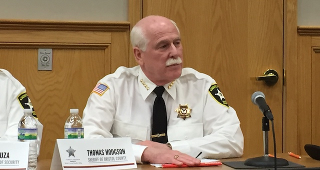
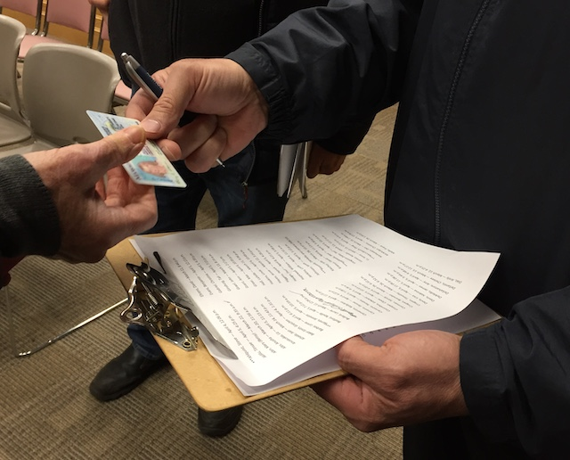
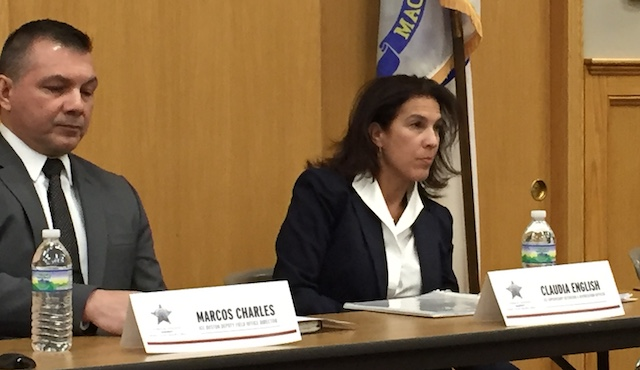
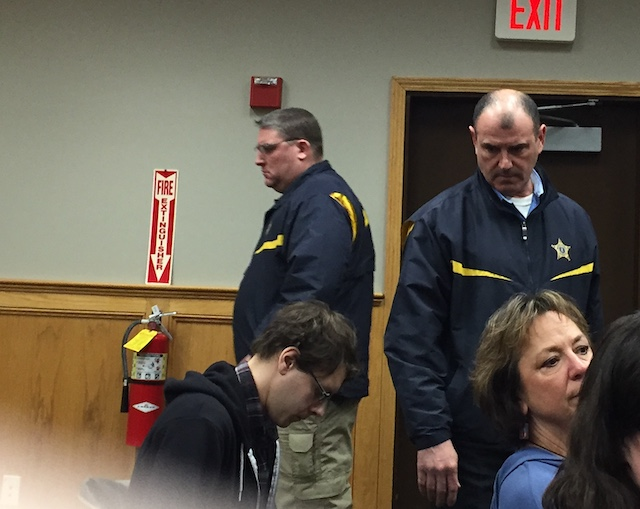

---

Citizens of Bristol County have known for years that sheriff Tom Hodgson peddles [fiction](/Tom Hodgson/fact-checking/) while [demonizing](https://americasvoice.org/blog/who-attended-feet-to-the-fire-act-2018/) brown people, that he relies on sham [awards](/Tom Hodgson/sham-award/) and sham [accreditations](/Tom Hodgson/aca-accreditations/) to spray away the stink of the [human rights abuses](https://imm-print.com/nobody-should-endure-the-negligence-that-i-experienced-i-do-not-want-this-to-happen-to-anyone-else/), prisoner [mistreatment](https://www.southcoasttoday.com/news/20180110/mentally-ill-inmates-sue-sheriff-hodgson-over-solitary-confinement) and [deaths](https://www.prisonlegalnews.org/news/2018/dec/5/suicides-increasing-massachusetts-prisons-and-jails/) at his facilities, and he is not averse to using [excessive force](https://www.telegram.com/news/20181113/looking-to-bring-order-to-unruly-encounters) on prisoners.

But last night Bristol County residents got a little taste of it themselves at an ostensibly “public hearing” the sheriff is required to hold once a year as part of his 287(g) agreement with ICE.

In contrast to recent 287(g) hearings in [Barnstable](https://provincetown.wickedlocal.com/news/20190221/barnstable-sheriff-and-ice-try-to-explain-need-for-their-pact) and [Plymouth](https://959watd.com/blog/2019/03/plymouth-plymouth-county-sheriff-and-ice-officials-hold-forum-on-287g/) counties, Hodgson's show was not a public event. And, unlike his award ceremonies which are often held at [schools](https://www.tauntongazette.com/news/20190210/bristol-county-sheriffs-office-honors-staff-who-went-above-and-beyond-call-of-duty) to maximize the number of community visitors, this one was designed to keep the public away from people asking tough questions.

In line with the xenophobe who relentlessly shills for “Fortress America,” getting into Hodgson's hearings was almost as bad as going through airport security. Anyone who wanted to attend first had to RSVP by email, then get by the jail's guard house, where “Special Sheriff” Bruce Assad checked their ID, permitting only those on the “list" to enter the jail complex. Visitors were then directed to a parking lot from which they had to walk about a thousand feet, past a phalanx of armed deputies, to the jail’s auditorium, where once again they had to show ID. 

Nor could the spectacle really be called a hearing. Though the ICE panel included Sheriff's Office Legal Counsel Robert Novack, "Special Sheriff" Bruce Assad, Superintendent of Security Steven Souza, ICE Boston Deputy Field Office Director Marcos Charles, ICE Supervisory Detention and Deportation Officer Claudia English, Sheriff's Director of Immigration Services Liunetty Couto, and Sheriff's spokesman Jon Darling, Hodgson did all the talking. This was his show.

During the “hearings” the tone-deaf sheriff refused to truly listen to the roughly 50 attendees, most of whom disapprove of Hodgson's abuses of prisoners and his unilateral decision to sign the 287(g) agreement. The sheriff treated his guest with contempt, evading questions, peddling falsehoods, frequently changed the subject, lashing out at his enemies, and it was clear the purpose was mainly to demonstrate that he was in control of the show. 

At the beginning of the proceedings, two members of the FANG Collective, Arely Diaz and Max Grear, unfurled a banner and began to make a statement. They were immediately assaulted by a number of Bristol County deputies, arms twisted into submission, and were shoved out the door. They did not resist, nor did they refuse to leave. The two had RSVP’d and were on the sheriff’s “list." Nevertheless, the two face multiple charges, including trespassing, resisting arrest and disorderly conduct. FANG may have momentarily interrupted the sheriff’s staged event, but the disorderly conduct was entirely the sheriff’s by responding with violence to people who had irritated him by [protesting](https://www.nbcboston.com/news/local/Protesters-Gather-at-Bristol-Sheriff-Thomas-Hodgson-Home-to-Decry-Arrests-for-ICE-501082201.html) in front of his house last winter.

The thin-skinned sheriff also ejected New Bedford activist Marlene Pollock, who had the temerity to challenge him during one exchange on former inmate claims of brutality and neglect. Hodgson delivered personal insults to Pollock and referred to her long history of opposing him before ejecting her as well from “his" hearings. Through both these authoritarian acts of force Hodgson made it clear he was delivering personal payback to his political enemies.

There was a contingent of deputies inside and out who managed to create an intimidating environment for attendees. A conspicuous display of weapons was a new touch this year, and it seemed hardly coincidental. Everyone was packing a sidearm, including the sheriff, and ICE Boston Deputy Field Office Director Marcos Charles was wearing an ankle holster. 

The arrests and ejection of the sheriff’s enemies were the only aspect of the hearings that the [press](https://www.bostonglobe.com/metro/2019/04/10/two-demonstrators-protesting-bristol-sheriff-arrangements-with-ice-are-arrested/Juu41yP8Hbru9whXbpzipN/story.html) generally thought to cover. Among issues of substance raised by Bristol County voters last night were Massachusetts Sheriff’s Association’s figures showing that ICE agreements are actually *costing* the state millions — not raking in the profits that Hodgson claims and the press parrots. Citizen questions also revealed that the number of deputized ICE agents at the jail has not increased and that in the last year only 18 Bristol County ICE detainees were arrested on criminal charges. Bristol County Jail and ICE statistics both refute the sheriff's claims that “criminal aliens” are overwhelming the Commonwealth.

Community members also questioned whether all the money lost to ICE could not be better spent on medically assisted drug treatment, prisoner rehabilitation and education programs, and better food and health care. But the sheriff retreated to his single preoccupation — immigration — claiming that immigrants account for most of America's crime, that MS-13 is taking over the state, and that [90% of the opioids in the US](https://whdh.com/news/2-arrested-during-public-forum-about-ice-detainees-in-dartmouth/) are coming across the border. Community pushback on these lies and misinformation accomplished nothing. The sheriff’s heart and mind are black holes admitting no light.

It was a complete waste of time for everyone. But for Hodgson it may have been a great audition for one of those empty Homeland Security jobs now available with the Trump administration.

