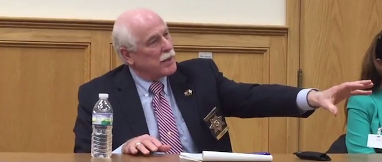

---

Speaking at a hearing earlier this month to discuss the Bristol County Sheriff’s Office’s (BCSO) collaboration with Immigration and Customs Enforcement (ICE) in the arrest and detention of undocumented immigrants, Sheriff Tom Hodgson described his targets as criminals responsible for the most heinous crimes — murder, rape, narcotics trafficking. But, as usual, the sheriff could offer no evidence to support the charge. Instead, he ridiculed and humiliated citizens who challenged him.

About 25 people, local activists, public defenders and lawyers, and some from the Cape and Providence, attended. Sheriff Hodgson who had invited citizens to discuss his department’s participation with ICE under a program known as 287(g), was flanked by Todd Lyons, Deputy Field Office Director, ICE Boston; William Sullivan, 287(g) Program Director, ICE Boston; Steven Souza, Superintendent of Security, BCSO; and Liunetty Couto, Director of Deportation Services, BCSO.

Five minutes into the hearings Sheriff Hodgson launched into his customary scary talking points about dangerous immigrants, asserting, “I took an oath to protect you,” claiming that inmates in his jails are there “because they committed a crime,” though fewer than half the prisoners have been convicted. Most inmates are there simply because they cannot post bail.

The sheriff asserted that 95 percent of violent crimes, the drug trade, and sex trafficking were committed by illegal aliens. When challenged for evidence, he attacked the questioner personally, declaring the man couldn’t possibly know the “real story” because he was not in law enforcement. Another questioner, a lawyer, received a similar condescending response.

Even the ICE officers acknowledged that Hodgson’s “detainees” were often guilty of lesser offenses such as operating a vehicle without a license.

Attendees objected to the panel’s claims that, before 287(g), dangerous criminals were frequently released from jail. Exactly what type of criminals had been released? Neither the sheriff nor the ICE officers could provide a substantive answer. One questioner complained about the panel’s use of anecdotes and misleading statistics, and that no data actually substantiated claims that a majority of detainees had been picked up for violent crimes. An ICE officer promised to get back to her with some data.

While the sheriff gave the impression he had sweeping powers to deploy local resources to help ICE, one ICE officer cautioned that, with the abandonment of the 287(g) Task Force model, local law enforcement can no longer conduct raids but is limited to investigating and holding prison inmates.

Of particular concern was that Massachusetts taxpayers pay for the sheriff’s decision to work for the Trump administration. Hodgson dug in, telling attendees he was not going to apologize for protecting the public. He said being elected justified his personal decision to partner with ICE. He rejected the notion that voters elected him to do a specific job — running the county jails. And the sheriff tried to downplay 287(g) costs. Both Hodgson and ICE insisted that ICE paid for all training, lodging and travel for personnel from BCSO during training. But this is simply not true.

The BCSO’s [Memorandum of Agreement](https://www.ice.gov/doclib/287gMOA/287gBristolMa2017-02-08.pdf) (MOA) with ICE states that Massachusetts taxpayers pay for “personnel expenses, […] local transportation, […] salaries and benefits, including overtime, of all of its personnel being trained […] and of those personnel performing the regular functions of the participating BCSO personnel while they are receiving training. The BCSO will cover the costs of all BCSO personnel’s travel, housing, and per diem affiliated with the training required for participation in this MOA.”

Several questioned whether ICE knew about various abuses at the prisons. Attendees challenged Hodgson’s claim that his facilities were rated in the top ten percent of American prisons when so many complaints have been filed against them. The sheriff refused to acknowledge the [highest prison suicide rates in the Commonwealth](https://www.bostonglobe.com/opinion/editorials/2017/05/28/suicides-plague-mass-county-jails/DERn8zFGhjiTSZNjk8p17O/story.html), class-action lawsuits for [human rights abuses](http://www.heraldnews.com/article/20091020/News/3102091218), and repeated citations for [violations of health and safety](/Tom Hodgson/repeated-violations/) regulations.

Hodgson denounced a [recent lawsuit](http://www.southcoasttoday.com/news/20180110/mentally-ill-inmates-sue-sheriff-hodgson-over-solitary-confinement) by Prisoner’s Legal Services over abuse of solitary confinement and made derogatory comments about the plaintiffs. He insisted that those accusing him of mismanaging his jail, treating inmates cruelly, failing to properly oversee psychological treatment of prisoners, or dealing with the suicide rate, were either “politically motivated” or acting out of venality or pecuniary interest.

When asked about violations of the Massachusetts [Supreme Judicial Court’s Lunn ruling](https://commonwealthmagazine.org/criminal-justice/sjc-blocks-local-detentions-ice/), which constrains ICE detentions, Hodgson feigned ignorance. One attendee refreshed the sheriff’s memory, mentioning an illegally-detained inmate’s name. But Hodgson waved that one away as well. It was surprising to hear a Republican, from the party of state rights, claim, “federal law supersedes state law.”

Hodgson says he took an oath to “protect” us all. But he seems more dedicated to protecting himself and the extrajudicial activities he has undertaken in service to a personal agenda. The question citizens of Bristol County might reasonably ask is — who will protect us from Sheriff Hodgson and the cost of his misfeasance?

*UPDATED 1/21/2018 12:00.*
