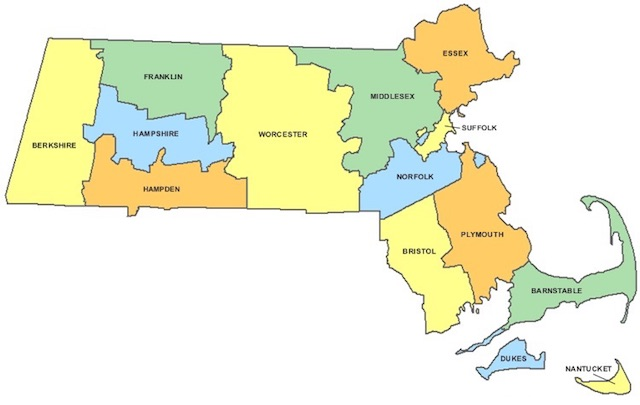

---

Three neighboring counties in the bottom right quadrant of the Commonwealth have Republican sheriffs in otherwise Democratic districts. It could have something to do with demographics — or maybe just neglect and Boston-centric politics. But it is surely a sign that not all is well with a party that habitually runs weak sheriff candidates — or none at all.

Barnstable County Sheriff James Cummings recently joined fellow Republicans, Bristol County Sheriff Tom Hodgson and Plymouth County Sheriff Joe McDonald, in signing a [287(g) agreement](https://www.aclu.org/other/287g-agreements) with the U.S. Immigration and Customs Enforcement agency. Under such agreements ICE permits prison officials to volunteer as federal immigration agents. The Trump administration, which strongly promotes the program, sees 287(g) as a tool in its larger mass-deportation strategy. And the Republican sheriffs know it. "The president said our role is probably the most critical because we know the players in our communities and we know how to find them," [Bristol County Sheriff](https://www.metro.us/boston/ice-agents-coming-to-a-jail-near-you/zsJqbw---uo3yzYloNf0VA) Tom Hodgson said.

You wouldn't know it from Hodgson's many statements on right-wing talk radio, but 287(g) is not very popular — by any stretch of the imagination. At present ICE has [agreements](https://www.ice.gov/287g) in only 18 states, and with only 60 law enforcement agencies. Massachusetts joins Arizona, California, Nevada, New Jersey, and Ohio — and the entire South — as participants. Now generally limited to a "jails" model because of previous abuses in the older "task force" and "hybrid" models, 287(g) agreements have a [long history](https://www.phoenixnewtimes.com/news/feds-pull-287-g-authority-from-maricopa-county-jails-because-of-civil-rights-violations-6631025) of [civil rights abuses](http://www.law.unc.edu/documents/clinicalprograms/287gexecutivesummary.pdf). For instance, in 2011 Maricopa County, Arizona Sheriff Joe Arpaio's agreement with ICE was [terminated](https://www.phoenixnewtimes.com/news/feds-pull-287-g-authority-from-maricopa-county-jails-because-of-civil-rights-violations-6631025) for civil rights abuses.

These ICE agreements impose costs of running a federal law enforcement program on state government and redeploy state corrections employees as federal agents. Sheriffs who enter into the agreements do so out of personal politics — not as part of their job description. And many local police forces find 287(g) programs undermine community trust. 

According to the American Immigration Council, ICE agreements with local sheriffs are [not properly supervised](https://www.americanimmigrationcouncil.org/research/local-enforcement-immigration-laws-through-287g-program) by ICE. Both the Boston Globe and the New York Times have featured articles on the lack of local accountability for county sheriffs — sheriffs who often operate as spokesmen for the Trump administration and anti-immigrant groups like FAIR and CIS. Understandably, there is [growing resistance](https://www.miracoalition.org/170-news-events/710-a-flood-of-opposition-to-deputizing-law-enforcement-as-ice-agents) to 287(g) programs and a desire to slap some limits on them. And a lot is happening recently.

On January 3rd the Barnstable County Assembly of Delegates ratified a resolution opposing the 287(g) program in Barnstable County — although voters had no choice in entering into the agreement in the first place.

On January 8th at 7PM at the Falmouth Public Library county residents will have a chance to discuss 287(g) agreements and learn about the [Safe Communities Act](https://aclum.org/wp-content/uploads/2017/03/Safe-Communities-Act-fact-sheet-march-21-2017.pdf) — state legislation which puts some limits on a sheriff's discretionary powers regarding ICE.

And at the Bristol County prison on January 11th at 6PM county residents will have a similar opportunity to express concerns about the 287(g) program — see <http://www.bcso-ma.us/> for details of the public hearing. And do your homework if you plan on attending.

