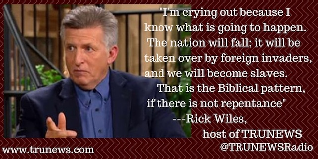
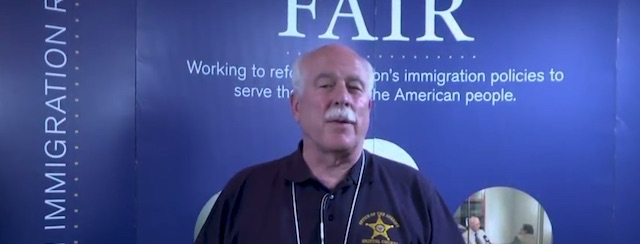

---

Tom Hodgson is in bed with the extreme Right. There's his seat on the [National Board of Advisors](http://fairus.org/about-fair/board-directors) of the Federation for American Immigration Reform (FAIR), a group founded by white supremacist [John Tanton](https://www.splcenter.org/fighting-hate/extremist-files/individual/john-tanton). Then there's his membership in the Constitutional Sheriff's and Police Officer's Association, an extremist group of lawmen who claim to know the proper interpretation of the U.S. Constitution. Then there are Hodgson's flirtations with Muslim-bashers, gay-bashers, birthers, and all manner of conspiracy nuts — many of them members of FAIR.

And then, in a category all by himself, there's Rick Wiles.

In November 2014 [Hodgson appeared on TruNews](https://www.youtube.com/watch?v=JCbSSMWSROc&t=1289) — the "End Times Newscast" with Wiles, who [advocates locking up people](https://www.bostonglobe.com/metro/2017/03/30/banner-week-for-lock-hodgson/8gE27AqNQ2lnWittultTbN/story.html) whose politics he disagrees with — just like Hodgson. The sheriff managed to cram in many of FAIR's talking points on Wiles' show, repeating the lie that Mexico pays $300 per child to come into the United States, that 30,000 Americans have been murdered by illegal immigrants since 9/11, and that undocumented immigrants receive better treatment than citizens because — well — that's just what America-hating Liberal elites want.

Wiles then turned his questions to the "historical role of the Constitutional sheriff," giving Hodgson an opportunity to whine about Massachusetts mayors and other officials who support Safe Communities. The show ended with Wiles appealing to his audience to raise funds for local sheriffs to attend a FAIR-sponsored event. Hodgson, who in 2014 was already sticking taxpayers for his FAIR-related travel, never bothered to correct Wiles.

So it didn't come as a surprise when Hodgson's old buddy [went on the air](http://www.rightwingwatch.org/post/rick-wiles-conservative-patriots-will-violently-wipe-out-democrats-who-oppose-trumps-border-wall/), warning that any opposition to Donald Trump’s plan to build a border wall would result in the US military rounding up godless subversives and *smiting* them. Extreme, certainly. But that's why people like Wiles and Hodgson are called *extremists*.

> “They’d better wise up and stop what they’re doing because they’re pushing the republic to the brink of breaking,” Wiles warned. “They’d better count the cost. What happens if you push the country that far? You snap the bonds that hold this country together [and] you might be shocked at the reaction you get because there is a lot of fury built up inside millions of Americans who are just fed up with what the Left is doing.”

> “It’s going to be lights out for the Democrats and the leftists,” Wiles said. “The conservative patriots will slam your slimy butts against the wall that you hate. It’s going to happen. They are not going to tolerate it. The American people want law and order in this country and the Democrats are a party of rebellion, of lawlessness. They better count the cost before they do something crazy because there’s a limit to how much patience the American people are going to show them.”

But speaking of locking people up — locking Tom Hodgson in his office on Faunce Corner Road might not be such a crazy idea. 

Then maybe the immigration-obsessed sheriff could finally take care of the many messes he's created by neglecting his day job — spending all his working hours with proto-fascists like Wiles and his white supremacist handlers at FAIR.

