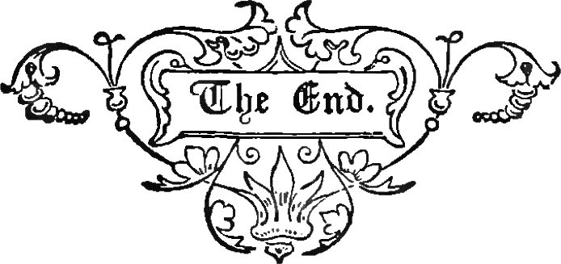

---
 

After a quarter of a century of Tom Hodgson's excesses going unpunished and no politician ever mounting much of a challenge, voters finally gave a pink slip to a sheriff who preferred playing the national stage to tending to his office back home.

Hodgson's defeat represents the tireless efforts of regular citizens, church groups, and community organizations across Bristol County who had simply had enough of Hodgson's intentional and egregious cruelty. Paul Heroux's win over Hodgson rides on the wings of surprising electoral wins by Democrats across the country.

Heroux's victory was not only a rejection of the incumbent and his carceral notions but an endorsement of professionalizing what has become a highly and dangerously politicized office. In Barnstable County voters similarly elected Donna Buckley, who like Heroux ran on a campaign of reducing recidivism and doing more to treat drug and mental health problems in jail.

Because Hodgson had placed himself squarely in the national spotlight, the Bristol County election took on national significance. Heroux, with a much smaller budget and an all-volunteer campaign team, amazingly beat an incumbent with a massive war chest, a slick media campaign, and a professional and unscrupulous campaign manager.

Hodgson's campaign attempted to re-frame the tough-talking, gun-toting Western sheriff wannabe as a kind grandpa protecting Bristol County from rising crime, which he frequently attributed to "criminal aliens" and the "woke" criminal-loving Democrats who coddle them. Hodgson spared no effort to smear Heroux as a pedophile-loving Communist funded by Jews with a global agenda. His extraordinarily sleazy campaign may have done him in as much as a quarter century of abusing Bristol County's sons and daughters.

In the end, all of Hodgson's mendacity and cruelty caught up with him.

