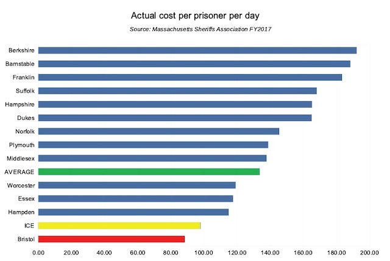
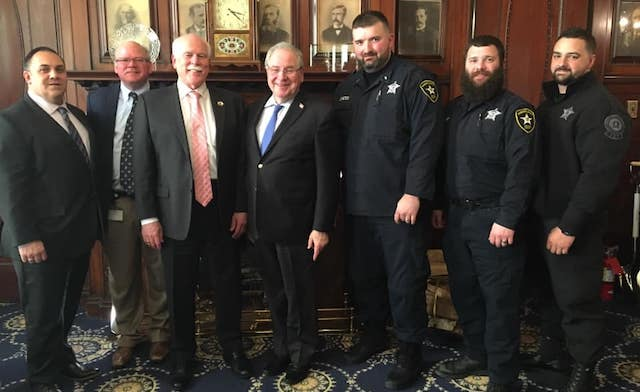

---

When something is too good to be true, it usually isn’t.

During Bristol County Sheriff Tom Hodgson’s 287(g) hearings on April 10, 2019, citizens pushed back at Hodgson’s claims that his 287(g) agreement with ICE is a big money-maker. Hodgson claimed that since 2007 he has “earned” \$61 million of ICE reimbursements for the Commonwealth. News sources have been parroting the sheriff’s numbers without really looking at the math.

Some of us, on the other hand, have reason to believe the sheriff is simply subsidizing ICE detentions at a loss to the taxpayer because of his well-known associations with far-right anti-immigrant groups. And recently obtained [Massachusetts Sheriff’s Association figures](msa.pdf) support this suspicion.

The FY2017 Massachusetts Sheriff’ s Association’s “Spending per Inmate Report” for all counties shows that the [average cost](graph.xlsx) per prisoner per day in the Commonwealth’s 13 county jails is roughly \$134 — well over the \$98 that ICE reimburses Hodgson and the \$90-\$94 it reimburses other Massachusetts sheriffs. Hodgson’s [incredible](graph.jpg) (as in “not credible”) figures are so low, and so anomalous, that only forensic accounting by a watchdog agency can ascertain if they are truthful.

Right before she was ejected from the hearings for arguing with Hodgson, local activist Marlene Pollock asked the sheriff if his suspicious figures were the result of (1) skimping on food, rehabilitation and medical care of prisoners, (2) if the sheriff was still using the shoddy financial management practices a recent state audit faulted him for; or (3) if Hodgson had found some magic formula no other sheriff could duplicate.

The sheriff chose the last option, calling the state audit a “joke” and trumpeting his SAMS system — a 20 year-old piece of homegrown management software and the data it tracks “right down to the cost of a cup of coffee” — as the key to his too-good-to-believe custody and care costs. When challenged to share his expertise with other sheriffs, Hodgson declined, claiming that House Speaker Robert DeLeo had all the numbers.

And now the public needs to see those numbers.

The Bristol County sheriff may not appreciate the scrutiny, but the Massachusetts Sheriff’s Association report calls into serious question Hodgson’s fabulous (as in “out of a fable”) per-diem rate. Only a complete and detailed accounting of Bristol County Sheriff’s Office income and expenses — right down to the cost of that cup of coffee — will prove whether the sheriff and his numbers can truly be trusted. Equally important, the question of whether the state’s ICE agreements are losing money can finally be answered.

Though short of a full accounting, [Amendment 1250 to the FY2020 budget](https://malegislature.gov/Bills/GetAmendmentContent/191/H3800/1250/House/Preview) requires sheriffs participating in 287(g) agreements to document the real costs of caring for, and the proper reimbursement of, ICE detainees. This amendment was sponsored by representatives Cabral of New Bedford, Robinson of Framingham, Balser of Newton, Domb of Amherst, Hecht of Watertown, Vega of Holyoke, Provost of Somerville, Peake of Provincetown, Lewis of Framingham, Garballey of Arlington, Decker of Cambridge, Farley-Bouvier of Pittsfield and DuBois of Brockton.

Bristol County for Correctional Justice recently testified before the Ways and Means Committee in favor of the amendment, and we urge state representatives concerned with the abuse of taxpayer money to support its provisions.

When something is too good to be true, it usually isn’t.
