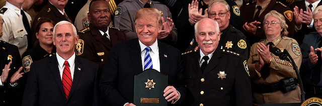
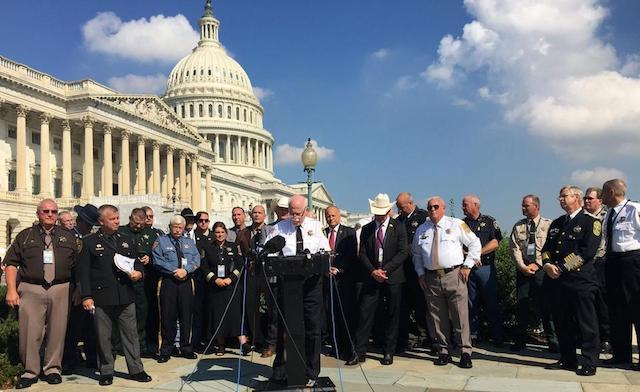
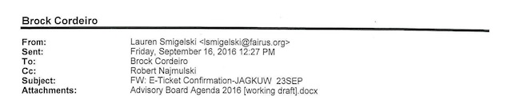

---

On September 5th Tom Hodgson was in Washington DC giving Donald Trump an [award](http://wbsm.com/bristol-county-sheriff-presents-president-trump-with-plaque/). How does Hodgson ever find the time with so many work problems unsolved back home in Massachusetts?

With Bristol County leading the state in suicides, second-place in recidivism, receiving non-stop complaints of abuse and neglect in his facilities, and Hodgson himself spending so much time on [talk radio](https://1063word.radio.com/media/audio-channel/taras-tirade-interview-bristol-county-ma-sheriff-thomas-hodgson-orig-9-5-18) or before the press cameras, we wondered how much time and taxpayer money the Sheriff was wasting.

Last May we requested the Sheriff's travel records, including dates and sponsoring agencies. At the end of August we finally received a thumb drive with 574 pages in PDF format.

Much of the mundane paperwork is meal vouchers, rent-a-car bills, airfare, and hotel bills --- the sheriff spends a lot of time at the Hotel Omni Shoreham in Washington DC, the Willard Intercontinental in DC, the Grand Hyatt in DC, the Hamilton Crowne Plaza in DC, The Old Town Crowne Plaza in Alexandria Virginia, and others. Hodgson's official job may be to run the county jail, but he seems to spend most of his time on activities taxpayers are footing the bill for but know very little about. 

Many of the documents we received were *not responsive* --- that is, did not answer the question of who sponsored the trip or for what purpose the sheriff left town. Many of the travel cover sheets noted only "Sheriff's DC trip" or contained no reference at all. Almost none of the documents received documented the hundreds of talk show radio and television appearances he has made.

Some of the documents we received had little or nothing to do with travel and simply make going through the trove more difficult. For example, we were given bills for locks, transmissions, and a floor scraper. Somebody at the Sheriff's Office has a sense of humor.

Some of the receipts were for National Sheriff's Association meetings --- weeklong affairs in vacation locales like Mackinac Island and New Orleans. These are not quite the professional meetings the rest of us attend since they almost always feature celebrities like *Trumpista* [Jeanine Pirro](/Tom Hodgson/sham-award/) or events some taxpayers might object to, like prayer breakfasts. The NSA is more right-wing advocacy group than professional association and attendance at events like this ought to come out of the Sheriff's campaign coffers.

Massachusetts taxpayers are also being stuck with the bill for the sheriff's attendance at [AIPAC](https://www.washingtonpost.com/news/made-by-history/wp/2018/03/06/the-dark-roots-of-aipac-americas-pro-israel-lobby/?noredirect=on&utm_term=.5190dd1224b9) conferences. AIPAC is a lobbying group which promotes Israeli, particularly extreme right-wing pro-Likud, interests. Again, this is something some taxpayers find abhorrent. We again ask Suzanne Bump and the State Auditor's office to investigate the sheriff's use of taxpayer money for no other purpose than to help Hodgson curry favor with the far-right.

One of the most sickening use of the Sheriff's time and our tax money is his association with the far-right anti-immigrant group FAIR, the Federation for American Immigrant Reform. Started by [John Tanton](https://www.splcenter.org/fighting-hate/extremist-files/individual/john-tanton), a Michigan white supremacist, FAIR (along with its sister organization CIS) is at the forefront of shaping Trump's immigration policy. Tom Hodgson sits on FAIR's [National Advisory Board](http://imagine2050.newcomm.org/2017/11/29/anti-immigrant-sheriff-thomas-hodgson-joins-fairs-advisory-board/) along with John Tanton.

FAIR coordinates many of Tom Hodgson's appearances. For example, the trove we received documents communications from FAIR President [Dan Stein](https://www.splcenter.org/hatewatch/2018/04/26/1991-fair-president-dan-stein-said-immigrants-are-getting-competitive-breeding), who once said that non-white immigrants are challenging white supremacy with "competitive breeding." GOP-connected BCSO employees coordinated Hodgson's appearance at FAIR's direction on on the Daily Ledger show on the [conspiracy theory](https://en.wikipedia.org/wiki/One_America_News_Network) network One America News.

There were only a couple of FAIR events included in the returned travel documents. Hodgson has been involved with FAIR since 2011, has appeared at many FAIR and FAIR-sponsored events, and there ought to have been many more communications with groups affiliated with the Tanton network, a network of approximately a dozen anti-immigrant and white supremacist sister organizations.

One lonely little receipt showed that Hodgson met for dinner with Rockingham County, North Carolina Sheriff Sam Page, who regularly collaborates with the ultra-far-right, anti-government [Constitutional Sheriff's Association](http://www.rightwingwatch.org/organizations/constitutional-sheriffs-and-peace-officers-association/) (Tom Hodgson joined in 2013 according to OCPF campaig filings). Like Hodgson, Sam Page is often found flirting with white supremacists. [Here he is](https://www.splcenter.org/hatewatch/2015/02/11/house-judiciary-subcommittee-continues-invite-anti-immigrant-voices-testify) (above) with Michael Peroutka, board member of mass-murderer Dylan Roof's favorite racist group, the Confederate League of the South.

We think there's probably a lot more where this came from, but we believe the attorney general, the legislature, and the state auditor should all take a little more interest in the sheriff's use of taxpayer money for questionable travel -- and the staggering number of days each year he is nowhere to be found at the facilities he mismanages.

