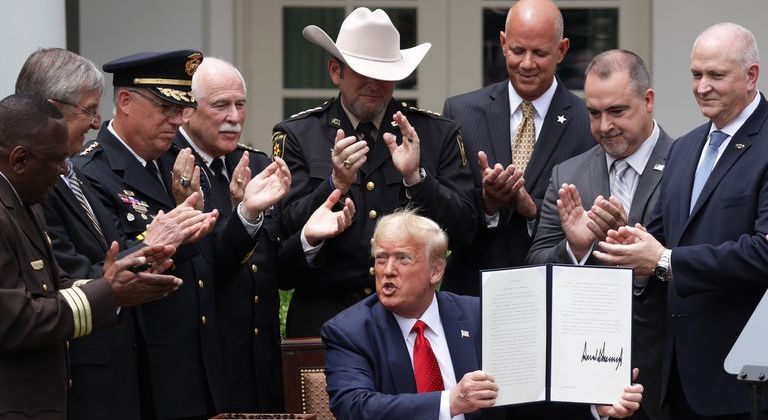

---

On Tuesday Bristol County Sheriff Thomas Hodgson was photographed standing behind Donald Trump as the President signed an executive order on policing.

Trump's police "reforms" may have been meaningless — especially since his administration [deep-sixed](https://www.msn.com/en-us/news/politics/trump-justice-department-killed-police-reform-programs-that-could-have-helped-minneapolis/ar-BB14OGyg) real reforms as soon as he parked his rump in the Oval Office, and none of the families of police murder victims Trump claims to have invited with were present for the signing — but it *was* an opportunity for Trump to show off what Trump does best — dousing fire with gasoline.

Trump's signing speech was precisely the plate of red meat people like Hodgson love. In fact, Hodgson could easily have written it himself: "Americans know the truth, without police there is chaos. Without law there is anarchy and without safety there is catastrophe. [...] As we did in Minneapolis after it got out of control for 4 days. We sent in representatives, commonly known as the National Guard and it was all put down very quickly." 

But Bristol County voters may be wondering: *what the hell was Hodgson doing there?*

Good question. For starters, a Massachusetts sheriff's job consists solely of running a county jail — something Hodgson can't even do without killing and abusing a disproportionate number of his detainees. For all his posturing and attempts to expand his powers to patrols — rejected by the DA and the cities of New Bedford and Fall River — Hodgson is nothing but a jailer. He's not a lawman. And if this was ever in doubt, in 2016 the Massachusetts Supreme Judicial Court ruled that "a deputy sheriff is not a 'police officer' for purposes of G.L. c.269, §13A." Hodgson runs four jails in Dartmouth and New Bedford. That's it. Or should be.

If Hodgson had a role to play at the White House yesterday, it was as an extra in whatever cowboy drama Trump thinks he's starring in, and to sell his tough lawman image by rubbing elbows with Stetson-hatted brethren.

But playing a lawman on TV is not the same as competently doing the job. Hodgson is such a clueless and reckless martinet that he appears to have personally triggered a recent riot in his own facility. Hodgson is absolutely the last person anyone would want to ask for "good policing" best practices.

Hodgson will get red in the face and sputtering mad any time a detractor mentions his cruelty and incompetence or pleads with government officials for long-overdue oversight. In Hodgson's book anyone who thinks he's unfit for office must be a pinko Commie anarchist with a political agenda.

But the fact is, the phrase "political agenda" was custom-made for Hodgson and everything he does — from sucking up to Stephen Miller, to ratting out his own church, to shilling for Identitarians at the American Border Foundation who are raising money for Trump's border wall, to testifying with racists and eugenicists from the Center for Immigration Statistics, to attending meetings of the national advisory board of the Federation for American Immigration "Reform," to participating in training exercises on the ranch of a couple affiliated with the Minuteman [militia] Project, to his numerous media appearances with racists, Muslim bashers, Christian nationalists, gay bashers, Birthers, End Times preachers, and conspiracy nuts. Not to mention Hodgson's never-ending pilgrimages to the White House on the public dime. 

His recent controversy is hardly surprising. That Hodgson would pose for an official photo in Confederate Battle Stars demonstrates that Hodgson the politician values the power of silent signals and dog-whistles, which apparently work as well in Massachusetts as they do in Mississippi. 

No, very little of what Hodgson does is related to his day job, but *everything* he does is political — and of the worst sort. 

It's time taxpayers stopped paying for Hodgson's white supremacist hobby. And where are those Congressional, state Senate, and AG investigations?

