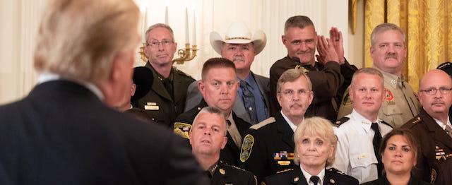
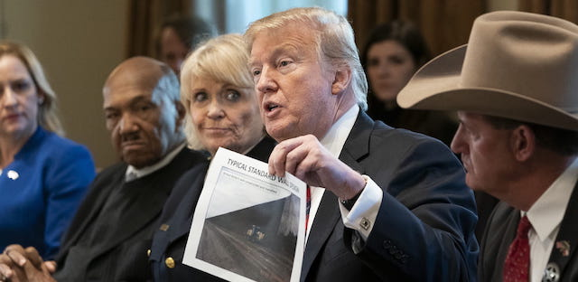
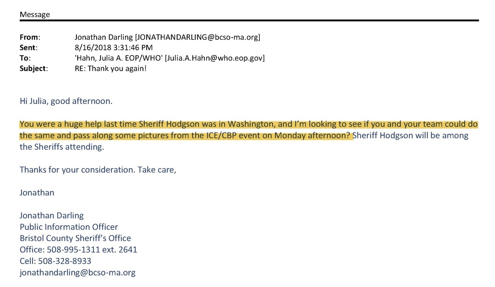
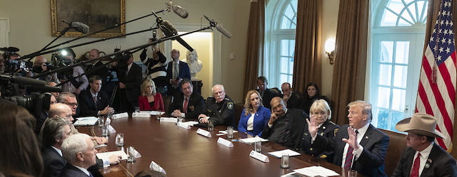

---

The nation's right-wing sheriffs flock to the White House for vanity photos of themselves, often captured in embarrassing thrall to the President.

Among the many White House emails returned from the ACLU FOIA request, there are at least fifty that include photos of Tom Hodgson in rapt attention to the stirring insights of Donald Trump, who is sometimes pictured holding a photo of his border wall. 

These taxpayer-funded photo-ops are meat for the President and manna for the sheriffs. But sometimes even the dozens of photos offered by the White House are not enough. Here Hodgson's media guy Jonathan Darling is found begging for more:

