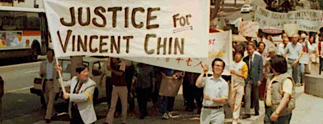
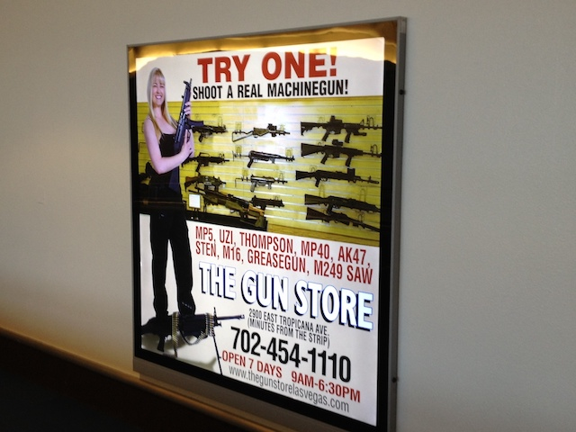

---

On Saturday, October 7th, from 5-6:30pm the City of New Bedford's Department of Community Services and the Asian Pacific Law Students Association at UMASS Law will present a roundtable discussion on community building. The disussion will center around the story of Vincent Chin, whose case sparked the Asian-American civil rights movement depicted in the film [Vincent Who?](https://www.vincentwhofilm.com/)

Speakers include Martin Bentz from the Islamic Society of Southeastern MA, and Thomas Curnalia and Jared Picchi from Human Rights Clinic.

For more information, contact Mali Lim at 508-961-3020 or email [mali.lim@newbedford-ma.gov](mailto:mali.lim@newbedford-ma.gov).

[Download the event flyer here](vincent.pdf).

In case you're curious about Vincent Chin, some context:

[Who Is Vincent Chin? The History and Relevance of a 1982 Killing](https://www.nbcnews.com/news/asian-america/who-vincent-chin-history-relevance-1982-killing-n771291)

[Why Vincent Chin Matters](http://www.nytimes.com/2012/06/23/opinion/why-vincent-chin-matters.html)

[The Case Against Vincent Chin](https://www.huffingtonpost.com/frank-h-wu/the-case-against-vincent_b_5237359.html)

\* \* \*

Unrelated to Vincent Chin -- except perhaps for our national dedication to violence -- was Sunday night's massacre in Las Vegas. It should not come as a surprise to anyone that it was a resident of Mesquite, Nevada -- the state with the most lax gun laws in the country -- who could assemble enough paramilitary firepower to create this kind of carnage.

In 2013 I snapped this photo in the Las Vegas airport. In Nevada, apparently, machine guns are just a part of the culture -- a culture of violence.

