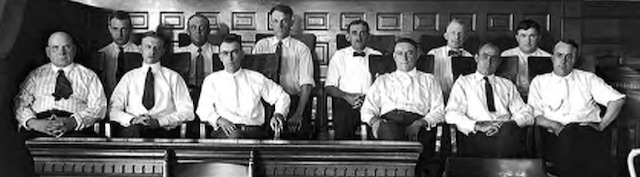

---

The U.S. Senate consists of 100 senators, 67 of whom must vote to convict Donald Trump in order to remove him from office. Of these, 53 are Republicans, 45 are Democrats, and 2 are independents. One may think that the greatest obstacle to fair proceedings in the Senate is political affiliation.

But like most things in America, it's going to be about race.

While Republicans have a majority in the Senate, it's thanks to a Constitution which gives a state like Wyoming with half a million people the same number of senators as California with almost 40 million.

Our nation's founders not only feared black demographics but modeled the Senate after the British House of Lords. It wasn't until the 20th Century that a citizen even got to vote for his senator, Until the Seventeenth Amendment was ratified in 1913, senators were appointed by the governor of each state and often the position was inherited. It wasn't until 1920 until women could vote at all.

By design, then, the U.S. Senate has always been the Yankee version of the House of Lords. By design it was and remains undemocratic, and by design its purpose is to thwart the will of the people's House of Representatives. It does this a little too well, and thus undermines democracy.

Also by design, the Senate remains an almost exclusively white club. Of the nation's 100 senators, 91 are white — a statistical anomaly in a country where 76% of the people are white and the percentage has been in steady decline since 1950. There are four Hispanic senators, three Asian senators, and three Black senators. Kamala Harris is of Indian-Jamaican heritage, checking off two boxes.

All of which is to say — this is the lily white jury that's going to consider Trump's Articles of Impeachment.

Donald Trump once boasted that he could shoot someone on Fifth Avenue and wouldn't lose a vote. A Department of Justice memorandum gives him a get-out-of-jail-free card for federal offenses. And the composition of the Senate makes it virtually certain that Trump's impeachable offenses will result in acquittal.

But American deference to white billionaires is bipartisan.

Even the House's Articles of Impeachment are watered-down charges consisting only of the president's most *recent* attempts to extort Ukraine to intervene in the 2020 presidential election. So far, the charges don't include *anything* from the Mueller report, Trump's numerous emoluments clause violations, lying about illegal payments to porn stars and mistresses, or any of his many obstructions of justice.

As if all this kid glove treatment were not bad enough, Senate Majority Leader Mitch McConnell intends to fast-track the Senate trial down to two weeks — three times shorter than Nixon's. And for the sake of comparison, in 2016, when South Korea impeached president Park Geun-hye for corruption and influence-peddling, prosecutors charged her with 13 counts remarkably similar to Trump's, and her trial in South Korea's Constitutional Court lasted 10 weeks. Gun-hye's refusal to appear before the court was never an impediment to her conviction.

No, the travesty of justice we are about to witness *from an all-white jury* in the U.S. Senate is one America has seen many times before:

- In 1955, when Emmett Till was murdered and his body thrown into the Tallahatchie River, his killers were acquitted by an all-white jury after one hour of deliberation.
- In 1963, after Medgar Evers was gunned down in Mississippi, two all-white juries acquitted his killers in separate trials.
- In 1998, when 13 white supremacists were charged with attempting to murder a federal judge and FBI agent, they were acquitted by an all-white jury.
- In 2013, George Zimmerman was found not guilty of the murder of Trayvon Martin by a jury with only one juror of color.
- In 2016, a group of armed sovereign citizens who occupied the Malheur National Wildlife Refuge were acquitted by an all-white jury — while on the same day unarmed Native Americans protesting a pipeline on their own land were maced and beaten by police.
- It's not even possible to list the thousands of times that white police officers have murdered unarmed black men and been acquitted or simply not charged.

As Trump's impeachment unfolds, Democrats may rightly fume about a partisan Senate subverting justice by speeding through a sham trial with the clear intention of acquitting the *white guy* president.

But it's a travesty of justice that's hardly unique — and it's nothing new. 

