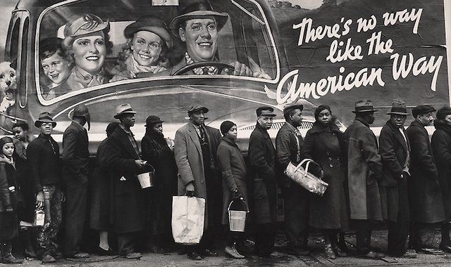

---

Each day we are reminded how corrupt, incompetent, mentally ill, and cognitively impaired Donald Trump is. His administration is a nightmare from which we awake only to discover that the new day's reality has become even more frightening than the day before. 

With over 1.2 million COVID-19 cases and [over 73,000 deaths](https://www.cdc.gov/coronavirus/2019-ncov/cases-updates/cases-in-us.html) [as of today], Trump is more concerned with "reopening" the country than saving lives, providing testing and masks, or issuing a national shutdown order. Trump's leadership has been as lacking as with every other [GOP response to a natural disaster](https://newrepublic.com/article/157537/blackness-preexisting-condition-coronavirus-katrina-disaster-relief). 

Trump has hawked [snake oil cures](https://commonwealthmagazine.org/health-care/study-finds-no-benefit-of-anti-malaria-drug-promoted-by-trump-for-coronavirus/), peddled multiple conspiracy theories involving [China](https://www.theguardian.com/world/2020/apr/15/trump-us-coronavirus-theory-china) and the [World Health Organization](https://thehill.com/homenews/administration/491671-trump-considering-suspending-funding-to-who), his scientists have been [muzzled](https://www.axios.com/fauci-coronavirus-trump-administration-blocked-testimony-congress-a447f198-3ceb-40f4-9c04-3013b50f7fe6.html), he has [sidelined](https://thehill.com/homenews/administration/494187-trump-threatened-to-fire-cdcs-chief-of-respiratory-diseases-in) and [censored](https://www.aljazeera.com/news/2020/05/ap-cdc-guidelines-opening-economy-shelved-white-house-200507122356794.html) the CDC, and his son-in-law is in charge of [phantom ventilator](https://www.buzzfeednews.com/article/rosalindadams/after-one-tweet-to-president-trump-this-man-got-69-million?utm_term=News%2520confirmed%2520list) contracts. Just as with deals involving the mafia, [when doing business with the White House Don](https://www.nbcnews.com/politics/white-house/political-influence-skews-trump-s-coronavirus-response-n1191236) it seems it pays to "know a guy."

In the midst of all this chaos, ineptitude and deep division over how (or whether) to socially distance, people have no recourse but to [fend for themselves](https://www.politico.com/news/2020/03/19/trump-governors-coronavirus-medical-supplies-137658), make their own masks, help their neighbors, try to nurture social connections, and somehow keep body and soul together. Trump's followers, however, are [prepping](https://www.bostonherald.com/2020/02/16/emergency-preppers-on-coronavirus-get-supplies-ready-take-the-virus-seriously-now/) for the apocalypse, [stockpiling](https://www.theguardian.com/world/2020/apr/01/us-gun-purchases-coronavirus-record) weapons and ammunition, placing their neighbors in the crosshairs, and putting them in spitting (and coughing) distance — all because it's their "right" as [God-fearing White Americans](https://newrepublic.com/article/157593/all-consuming-white-pandemic-protester). 

In Michigan, [armed militia members](https://www.bostonglobe.com/news/nation/2020/05/02/armed-militia-joins-michigan-protest-spurring-legislators-don-bulletproof-vests/Yh1TsafSrXTI0gi4sdQxeK/story.html) opposing the governor's stay-at-home orders entered the state capitol, forcing legislators to don kevlar vests. In contrast, the full weight of the State has come down on any Black person found ignoring [masks](https://www.theroot.com/video-shows-birmingham-ala-police-officer-body-slamm-1843317125) or [social distancing](https://gothamist.com/news/video-nypd-officer-beating-social-distancing-enforcement) orders. That is, when Black folks aren't being [harrassed](https://www.theroot.com/black-men-kicked-out-of-walmart-for-wearing-masks-durin-1842710492) for actually *wearing* a face mask. In Texas, a white woman [refused to obey an order to close her salon](https://thehill.com/homenews/state-watch/496594-texas-supreme-court-orders-release-of-salon-owner-jailed-for-reopening) and became a hero in a state that objects to asylum seekers crossing the border because "we are a nation of laws." But laws only for *some*.

The Coronavirus has also illuminated America's festering racial, class, and economic inequalities. For Republicans the pandemic has been a bonanza for extracting greater tax and loan advantages for Big Business, enacting bans on travel and abortion while the public is distracted, and for returning the country to the 1950's. For Democrats, the economic and health crisis on our doorstep hasn't fully registered. Democrats managed to choose a 78 year-old Centrist with a massive #MeToo problem who just wants to return the world to 2012 and to tweak Obama's flawed health plan as little as possible. In the meantime, the world has completely changed. Even with Biden's candidacy in shambles, they're still sticking with their man and his vision for the past.

Although people of color and America's [working poor](https://www.theguardian.com/world/2020/apr/09/america-inequality-laid-bare-coronavirus) have [borne the brunt](https://www.thenation.com/article/society/pandemic-disproportionally-impacting-black-latino-and-immigrant-communities/) of the pandemic, there is little indication that help is on the way. Although \$3 trillion has been disbursed to save American jobs, most of the money is predictably not finding its way into human hands.

Black Americans account for [a staggering number](https://www.aclu.org/news/racial-justice/if-covid-19-doesnt-discriminate-then-why-are-black-people-dying-at-higher-rates/) of Coronavirus deaths. In Louisiana, the percentage of African American mortality among all COVID-19 deaths is 70%. The same percentage describes the situation in Chicago. Black Americans have long had high rates of asthma (lack of environmental protections), diabetes and heart problems (lack of healthcare and insurance) — and these are all "underlying conditions" which reduce COVID-19 survivability. It's no exaggeration to say that America is *literally* killing Black people.

Despite the fact that the the [Navajo Nation has the third highest infection rate](https://www.democracynow.org/2020/5/5/navajo_nation_coronavirus_pandemic) in the country, it has [not received emergency funds](https://www.aljazeera.com/news/2020/05/navajo-nation-community-hit-hard-covid-19-200506141048185.html) for testing. Similarly, the Seattle Indian Health Board, a Native American health center, "asked for tests, and instead they [sent us a box of body bags](https://thehill.com/homenews/state-watch/496325-native-health-center-says-it-received-body-bags-when-it-asked-for)," according to the center's CEO. White America seems to be trying to tell Native Americans something.

LatinX workers in the nation's meat processing plants have been [forced to work-while-sick](https://www.dailymail.co.uk/news/article-8233591/JBS-close-two-plants-enforcing-work-sick-culture-saw-employees-die-COVID-19.html) at their jobs despite [massive infection](https://thehill.com/homenews/state-watch/496303-more-than-half-of-workforce-at-tyson-plant-in-iowa-tests-positive-for) levels. Likewise, people in the jails and prisons of this nation with the greatest incarceration rate in the world — overwhelmingly poor and people of color — are [at risk](https://theintercept.com/2020/04/28/coronavirus-new-jersey-prisons/) of contracting the virus in crowded, unsanitary conditions, deprived of soap, face masks and testing.

Many Americans are now literally [starving](https://theappeal.org/covid-19-exposes-stark-inequalities-across-u-s-as-thousands-struggle-daily-to-find-food/), people are unable to pay for rent or food, and everyone wants an expansion of antibody testing and vaccine development. But [corporate immunity](https://prospect.org/politics/absurdity-of-blanket-corporate-immunity-coronavirus-bailout/) is about the only immunity the Trump administration and its collaborators in the Senate really care about. Democrats just signed off on the greatest corporate giveaway in American history, and [only one House representative](https://www.nydailynews.com/coronavirus/ny-coronavirus-aoc-ocasio-cortez-stimulus-congress-20200327-f6d33k66ljgkzbkwoflskiidt4-story.html) protested the "crumbs for our families."

I am confident that America will survive a global pandemic — just as it did 102 years ago. Whether we end up with a quarter of a million or several million deaths is largely up to the lunatics running the asylum. Some of us will be statistics; others will be survivors. Life will go on.

But it's the survival of anything resembling a democracy that's got me worried. Unless a substantial number of Americans have had enough, the world of 2025 will be run by the same Capitalists who have profited the most from a [series of corporate bailouts](https://www.propublica.org/article/government-bailouts) beginning in the Seventies. For all the lofty Liberal expressions of "rethinking America" and "reconsidering" who is actually an essential worker, don't expect to see any change unless we — collectively — decide that an essential worker ought to be paid at least as much as a supply chain consultant. But please, somebody, tell me how that happens in a Capitalist economy.

We don't have a democracy now, and we won't have one in 2025 unless everyone is equal under the law. Without a serious effort to erase long-standing economic and racial injustices and completely restructure criminal justice and policing in America, cops will still be harassing and even [lynching](https://www.juancole.com/2020/05/killing-highlights-jogging.html) Black men in America in 2025, and the jails will still be full of poor people who can't make bail. Without health care as a right, some of us will live decades longer than others. Without reparations or a plan to lift up generationally disadvantaged communities, many Black and Native and LatinX Americans will still live in a Third World America while White America continues to live in its dreamy version of [Pleasantville](https://www.rogerebert.com/reviews/pleasantville-1998).

A new society is possible. But I fear White America, comfortable in its privilege, really has no incentive to tinker with what's been working for them so well all these years. 

