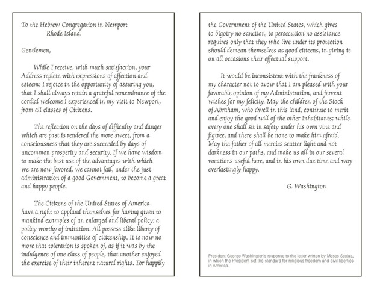

---

Encouraged by a rising tide of bigotry and xenophobia, opponents of the Cordoba Center, a proposed Islamic Center that has been termed "the Ground Zero mosque" by its opponents, have charged that it tarnishes the memory of 9/11 victims or that it is funded by Islamic militants. This nonsense has been propagated by any number of right-wing politicians like Newt Gingrich, Sarah Palin, Rudy Giuliani, and by people like Abe Foxman of the Anti-Defamation League. In this morning's paper [Kevin Cardin](http://www.southcoasttoday.com/apps/pbcs.dll/article?AID=/20100810/OPINION/8100334/-1/OPINION02) ("Until radicalism subsides, ground zero mosque inappropriate") has added his own shouts from a mob that would like to erase religious tolerance from this country's laws and legacy.

But let's immediately clear the dung from the shovel that Cardin has been swinging. The Cordoba Center is not a mosque and it is two blocks from the former site of the Twin Towers on property that was once a Burlington Coat Factory. The Cordoba Center's plans are actually based on a model anyone who has visited New York's 92nd Street Y or a Jewish Community Center will be familiar with.

The project is spearheaded by Daisy Khan, executive director of the American Society for Muslim Advancement, CEO Sharif El-Gamal, a New York real estate investor, and Faisal Rauf, a New York imam who in 2001 condemned the 9/11 attacks as "un-Islamic" and whose book "What's Right with Islam is What's Right with America" directly challenges the views of those who embrace Samuel Huntington's "clash of civilization" theory. Kevin Cardin appears to be one of these, ignoring the fact that the Cordoba Center's founders are precisely the sort of "moderate Muslims" whose absence he laments.

Cardin finishes his rant by asking how the Saudis would feel if a U.S. president forced them to build a grand synagogue in the heart of their country - somehow seeing this as equivalent to an American religious denomination simply exercising its freedoms. Interestingly, Cardin shares a mode of thinking with Osama bin Laden, who similarly sees the U.S. presence in Saudi Arabia as a clash of civilizations and an affront to Muslims everywhere.

But thankfully it is not up to Mr. Cardin to decide who has the right to religious freedom in the United States. Although some Christian fundamentalists may see it otherwise, the U.S. Constitution is crystal clear on religious freedom. The First Amendment begins: "Congress shall make no law respecting an establishment of religion, or prohibiting the free exercise thereof."

Yet in each generation American religious groups have had to contend with bigotry like this. Early in our history it was Protestant discrimination against "Papists." In the 19th and early 20th Century many Jews were accused of being anarchists. During the McCarthy era many were suspected of being Communists. Now we have the Muslims to pick on.

Let me make a suggestion to Mr. Cardin. Drive over to Newport, Rhode Island and visit the Touro Synagogue. Step inside and (if I recall properly) on the right near the door is a letter from George Washington to the congregation, assuring their welcome and safety in the United States. It reads in part:

"The Citizens of the United States of America have a right to applaud themselves for having given to mankind examples of an enlarged and liberal policy: a policy worthy of imitation. All possess alike liberty of conscience and immunities of citizenship. It is now no more that toleration is spoken of, as if it was by the indulgence of one class of people, that another enjoyed the exercise of their inherent national gifts. For happily the Government of the United States, which gives to bigotry no sanction, to persecution no assistance requires only that they who live under its protection should demean themselves as good citizens, in giving it on all occasions their effectual support."

Sit in one of the benches there and ponder the fact that nowhere in the world are people of any religion more free to practice their religions than in our country. And if you are so inclined, say a little prayer that it remains this way forever.

-----

*This was published in the Standard Times on August 13, 2010* 
*<http://www.southcoasttoday.com/20100813/opinion/8130332>*

