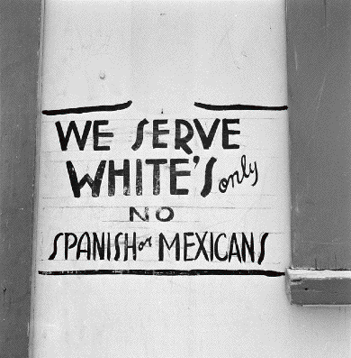

---

Charles Osborne's recent letter ("Bigots in Arizona? Not so fast") conveniently re-frames a civil liberties debate over a new law in Arizona as an unreasonable attack on sensible, tolerant Arizonans. While the law may be a desperate measure by some residents that state, the peanut gallery is indeed filled with angry white bigots.

There's no question that there's an immigration problem in Arizona. But there's also no question that Americans love their low-wage fish processing workers, their lawn cutters, their farm workers, their meat and poultry workers, janitors, cleaning ladies, and nannies. There never seems to be much interest in cracking down on the demand which fuels the supply of illegal labor - the employers - or in fashioning sensible guest worker programs with citizenship options. And after all, if after five years of making the American Dream a little cleaner, a little more nutritious, a little prettier for American citizens, why shouldn't those who have contributed to it be able to dream it for themselves?

But the new Arizona law is being questioned - not to ignore that border state's problems - but because it is simply a bad law which will legitimize racial profiling.

 Mr. Osborne takes President Obama to task for pointing out that the new law will indeed lead to families being stopped while enjoying ice cream. But forget the ice cream. Any opportunity - driving with a burnt-out headlight, beating a red light, spitting on the sidewalk, having a noisy party, a nuisance pet, an unkempt yard - can and will be used as an opportunity to check any Latino's legal status. Furthermore, the new law would make it a virtual necessity for Latino citizens to carry papers all the time to stay out of jail. And let's give Mr. Obama credit for stating what everyone knows all too well - that "driving Black" may not be a crime but remains a fact. Now to this we can add "driving Brown."

But Mr. Osborne's criticisms go a little beyond defense of Arizona citizens. He recalls the glory days when Arizona was a place where citizens who immigrated (in his words) "learned the language, became familiar with our customs." To me, it sounds like culture war is the real basis of Mr. Osborne's support for this new Arizona law.

_unpublished_
