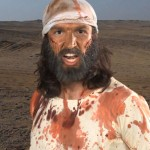
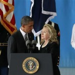
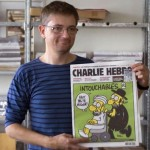
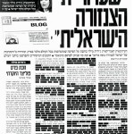
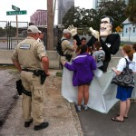
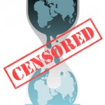

---

Over a week ago a combination porn/hate film appeared on YouTube. Among other things, it presents an image of a bloodthirsty murderer with odd sexual proclivities, in one scene depicting oral sex. Somehow the actors hired were deceived into thinking they were making an _action film_ depicting _George_, the "Desert Warrior." But after green-screen tinkering, scene editing and over-dubbing the actors' dialogue, a 14-minute trailer called "Innocence of Muslims" became the final product, and it was _not_ an action flick at all &#8212; but a hit piece on Islam and the Prophet Mohammad. The trailer was placed on YouTube just in time for the anniversary of 9/11, and the calculated outrage it produced contributed to the death of the American ambassador to Libya and three others.

As the strange case unravelled, it turns out that the film was the work of Egyptian Coptic Christian Islamophobes and American Evangelical Christian Islam-bashers who (contrary to their professed love of "Judeo-Christian" values) concealed their identities and initially [blamed it all on Jews](http://newsfeed.time.com/2012/09/13/friends-of-sam-bacile-a-whos-who-of-the-innocence-of-muslims-film-project/). All of the usual suspects, including Qu'ran-burning reverend Terry Jones, promoted the film. The haters were having their fun watching ugly, violent fantasies realized on the big screen. Yet even after their fake identities were revealed, they remained unapologetic. _So what if a few people had to die to show how evil Muslims really are?_

As children we may have heard the _truism_, "sticks and stones may break my bones, but words will never hurt me." Well, it just isn't true. And we'll never get the chance to ask Ambassador Christopher Stevens for his opinion.

President Obama and Secretary of State Clinton condemned both the film and the resulting mob violence. Right wing pundits went on the offensive, defending "free speech" and "freedom of expression," and condemning the "Muslim" President for capitulating to the Muslim hordes. One would have thought the Caliphate was about to take power in Washington or the Gates of Vienna finally overrun.

YouTube, which is run by Google, blocked the film in several Arab nations, but again the right wing pundits objected to even this _symbolic_ measure intended to cool the outrage. And a _symbolic_, if not paternalistic, gesture it was. Google's own techies certainly know that Arab techies are quite familiar with censorship and how to use proxy servers and other techniques to circumvent access limitations.

In the course of normal human interactions, when we have a dispute with someone, we tend to back off bit, try to defuse the situation, let everybody cool off. But Muslim-bashers are not normal humans. They double down on their malice. Like adolescents with [Oppositional Defiant Disorder](http://www.mayoclinic.com/health/oppositional-defiant-disorder/DS00630/DSECTION=symptoms), they go for the grown-ups' "buttons" &#8212; desperate for the attention and respect so few accord them.

So not to be out-done by _les Amis_, a French cartoonist recalling the great success of his [Danish](http://en.wikipedia.org/wiki/Jyllands-Posten_Muhammad_cartoons_controversy) colleague, created some new, juvenile, cartoons of his own lampooning the Muslim prophet. The cover of [Charlie Hebdo](http://www.charliehebdo.fr/) broke new ground by caricaturing both a Muslim _and a Jew_ in a single image. The back cover, however, was reserved for &#8212; again, pornographic &#8212; images of the Prophet Mohammad in various poses. The quips in the cartoon bubbles (such as _"And my buttocks? You like my buttocks?"_) did not exactly provide much in the way of thoughtful insight &#8212; raising the legitimate question: exactly what kind of "free speech" _was_ Charlie Hebdo trying to exercise anyway?

But again the "defenders of democracy" insisted that the Islamophobic show must go on. Tanks were deployed in French embassies throughout the Middle East and, just to make sure that the Muslim hordes back in France would not interfere with free speech, demonstrators were actually [barred from protesting the cartoons](http://in.reuters.com/article/2012/09/21/film-protests-france-idINL5E8KLDRQ20120921)! It was a Gallic triumph for intolerance, but a definite setback for _liberté, égalité, and fraternité_. And, well, so much for the national motto &#8212; not to mention free speech and freedom of assembly. Gratuitous hate trumped everything, especially reason.

Yet we continue to hear that we live in the West where freedom of expression and speech are about the only thing separating us from the Chinese (with whom we are major trading partners), or the Saudis (with whom we are major arms-for-oil partners) &#8212; or those damned _Islamofascists_ who would have us memorizing long passages from the Qu'ran in kerosene-lighted madrassas. Western civilization must be preserved at all costs!

_But hold on a moment._ The West actually _does_ regulate hate speech and practices selective censorship. Antisemitic hate speech and Holocaust denial is [illegal in most of the European Union](http://www.nytimes.com/2007/04/19/world/europe/19iht-eu.4.5359640.html) and in about a dozen European nations where no equivalent protection for Muslims exists. In [Israel](http://forward.com/articles/127130/now-it-is-told-an-israeli-story-of-secrecy-and-ce/), which exercises military and civilian press censorship, commemorating the [Nakba](http://www.jta.org/news/article/2011/03/23/3086536/knesset-passes-nakba-law) (the Palestinian "catastrophe" which recalls pogroms and the theft of their homes in 1948) is illegal. And recently, when semi-nude photos of the Dutchess of Cambridge emerged, the [British press censored](http://www.newstatesman.com/blogs/laurie-penny/2012/01/libel-laws-british-journalists) _itself_ and the Royal photos were not printed in England. And back in France [French police raided a magazine](http://www.thedailybeast.com/articles/2012/09/19/french-cops-raid-closer-mag.html) that actually published them.

Here in the U.S., we think of our nation as _the ultimate_ bastion of freedom. But here too [censorship is alive and well](http://en.wikipedia.org/wiki/Censorship_in_the_United_States). By one measure the United States stands [behind 46 other nations](https://rsf.org/en/press-freedom-index-2011-2012,1043.html) in press freedoms. During the last several wars the U.S. has waged, the sight of military caskets or [photographs of stricken soldiers has been censored](http://www.fair.org/index.php?page=3095). At most recent national political conventions, demonstrators have had to go into cages or cordoned-off areas euphemistically named [free speech zones](http://en.wikipedia.org/wiki/Free_speech_zone) which our Founders probably never envisioned. And systematic surveillance and spying on [virtually all ](http://privacysos.org/node/753)Americans' [electronic communications](http://privacysos.org/node/825) has a chilling effect on the willingness to exercise those once-Constitutionally-protected freedoms.

When the Pentagon Papers first appeared, the [U.S. government censored their publication](http://www.aclu.org/national-security/aclu-history-pentagon-papers-censorship-name-national-security). When Julian Assange published a trove of WikiLeaks documents, the [U.S. government blocked its DNS records](http://www.guardian.co.uk/world/2010/dec/03/wikileaks-cables-blocks-access-federal) and [cut off its payment options](http://thelede.blogs.nytimes.com/2010/12/04/paypal-suspends-wikileaks-account/) via Amazon.com and Paypal. As of this date, Google has received 6,192 requests from the U.S. government to censor web content and it has complied with 42% of these requests. Books, too, are still routinely banned in the U.S. The American Library Associations reports that since 1990 over [11,000 books have been banned](http://www.huffingtonpost.com/roberta-stevens/yes-there-is-still-book-b_b_738679.html).

A recent example of how _selectively_ Western censorship operates is the case of the German satire magazine [Titanic, which ran a cover with the pope](http://www.spiegel.de/international/zeitgeist/pope-benedict-xvi-sues-german-satire-magazine-titanic-a-843690.html) in a cassock with signs of urinary incontinence and the caption, "Hallelujah at the Vatican &#8212; the leak has been found!" &#8212; referring to a recent scandal over private Vatican correspondence that found its way into a book. A Vatican spokesman responded, "Titanic oversteps every measure of decency," slapping a legal restraining order on the magazine, which was then forced to withdraw issues from newsstands and pull the images down from its website.

Censorship in the West is doing amazingly well._  

Now I certainly don't want the government locking me up for what I write &#8212; although it did so in the case of [Tarek Mehanna](http://en.wikipedia.org/wiki/Tarek_Mehanna). In another case, the government won a case against the [Humanitarian Law Project](http://en.wikipedia.org/wiki/Holder_v._Humanitarian_Law_Project), which only wanted to offer Kurdish rebels ways of resolving conflicts with the Turkish government. The California State Assembly wants to [outlaw criticism of Israel](http://www.huffingtonpost.com/stephen-zunes/california-state-assembly_b_1842841.html) on campuses. And I'd rather not have the government assassinate me just because it [suspects](http://www.brookings.edu/research/opinions/2009/07/14-targeted-killings-byman) I'm a dangerous radical.  We don't need any more censorship than we already have. It's too easily abused.

But government censorship in the age of the internet may pale in comparison to the ability of multinational corporations to either censor content &#8212; or promote select content outside national boundaries. In a recent posting on _Foreign Policy_, [Robert C. Post](http://www.foreignpolicy.com/articles/2012/09/17/free_speech_in_the_age_of_youube), dean at Yale Law School, wrote:

> A looming question raised by _Innocence of Muslims_ is how we should conceptualize the public function played by international companies like Google. On the one hand, they may render our constitutional principles all but irrelevant, since in a digital world private companies will wield the sovereign prerogative of effective censorship. On the other hand, the absence of constitutional restraint will authorize private companies to respond flexibly and pragmatically, in ways that the American government cannot, to the inevitable crises that will accompany an international clash of cultures.

Post makes a good argument that government censorship is largely irrelevant. In Europe, where Holocaust denial is outlawed, those so inclined can still find neo-Nazi propaganda here in the United States &#8212; just two clicks away.

And so I reluctantly defend the haters' right to spread their vile propaganda. But I wonder what kind of sick society so willingly encourages it through repetition of lies until it starts to ring almost true. What kind of sick society gratuitously and habitually puts so much hate into satire, into magazines, into film, into blogs, into everyday discourse? As a card-carrying member of the ACLU, I nevertheless harbor the fear that the damage to civil democracy by such extreme and pervasive hate speech actually _outweighs_ the value of preserving the right to say such things.

So, to those of you &#8212; US, Danish, French, German, whatever &#8212; who think you are defending freedom by actually _generating_ hate speech &#8212; you're dead wrong. You're simply looking for an excuse to spew some secret malice. And to those of you who think that governments should ban hate speech &#8212; you're also wrong. Governments, even in the West, _selectively_ choose what and whom they want to ban and none of us should willingly give away even _one_ freedom more to _any_ regime that toys with freedom so carelessly. Keeping in mind that government's dominion is ultimately weaker than the Internet's.

Finally, when it comes to hate speech, the issue really boils down to _civility_. Can a civil democracy survive when it ceases being civil? Can it survive when its minorities live in fear of relentless persecution by the _Leitkultur_? Not for a thousand years, and not for three hundred.
