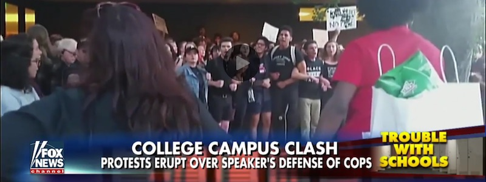
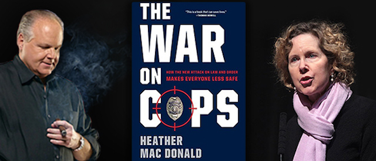

---

Poor Heather Mac Donald. She didn’t get quite the reception she wanted at Claremont McKenna College (CMC) outside Los Angeles. She had come to speak on "The War on Police," another of her frequent attacks on Black Lives Matter (BLM), and [the students weren't having it](https://www.city-journal.org/html/get-up-stand-up-15109.html). A FOX News video shows what appear to be white allies locking arms and peacefully blocking access to the school's Athenaeum. Mac Donald's talk had to continue with whomever had already entered. [President Hiram Chodosh](https://www.cmc.edu/news/message-from-president-chodosh-on-heather-mac-donalds-athenaeum-talk) live-streamed the talk and [put it online](https://www.youtube.com/watch?v=qyfX5UCAe3A). Ironically, as the media and [two organizations](http://roseinstitute.org/a-message-from-the-director-regarding-the-heather-mac-donald-talk/) which sponsored her talk pointed out, more people heard Mac Donald than if no protest had taken place.

Sarah Sanbar, a [student fellow](https://www.cmc.edu/news/meet-new-athenaeum-fellows-for-2016-17), introduced Mac Donald, apologized for the almost empty room, and placed the talk in its proper context. She said that Black Lives Matter opposes systemic racism and that Mac Donald was there to deny it and to paint BLM as dangerous. And that turned out to be a fairly accurate introduction.

Although Heather MacDonald is ostensibly a conservative intellectual and a "fellow" of the Manhattan Institute, she spends a lot of time on the talk show and cable television circuit. [Here](https://www.rushlimbaugh.com/daily/2016/07/08/heather_mac_donald_talks_about_her_essential_book_the_war_on_cops/) is Mac Donald being interviewed by Rush Limbaugh. [There](http://www.dennisprager.com/macdonald-the-war-on-cops/) she is with Dennis Prager. [Here](http://www.frontpagemag.com/fpm/263504/war-cops-mark-tapson) she is visiting Frontpage Magazine. Mac Donald is a regular on FOX News and in virtually every far right publication. Her book on Black crime is a [recommended read](https://www.jbs.org/store/shopjbs/the-war-on-cops) of the John Birch Society and the white supremacist group [VDARE](https://www.vdare.com/posts/heather-mac-donald-explains-the-deadly-cost-of-the-lefts-wrong-headed-anti-cop-ideology).

Mac Donald, who studied English and law and who is not actually a social scientist or criminologist, frequently veers into white supremacy. She believes Black communities need to be aggressively policed (occupied) to keep them safe (the White Man's burden), and Mac Donald calls affirmative action programs "racist." On FOX News Mac Donald and host Laura Ingraham held a pity party for white student "victims," [with Mac Donald going so far as to claim](https://mediamatters.org/video/2016/06/23/right-wing-commentator-heather-mac-donald-affirmative-action-brings-students-schools-who-are-not/211141) that "underprepared" blacks don't actually want to be on these college campuses "when in fact the only reason they're there is because the campuses want so-called diversity so much that they lower their standards."

Such rhetoric might have had more to do with the protest at Claremont McKenna than with the pseudoscience Mac Donald tossed into her book "The War on Cops," which [Newsweek](http://www.newsweek.com/war-cops-flawed-logic-fantasy-485546) dismissed as "flawed logic and fantasy." The Libertarian magazine [Reason](https://reason.com/archives/2016/07/16/there-is-no-war-on-cops) found Mac Donald's logic "deficient" and took her central thesis to task: "America does not have an incarceration problem; it has a \[Black\] crime problem." Police reform, prison reform, legal reform, and social reform are therefore all unnecessary because – when Mac Donald drills right down to root causes – well, the root cause is Black people.

I found it ironic that Mac Donald claims to revere the Bill of Rights while finding nothing wrong with police depriving Black teenagers of Fourth Amendment rights. She richly deserves the monicker that Black Lives Matter has given her – racist and fascist. But interfering with someone's First Amendment rights is a problem and it's also become an unfortunate trend. And liberal publications from the Atlantic to the LA Times and the New York Times, as well as civil liberties groups like the [ACLU](https://www.aclu.org/news/aclu-statement-ann-coulter-speech), have condemned such liberal intolerance.

Yet if the American Right are the true friends of the First Amendment, as they claim to be, let us see a flurry of Conservative letters to the editor defending protections for whistleblowers, journalists, rights for those boycotting Israeli occupation, support for net neutrality, and ending press bans in the White House. Let us hear fevered calls to stop restricting the right of people to demonstrate except in "free speech zones." Let the Great Right wing rise up and repeal their own laws permitting vehicular murder of protesters (google it!). Let there be a torrent of letters demanding an end to gag orders on physicians providing women's health services.

And let us see the nation's editorial pages flooded with defenses of Kashiya Nwanguma, a Black woman who protested at a Trump rally and was assaulted by a white supremacist at the behest of the white supremacist candidate.

For this is what it's really about. There's more here than Heather Mac Donald's First Amendment right to heap insult and advocate repression on an entire race.

Now that the entire government is doing it.