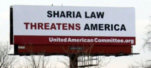

---

I wanted to find out what the kerfluffle over "creeping Shariah" was all about. After all, this is a Republican worry in [thirteen states which have introduced anti-shariah laws](http://thinkprogress.org/politics/2011/02/08/142590/sharia-states/). And apparently it's more serious than even a global economic Depression.

So I went to a blog by the promising name of "Creeping Shariah" and its matching Twitter feed for some hard answers.

The website promised to easily locate the numerous recent cases of jihad being waged on our very shores. In Massachusetts alone there were forty incidents of jihad, as those sly Mahometans managed to finesse a Muslim holiday in Cambridge, plotted to build a cemetery in Belchertown, and the Muslim Brotherhood had apparently consulted with Whitey Bulger to get governor Duval Patrick to build a mega-mosque in Bah-stahn.

Those armed-and-dangerous ladies from Code Pink were raising money for Hamas, CAIR was at it again, trying to help out some headscarf-toting Muslim terrorists at a Boston pharmacy school, Yale University was cozying up to faculty jihadis by not re-inviting an Islamophobe to come back for a conference, and some crazy Mooslim women troublemakers in Kansas City wanted to wear Islamic-style bathing gear in a pool. The fate of our pools, our children, and our very nation were at stake. And all this trouble from a bunch of Muslim women, no less.

Beside the fact that New Haven and Kansas City are not exactly in Massachusetts, most of the other "incidents" reported were endlessly-recycled hate blurbs from people like Pamela Gellar and Rick Santorum -- which, I will grant you -- do constitute a sort of domestic terror. But most of the postings were over a year old. Maybe getting all that "news" onto his website was just too overwhelming for him. HTML can be so wordy.

But now I was really curious. Incidents of creeping shariah and jihad were obviously so numerous, so dangerous, and so troubling that perhaps a Twitter feed could provide better real-time coverage of the onslaught. And surely the feed would corroborate a pattern of Islamification of our beloved heterosexual, fetus-friendly, pro-capitalist, White-loving, brown-skin-hating, Ayn Randophilic, Judeo-Christian-based culture! I went online looking for more answers.

And answers I found. More attacks on Keith Ellison, indignation at a Toronto school which tried to accommodate a Muslim student who wanted to pray quietly in a corner of its library, and the unmitigated gall of the town of Farmington, Michigan, to sell an unused school to an Islamic cultural association. Truly disturbing stuff, indeed!

Elsewhere in the tweets were some on a Republican congressman (Wolf, R-VA) going after CAIR via the IRS, Judicial Watch going after CAIR, and disappointment that CAIR could sue a former intern who stole tens of thousands of documents for his Islamophobe father, Paul Gaubatz. I made a mental note to give CAIR a donation.

There was also a speech by Geert Wilders at the Cornerstone Church in Nashville, part of his "Warning to America" event, which concluded with the words:

> You and I, Americans and Europeans, we belong to a common Western culture. We share the ideas and ideals of our common Judeo-Christian heritage. In order to pass this heritage on to our children and grandchildren, we must stand together, side by side, in our struggle against Islamic barbarism. That, my friends, is why I am here. I am here to forge an alliance. Our international freedom alliance. We must stand together for the Judeo-Christian West. We will not allow islam to overrun Israel and Europe, the cradle of the judeo-Christian civilization.

Wow. Now I get it. Only Leni Riefenstahl was missing from the picture. Or was that Hermann Goering?

I mean, thank goodness I'm a Jew! It wasn't that long ago that Nordic types like Wilders were saying the same thing about my people. Now with the cool kids expanded to "European Judeo-Christians" and not just Christians anymore, I could join a select club and kick around Muslims if I wanted to -- rather than just being a Yid whose faith and culture was once characterized by Nazis exactly as Wilders paints Islam at churches and synagogues today.

I'd get with his program, but all I'd have to do is stop trying to be a mensch. That and the stench Wilder's words would leave in my mouth.
