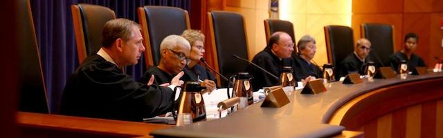
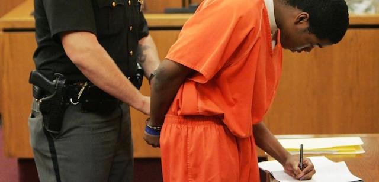
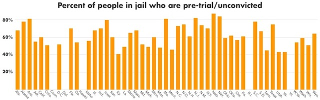

### Dangerous Legislation

Last August Democratic District Attorney Thomas Quinn [penned an editorial](https://www.bostonglobe.com/opinion/2018/08/21/cash-bail-reform-efforts-must-account-for-dangerous-defendants/6ijvUnypc3UXtuddEoceMI/story.html) in the Boston Globe supporting "get tough" bail revocation. It was part of a [coordinated effort](http://www.wickedlocal.com/news/20180906/baker-dangerousness-bill-expands-pre-trial-detention-of-suspects) with Republican Governor Charles Baker to modify the Commonwealth's Section 58A "Dangerousness" statutes. On September 10, 2018 the governor introduced [legislation](https://malegislature.gov/Bills/190/H4903) to keep people not yet convicted of any crime behind bars for up to a year without trial if deemed "dangerous" by police or District Attorneys. And this year, again, [Baker's bill H.66](https://malegislature.gov/Bills/191/H66) currently awaits a vote in the legislature.

The governor's legislation follows several high-profile cases of people out on bail committing serious crimes. In one case, a Weymouth police officer was allegedly killed by a man with a history of run-ins with local police who was out on $500 bail for a pending drug charge. In another case, a Fall River man who was charged in 2015 but never convicted of armed robbery reportedly killed two people, including a veteran and new father, after losing control of his vehicle in a high-speed police chase. The press has been generous with photo-ops of DAs, the governor, and police captains all calling for "Blue Lives Matter" policies. The Sun-Chronicle showed its [bias](http://www.thesunchronicle.com/news/local_news/bristol-county-da-pleads-for-bail-reform-to-keep-criminals/article_531a60f4-db01-5ff4-ac4f-c02ae8f007ea.html) running with "Bristol County DA pleads for bail reform to keep criminals off streets" while [NECN](https://www.necn.com/news/new-england/Gov-Charlie-Baker-Pushes-to-Close-Loophole-Keep-Dangerous-Criminals-Behind-Bars-492660981.html) cast the legislation as an effort to "Keep Dangerous Criminals Behind Bars." Forgotten is the fact that you're only a criminal if you've actually been convicted of a crime.

Last Summer the Massachusetts legislature passed an omnibus criminal law reform bill which was signed by the governor and includes [bail reform](https://willbrownsberger.com/bail-reform-in-the-criminal-justice-package/). As Senator Will Brownsberger explained, the reform bill codified the State Judicial Court's [Brangan decision](https://cases.justia.com/massachusetts/supreme-court/2017-sjc-12232.pdf), which ruled that "in setting the amount of bail, whether under [G.L. c.276, §57](https://malegislature.gov/Laws/GeneralLaws/PartIV/TitleII/Chapter276/Section57) or [§58](https://malegislature.gov/Laws/GeneralLaws/PartIV/TitleII/Chapter276/Section57), a judge must consider a defendant’s financial resources, *but is not required to set bail in an amount the defendant can afford if other relevant considerations weigh more heavily* than the defendant’s ability to provide the necessary security for his appearance at trial." The SCJ ruling balanced public safety with concern for America's habit of [criminalizing poverty](https://www.theatlantic.com/politics/archive/2016/04/the-dangerous-domino-effect-of-not-making-bail/477906/). 

Habitually hostile to [civil liberties](https://privacysos.org/blog/massachusetts-prosecutors-want-dangerous-new-surveillance-powers-less-48-hours-stop/), Massachusetts district attorneys have destroyed lives, in many cases defending [tainted convictions](https://www.innocenceproject.org/ma-court-dismisses-drug-convictions-tainted-lab-analyst/) with [tainted evidence](https://www.washingtonpost.com/news/true-crime/wp/2017/12/28/massachusetts-prosecutors-to-throw-out-8000-convictions-in-second-drug-lab-scandal/?utm_term=.b5dfa1394be6), and [nine out of eleven](http://www.masslive.com/politics/index.ssf/2017/10/massachusetts_prosecutors_oppo.html) Massachusetts DAs staunchly opposed the recent criminal justice reform legislation. Nationwide, district attorneys have discovered that running on a “law and order” platform — going after the weakest and most vulnerable in society by labeling them “superpredators” — is always a winning election strategy. So it's no surprise that both Republican and Democratic DA's are joining in an assault on *Brangan*.

Jahmal Brangan, for whom the ruling is named, had been sitting in a Massachusetts jail for three and a half years simply because he couldn't meet bail. After Brangan's case was finally heard, now-retired Supreme Judicial Court Judge [Geraldine S. Hines](https://www.masslive.com/news/index.ssf/2018/06/jahmal_brangan_whose_case_led.html) wrote, "A bail that is set without any regard to whether a defendant is a pauper or a plutocrat runs the risk of being excessive and unfair."Hines also added: "A $250 cash bail will have little impact on the well-to-do, for whom it is less than the cost of a night's stay in a downtown Boston hotel, but it will probably result in detention for a homeless person whose entire earthly belongings can be carried in a cart."

There is an old truism: "a single death is a tragedy; a million deaths is a statistic." Indeed, Brangan's case was just one of almost a million nationwide. On any given day in 2015 roughly 700,000 people were locked up in local jails. The [ACLU](https://www.aclu.org/issues/smart-justice/bail-reform) notes that the bail system disproportionately affects poorer Americans and people of color. Lost in the hysteria over isolated tragedies involving policemen and veterans, the victimization of poor and brown and black people merits barely a statistical footnote. 

If you don't think there's a racial double-standard in setting bail and letting people participate effectively in their own defense, consider the case of Paul Manafort. When he was first charged with the mountain of offenses Robert Mueller threw at him, [Manafort was able](https://theintercept.com/2018/06/09/paul-manafort-bail-inequality/) to post $10 million bond, allowing him to live, as the Intercept described it, "with a monitoring device around his ankle, in various luxury residences he owns in northern Virginia; Palm Beach, Florida; and the Hamptons, a tony New York beach area." Even after Manafort's flight risk became troubling and he was [sent to jail](http://nymag.com/daily/intelligencer/2018/07/manafort-is-a-vip-in-jail-with-his-phone-laptop-shower.html), it was nothing like Jahmal Brangan's experience. New York Magazine reported: "Manafort has everything he needs to prepare for the trial, including his own phone and computer. He is allowed to write emails and make an unlimited number of 15-minute calls to his lawyers. He’s even got his own 'private, self-contained living unit, which is larger than other inmates’ units,' the filing says. The unit includes a work space and a private shower. Manafort doesn’t even have to wear a prison jumpsuit."

District Attorney Quinn, doing the governor's heavy lifting by misrepresenting the Brangan decision, wrote that "the decision emphasized that judges must consider a defendant’s financial resources when setting cash bail and reiterated that dangerousness was not a reason for setting high cash bail." Quinn's (or was it Baker's) solution is "to hold dangerous criminals without bail after a hearing, *REGARDLESS OF THEIR FINANCIAL MEANS*. Whether rich or poor, defendants should be held without bail if they are determined to be a danger to the community. The cash bail system can be reserved for defendants who are not dangerous, but still pose a default risk based on their criminal history."

Denying bail and locking people up for a year completely violates “the principle that there is a presumption of innocence in favor of the accused is the undoubted law, axiomatic and elementary, and its enforcement lies at the foundation of the administration of our criminal law.” Commonwealth v. Healy, 15 Mass. App. Ct. 134, 136-137 (1983) citing Coffin v. United States, 156 U.S. 432, 453 (1895); In re Winship, 397 U.S. 358, 363 (1970); Estelle v. Williams, 425 U.S. 501, 503 (1976); Commonwealth v. Drayton, 386 Mass. 39, 46 (1982).

In 1996, when the Supreme Judicial Court considered whether 58A was constitutional, and whether the government could constitutionally lock someone up without access to bail before they have been found guilty at a trial, one of the prime reasons that the Court allowed this practice was the time limits on 58A, and "that detention under § 58A is *temporary and provisional.*" Mendonza v. Com., 423 Mass. 771, 790 (1996). 

Now DA Quinn wants to remove that protection. His goal appears to be to simply lock up people without having to prove them guilty at trial.

Quinn admits that prosecutors' "traditional approach to bail on serious cases was to ask the court to set a high cash bail that most defendants could not make." In other words, "the imposition of very high bail, which cannot be explained simply by the need to assure the accused's presence at trial and his noninterference with the pretrial process," was used by prosecutors to lock up poor people accused of serious crimes. Mendonza v. Com., 423 Mass. 771, 781 (1996). Rather than following the law and requesting bail to ensure the defendant's appearance in court, prosecutors asked for bail to keep people locked up. Now that they can no longer perpetrate that fraud, they need another mechanism to accomplish the same goal.

Replacing high bails with pretrial detention per 58A is just a more modern method of locking up people without ever having to prove them guilty at trial. 

Prosecutors know that convincing a jury of a person's guilt beyond a reasonable doubt is much more difficult than convincing a judge that the person is "dangerous" by clear and convincing evidence. So if they can convince a judge to lock someone up as a "danger," they can incarcerate people without having to go before a jury.

Prosecutors also know that when people are locked up they are more likely to plead guilty. A recent study in [American Economic Review](https://www.aeaweb.org/articles/pdf/doi/10.1257/aer.20161503) found that people who are locked up are 24.5 more likely to plead guilty. See The Effects of Pre Trial Detention on Conviction, Future Crime, and Employment: Evidence from Randomly Assigned Judges by Will Dobbie, Jacob Goldin, and Crystal Yang. American Economic Review 2018, 108(2): 201–240 (<https://doi.org/10.1257/aer.20161503>). 

Moreover, Quinn's call to lock up "dangerous" people indefinitely is especially appalling in Bristol County, where his political ally, Sheriff Hodgson, runs two brutal jails where people are denied medical care, subjected to solitary confinement more than any other county jails in Massachusetts, and which account for more than 25 percent of county jail suicides in Massachusetts — despite only having 13 percent of county inmates. This combination of prosecutorial zeal and carceral sadism leads to a high rate of people desperate — virtually *compelled* — to accept unfavorable plea deals.

Quinn also seems to be unperturbed that the lack of a speedy trial combined with the presumption of guilt until trial results in unconstitutional jail sentences for those never convicted of a crime. Quinn writes, "the time frame must be increased to one year in both the district and superior courts. Yet any rational attorney would agree that cases in superior court, where the most dangerous defendants are prosecuted, cannot be tried within six months. Unless this unrealistic time limit is expanded beyond the current 180 days in superior court and 120 days in district court, we will continue to see dangerous defendants released back into our communities." 

Several of Quinn's claims can only be made if he is truly ignorant of what happens in Massachusetts courts or cynically misrepresents judicial reality. Time limits of 120 and 180 days for pretrial detention under dangerousness statutes are illusory. Those time limits are extended based on events such as the defendant filing pretrial motions. Any rational attorney would agree that motions to dismiss or suppress must be litigated in the types of cases where pretrial detention is sought — firearms cases, drug trafficking, and sexual assault. Yet the time that elapses between the filing of those motions and their resolution extends the 120/180 limit. If that takes 60 days (good luck getting such quick turnaround), the defendant is held for an additional 60 days.

And the right of the Commonwealth to seek pretrial detention *renews* after indictment. If a prosecutor seeks detention in District Court and the person is held, that person may wait 30-90 days to be indicted and arraigned in Superior Court. Once there, the prosecutor may seek a *new* order of pretrial detention. If granted, the 180 limit starts all over again. Virtually every public defender in Massachusetts knows that imprisonment without trial under dangerousness statutes is considerably worse than Quinn describes.

Hearings required before someone can be detained before trial provide practically no due process protections. Hearsay is almost always permitted, which means that a defendant is deprived of their right to question witnesses. Evidence is often admitted without determining authenticity. Offenses that a defendant has never been convicted of, such as dismissals, are used against them. These are the proceedings that Quinn wants to use to hold defendants indefinitely.

At any given time between 60 to 70% of all prisoners are [unconvicted](https://www.prisonpolicy.org/graphs/pretrial_by_state.html) and in pretrial detention. In the February 2018 issue of the [American Economic Review](https://www.aeaweb.org/articles/pdf/doi/10.1257/aer.20161503) cited above, Will Dobbie, Jacob Goldin, and Crystal S. Yang demonstrated that "pretrial detention significantly increases the probability of conviction, primarily through an increase in guilty pleas. Pretrial detention has no net effect on future crime, but decreases formal sector employment and the receipt of employment- and tax-related government benefits. These results are consistent with (i) pretrial detention weakening defendants’ bargaining positions during plea negotiations and (ii) a criminal conviction lowering defendants’ prospects in the formal labor market."

In other words, pretrial detention is not just unfair and unjust — it's extremely costly to society.

The same research also shows that *reducing pretrial detention actually reduces crime*. "Pretrial release may decrease future crime following case disposition through two main channels. First, pretrial release may decrease crime if pretrial detention is criminogenic because of harsh prison conditions and negative peer effects. Second, pretrial release can reduce future crime through an increased likelihood of employment, which subsequently discourages further criminal activity."

The study estimated the economic cost of needless incarceration to be between \$50,000 and \$100,000 per detainee: "While a comprehensive cost-benefit analysis is beyond the scope of this paper, we consider a partial back-of-the-envelope calculation that takes into account the administrative costs of jail, the costs of apprehending individuals who fail to appear, the costs of future criminality, and the economic impact on defendants. [...] Based on these tentative calculations, we estimate that the total net benefit of pretrial release for the marginal defendant is anywhere between \$55,143 and \$99,124. Intuitively, pretrial release on the margin increases social welfare because of the significant long-term costs associated with having a criminal conviction, the criminogenic effect of detention which offsets the incapacitation benefit, and the relatively low costs associated with apprehending defendants who miss court appearances."

\* \* \*

Tom Quinn bears considerable responsibility for the miserable overcrowding in the county jails *he* has filled, whose inmates are subjected to abusive conditions by the sheriff. Just like Hodgson, Quinn was first [appointed by the governor](https://www.bostonglobe.com/metro/2015/01/16/baker-appoints-quinn-bristol-county/0o7jehsbCQBZLK2n6dAkcK/story.html) after his predecessor’s resignation and then [ran unopposed](http://electionstats.state.ma.us/elections/search/year_from:2016/year_to:2017/office_id:530) in primary and general elections in 2016. DA Quinn ran unopposed in 2018 and is already promoting a Republican Governor's bill to claw back gains made in reforming abuses in our "Criminal Justice" system. But Quinn is typical of many DA's and the public had better start [paying attention](https://dadifference.org/).

