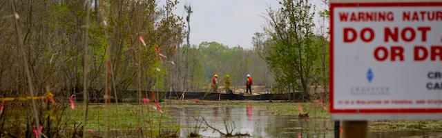

---

Book Review: *Strangers in Their Own Land: Anger and Mourning on the American Right,* by Arlie Russell Hochschild. ISBN: [9781620972250](https://www.goodreads.com/book/show/28695425-strangers-in-their-own-land)

This is a frustrating, disappointing book. It is a book that will make no one happy. Carlos Lozada's review in the Washington Post, for example, accuses Hochschild of condescension and preconceived notions about the Tea Party. The former is partly true. I don't think the author successfully manages to disprove the view many have of the Southern Far Right — that they'll believe any stupid damned thing and will stubbornly vote against their own self-interest. But some Tea Partiers actually liked her book. Ralph Benko, writing in Forbes, called it a "delight" — which might be going a bit overboard.

I found myself wondering where Hochschild was headed in her "exploratory" and "hypothesis generating" study. It took over a hundred pages to lay out her thesis, *finally* described in Chapter 9, "The Deep Story." From time to time Hochschild acknowledges the racism of the South, but there is really only one page (146-147 in the hardcover edition) devoted to it. Instead, environmental protection is the lens through which she timidly chooses to look at values of Louisianans. In Chapter 14 ("the Fires of History") Hochschild discusses the shocks to poor whites following the Civil War that might account for so many today still holding racist views and repressed class antagonisms (think Faulkner's "Abner Snopes"). But, again, it's only mentioned in passing. 

Ultimately, Hochshild's book is a fool's errand. It's impossible to bridge the empathy gap with people who themselves have no empathy for anyone but White Christians. And, though her efforts to empathize with people who reject science, fact, and blame all their problems on others, may be praiseworthy, I just can't bring myself to do it. These are seriously delusional people who have given up on remediating their fracked bayous because they think the Rapture is the proper solution for environmental problems.

There is some truth in right-wing critiques of the book, like Lozada's, that the book paints cartoon characters. In order to explain her subjects' irrational, dangerous, delusional, anti-social, and self-destructive views and behaviors, Hochschild concocts several two-dimensional archetypes — the Team Player, the Worshipper, and the Cowboy. A better analysis would have looked at the effects of generational racism coupled with the toxic effects of propaganda from FOX News and right-wing pastors. And it would have included a critique of Capitalism, a topic Hochschild won't touch any more than her subjects. But Hochschild's goal was to befriend them, not to truly explain the pathology.

I'm sorry, but it's hard to feel sorry for people who home-school their children or indoctrinate them in Christian madrassas, vote to bring cancer-producing industries into their communities, to kill themselves and their children — and then pay the petrochemical companies for the privilege. It's hard to feel much pity for people who believe every stupid lie they hear on FOX News or from the pulpit and uncritically support the most rapacious version of Capitalism — while blaming every brown face in the world for the failures of their *verkakte* worldview.

Rather than bridging the compassion gap, Hochschild's book convinced me that we need to let these people go. Let them secede and form their own Kingdom of Gilead, where they can spend their money on guns, church tithes, and petrochemicals. Let them live with self-inflicted poor health, poverty, superstition, and ignorance until the Rapture vacuums them up.

There are huge and irreconcilable differences between the two Americas. Half of us believe in democracy, the other half in Adam and Eve romping with Ayn Rand around a Deepwater Horizon platform.

Let's get the divorce over with.

