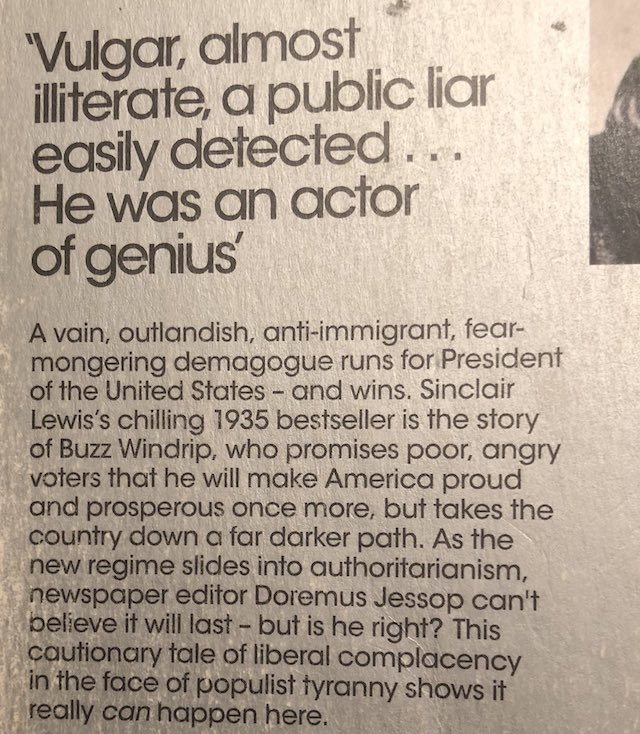

---

Sinclair Lewis’s [It Can’t Happen Here](https://www.nytimes.com/2017/01/17/books/review/classic-novel-that-predicted-trump-sinclar-lewis-it-cant-happen-here.html) — written in 1935 when America had seen the likes of Father Coughlin and Huey Long, and when Lewis could see the Third Reich barreling down on Europe — features a protagonist who was "vulgar, almost illiterate, a public liar easily detected… He was an actor of genius."

Spoiler alert: fascism comes to America. The [back cover](http://www.openculture.com/2018/07/penguin-classics-back-cover-blurb-sinclair-lewis-1935-novel-cant-happen.html) says it all.

