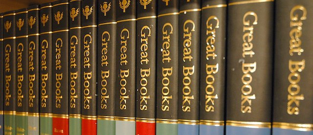

---

The culture wars are nothing new.

Even a hundred years ago White America had seen the writing on the wall. It knew its power was about to peak and would eventually decline. It also knew that culture war would be a potent brake on the process.

And so the *Western canon* — a curriculum exalting Western empire — was developed. In 1909 Harvard University's 51-volume "[Harvard Classics](https://www.goodreads.com/book/show/2689403-harvard-classics)" was published. It represented what any well-educated man of the time should know. The *Classics* were overwhelmingly those of ancient Greek and Roman empires and the rising colonial empires of Europe and America who saw themselves as rightful inheritors. Three non-Western texts were included — the *Sayings of Confucius*, the *Bhagavad-Gita*, and several *surahs* from the *Qu'ran*. But it was largely a white, Christian — and overwhelmingly male — curriculum.

In 1952 [*Great Books of the Western World*](https://en.wikipedia.org/wiki/Great_Books_of_the_Western_World) was published by Encyclopedia Britannica. This time the volumes targeted not an academic audience but businessmen who wanted to fill in educational gaps — and put some nice-looking books on their mahogony shelves. Robert Hutchins, a founder of the project along with Mortimer Adler, announced the books at a ceremony at the Waldorf-Astoria, saying: "This is more than a set of books, and more than a liberal education. *Great Books of the Western World* is an act of piety. Here are the sources of our being. Here is our heritage. This is the West. This is its meaning for mankind." One meaning the selection made crystal clear — only the West was of importance to a well-educated man. Confucius, the Hindus, and Muhammad had been banished from even token appearances this time around.

In 1994 academic Harold Bloom — no WASP but another old white male who called himself a "Jewish Gnostic" — came up with another reading list promoting Western civilization: [*The Western Canon: The Books and School of the Ages*](https://www.goodreads.com/book/show/20941.The_Western_Canon). Bloom's list focused on 26 authors and now represented what some were calling the [Judeo-Christian tradition](https://www.commentarymagazine.com/articles/the-myth-of-the-judeo-christian-tradition/), although he had added a [smattering](https://ebooks.adelaide.edu.au/l/literature/bloom/complete.html) — and a strangely [idiosyncratic](http://www.openculture.com/2014/01/harold-bloom-creates-a-massive-list-of-works-in-the-western-canon.html) selection — of "international" writers. Despite being an update for a post-war America that had received undeniable contributions from Jews, Bloom's "canon" remained one more reading list of largely dead white men written by a member of a slightly, and only reluctantly, enlarged club.

Around this time *another* Bloom — University of Chicago professor Allan Bloom — published [*The Closing of the American Mind*](https://www.goodreads.com/book/show/75812.The_Closing_of_the_American_Mind), which argued that abandoning the Western canon would dumb down students, plunge them into moral relativism, and that modern (and international) culture was bereft of civilizing influences. The book became required reading for neoconservatives like Dinesh D'Souza who himself published one with a similar theme. But what disturbed conservatives the most was that students and academics questioned whether the Western canon actually represented all that was best about the "democratic" Western world — or whether its main purpose was to defend reactionary, colonial, and elitist traditions. Even [the other Bloom](http://www.nytimes.com/books/98/11/01/specials/bloom-canon.html) — Harold — chimed in: "We are destroying all intellectual and esthetic standards in the humanities and social sciences, in the name of social justice." 

Social justice. God forbid.

The Civil Rights movement had been a shock, and the Sixties were bad enough for conservatives. But now students at Ivy League institutions were turning their backs on the Western world — or at least looking occasionally in other directions. These students were painted as lazy, spoiled children of privilege or angry, ungrateful, minority upstarts spitting on what democracy, consumer culture, and affirmative action had graciously afforded them. They wanted to read post-Colonial literature — Black Americans, Africans, Palestinians, Latin Americans, and Asians. Conservatives saw college students under the sway of Svengali academics attacking all that European civilization had done for those they had colonized.

For decades Joseph Campbell was known for books on mythology, comparative religion, and literature. Even today Campbell's studies of the folk tale and, specifically, the "Hero's Journey," are known by just about every working screenwriter — and now even [ISIS](https://www.chicagomaroon.com/2016/02/23/grant-will-explore-echoes-of-hollywood-in-isis-propaganda/). But while the Western canon's treatment of mythology was limited to Europe — mainly Greece, Germany, and Scandinavia — as early as 1952 Campbell slammed the omission of other cultures in his introduction to the [Viking Press Portable Edition of *Arabian Nights*](https://www.goodreads.com/book/show/15822704-the-portable-arabian-nights). Campbell took specific aim at the *Great Books*:

> "... it is remarkable how little is admitted of the Muslim contribution to our culture by those histories (hundreds appear every year) that rehearse the outdated schoolbook story about the Greeks and the Renaissance. In a recent list of "Great Books" not a single volume (save the Bible) is named from east of Suez: Calvin is there, but not Mohammed; Hobbes, but not Confucius; the *Iliad* (which for the past twenty-five hundred years has had no influence whatsoever on civilization, save as an unmastered model for the *litterateurs*), but not the *Mahabharata* (which, during the same period, has been the spiritual sustenance of billions of the world's living people). One searches in vain for a single Buddhist text (the dominant faith of about one-third the world's population), a single Oriental philosopher, a single poet or novelist of the great Chinese, Japanese, Arabian, or Hindu traditions. Such a list, in the present century, is ridiculous, and would be incredible were our Occidental megalomania not one of the most conspicuous of the world's present ills."

Occidental megalomania, indeed.

Fast forward seventy years and most would acknowledge that the old white men lost the Canon wars. But they do keep trying. In 2008 Americans elected a black president who had spent considerable time as a youngster in Asia — and white America didn't like it. In 2010, former MIT literature professor, playwright, and old white man A.R. Gurney — best known for a play about a dog — wrote [*Office Hours*](https://www.goodreads.com/book/show/15758938-office-hours), a [contrived swipe](http://www.nytimes.com/2010/10/01/theater/reviews/01office.html) at lazy plagiarizing students preoccupied with social justice and political correctness — and nasty academic feminists griping about old dead white men. *Office Hours* was a passionate defense — and among the last I can recall — of the *Great Books*, and the play had a mercifully short run. 

[Having lost](https://www.insidehighered.com/blogs/confessions-community-college-dean/remember-canon-wars) the Canon wars, Conservatives now have abandoned their traditional role of defending tradition. Nowadays when it comes to higher education, their new strategy seems to be gutting the humanities, focusing on STEM education, licensing fly-by-night for-profit universities, embracing flat earth anti-intellectualism, rejecting science, and embracing creationism. 

By the time the 2016 election rolled around, the old white men were in full panic. As always, the deck they had stacked and the bizarre election rules they had written guaranteed their presidency — even while losing by three million popular votes. But the gnarled white knuckles of these men are still clenched in a death grip on the levers of government, commerce, and culture. 

But they can't hold on forever. The known world today is no longer quite so flat, quite so white, quite so male, or quite as Western as it was in 1909. 

