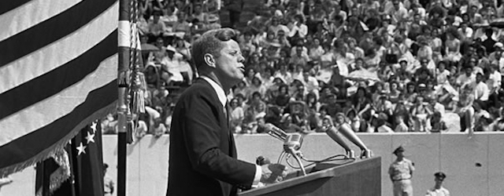

---

Like everyone I have been watching events of the last few months with horror. I don’t mean the Corona virus, which most civilized nations, even the hardest-hit, have managed to confront with strength, medical science, and social responsibility — while the United States instead has chosen denial, lies, and finger-pointing.

No, as bad as it is — and it’s not over by a long shot — the world will survive this as it did the 1918 Spanish flu.

It’s our “democracy” — and the word is in quotes because I’m not convinced we actually have one — it’s our democracy’s demise that’s making me lose sleep.

No need to recite the long list of crimes and usurpations from the fascist playbook that the current President has committed in only the last few months. No need to point out the erratic, disturbing behavior on display daily. Encouraging acts violence, threats to the press, the Justice Department run by a gang of cronies defending criminals. All part of a four year nightmare from which we have not yet awakened.

Even the steady approval the President receives from his “base” of White Christian nationalists, anti-government militias, overt white supremacists and treasonous grifters — this, in one form or another, has been with us since the founding of this slave republic. Historians can fill you in on past centuries, but if you don’t know what’s transpired in your own lifetime, you haven’t been paying attention.

I’ve been relatively silent these last months. Truth is, I’ve said just about everything I’ve had to say about Capitalism, American imperialism, foreign policy, militarism, white supremacy, inequality, immigration, press freedom, democracy, criminal justice, and police accountability.

If, after the second collapse of the American economy in little more than a decade — and if, after seeing precisely on what kind of foundation American Capitalism is based, the kind of people running the show, the total disregard they have for the lives of citizens and how easily they will abuse the power of the state for their own advantage — if after *all this* inescapable reality people cannot recognize America’s true face, then what’s the point of hurling more words into the void?

Hardly surprising, my conservative friends and relatives don’t understand why I have a problem with things that have been working so well for them — *for us, for white America* — these last 400 years. But it is American Liberals that worry me the most.

Here we are, on the cusp of a national election, and Democrats — [correctly identified](http://www.listenliberal.com/) as the party of [upper middle class](https://www.bloomberg.com/opinion/articles/2020-05-24/democrats-have-become-the-party-of-upper-middle-class) elites — don’t know what side they’re on. Of the several trillion dollars of COVID-19 bailout money allocated, little is actually finding its way into human hands. Alexandria Ocasio-Cortez called the amount “crumbs” when refusing to support one rescue bill.

Here we are, faced with the loss of 50 million jobs and the Democratic nominee is still clinging to Obamacare — employer-based healthcare — and his party has never debated [generational poverty](https://www.thenation.com/article/archive/democrat-debate-poverty-california/).

Here we are, faced with a resurgence of lynchings and police abuse, viral infection of prisoners in tightly-packed prisons — and Democrats have said almost nothing about mass incarceration and police accountability.

Here we are, faced with the obvious connections between global pandemics and global environmental crises, and the need to address them urgently — and the DNC still thinks [environmental policy](https://prospect.org/politics/corporate-lobbyists-on-the-dnc-committee-blocked-climate-debate/) and the Green New Deal are too controversial to discuss in public.

My Liberal friends expect me to support a gaffe machine who was just pulled out of storage and still smells of mothballs — this after watching younger, better, smarter candidates of color being systematically flicked off the primary chess board. 

But of course I’ll vote for him. What’s the alternative? A neurosyphilitic white supremacist? Liberals are not wrong to describe the 45th president as a toxic menace. But he’s only a menace because he has so successfully exploited every loophole in a Constitutional government designed by slaveholders to thwart a functional democracy. 

My Liberal friends tell me their man is just the guy America needs to return things to “normal.”

And this is precisely the problem. The “new normal” in America is really just the unavoidably, undeniable cartoon version of the “old normal” Democrats would have us return to. And it does nothing to address underlying problems of economic inequality, racism, militarism, and systemic exploitation and injustice that have made a lot of Democrats financially very comfortable.

Among Democrats there is an obsessive preoccupation with quashing “divisiveness,” a disturbing avoidance of committing to specific policy positions, and an even more disturbing kinship with Republicans — the obsession with “leadership.” Maybe it’s because in a Capitalist society every chief executive is a mini-Stalin, and it’s just another convention we never question. One friend wrote that a detailed party program was wrong, that we should elect Biden and *then* let *him* write it: “once elected, then comes the hard work of determining the specifics.” 

What my friend describes is a very American, very corporate, fundamentally undemocratic, and frankly patronizing, process of leaving heavy thinking to a leader who doesn’t have to follow party principles. In fact, in this world parties don’t have any principles. By the time political decisions are made [lobbyists](https://prospect.org/politics/corporate-lobbyists-on-the-dnc-committee-blocked-climate-debate/) are already running the show — because [they were the ones](https://prospect.org/blogs/tap/say-it-aint-so-joe-biden-rahm-emanuel/) whispering into the candidate’s ear from the beginning.

A recent example of the Liberal preoccupation with “leadership” is a [Washington Post article](https://www.washingtonpost.com/opinions/trump-said-not-a-word-to-soothe-a-smoldering-country-its-time-for-biden-to-step-up/2020/05/29/95cd30f2-a1e1-11ea-81bb-c2f70f01034b_story.html?c=c67fffc2-2d36-49f5-9bcc-5e536e9fb5d0) by Karen Tumulty attempting to connect Joe Biden’s COVID-19 remarks with Robert Kennedy’s after Martin Luther King’s assassination: “Though Kennedy was a white man of enormous privilege, he spoke with the moral authority of one who had lost his own brother to a murderer’s bullet […] Barely two months later, Kennedy himself would be slain. But the words he said still live. They speak not only to what this country can still become, but its need for a leader who can point the way in that direction.”

But nostalgia, name-dropping, and ham-handed metaphors don’t cut it for a lot of Americans. If you hadn’t noticed this week, African Americans are fed up with being killed and fed up with meaningless verbiage.

From [Bakari Sellers](https://www.cnn.com/videos/us/2020/05/28/bakari-sellers-george-floyd-death-newday-vpx.cnn) to [Derecka Purnell](https://www.theguardian.com/commentisfree/2020/may/22/black-americans-joe-biden-democratic-party-relationship) to [Van Jones](https://www.cnn.com/videos/us/2020/05/29/van-jones-george-floyd-white-liberal-hillary-clinton-supporter-sot-newday.cnn) to [Trevor Noah](https://www.thedailybeast.com/daily-show-host-trevor-noah-police-in-america-are-looting-black-bodies) Liberals have had a recent opportunity to hear (again) from black intellectuals and notables in media outlets they are familiar with. And these men and women are not saying anything [past generations](https://www.salon.com/2018/12/09/lorraine-hansberry-american-radical/) haven’t told white Liberals. The question is: why haven’t we been listening?

Van Jones took aim at Liberal hypocrisy: “It’s not the racist white person who is in the Ku Klux Klan that we have to worry about. It’s the white, liberal Hillary Clinton supporter walking her dog in Central Park who would tell you right now, ‘Oh I don’t see race, race is no big deal to me, I see all people the same, I give to charities,’ but the minute she sees a black man who she does not respect, or who she has a slight thought against, she weaponized race like she had been trained by the Aryan Nation.” 

I guess some of us are just a special sort of stupid. If Trump was promising “shooting” for “looting,” [New York City major Bill DeBlasio](https://www.nydailynews.com/new-york/ny-george-floyd-protests-bill-de-blasio-nypd-20200531-jbfxe3i6l5hshji43v4c3mkkza-story.html) was shooting himself in the foot. After [NYPD police officers actually ran over demonstrators](https://www.msn.com/en-us/news/us/they-didnt-start-the-situation-nyc-mayor-defends-police-after-nypd-trucks-drive-into-protesters/ar-BB14Qg0S) with patrol cars, the mayor defended their actions, attributing unrest in the city to “out-of-towners” — apparently the Northern version of “outside agitators.” 

Liberals just don’t know (without running a focus group or consulting pollsters) whose side they’re on.

An [article in the Root](https://www.theroot.com/a-timeline-of-events-that-led-to-the-2020-fed-up-rising-1843780800) ridiculed the White need to “contextualize the anger, frustration and desperation that forced protesters to recreate the lawlessness and chaos that black people experience on a daily basis.” “Alright,” it began. “August 1619…”

It is not a single person, a particular president, or a specific “leader” who is the cancer destroying the United States. It is not bad leadership but Capitalism and White Supremacy that are killing people, impoverishing families, oppressing people. 

If Liberals think that replacing one old white hair-plugged, dental-veneered geezer with another is the only remedy for what ails us, I have some hydroquinone I’d like to sell you.

The issue is not leadership, but the system that the leader leads.

