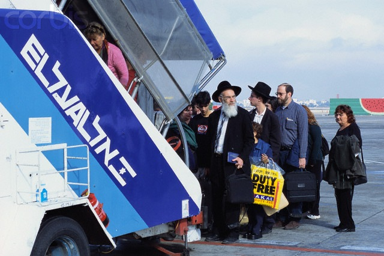
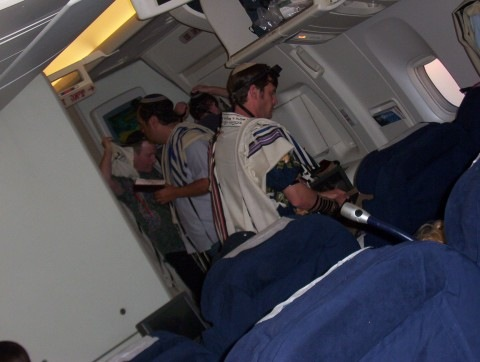

---

Rightwing bigots are bristling at Juan Williams' firing from NPR for his remarks about Muslims on airplanes. Thank goodness he still has that $2 million job at Fox News, which apparently has lower standards of professional conduct or, for that matter, basic human morality.

"I think the U.S. Congress should investigate NPR and consider cutting off their money," said former House Speaker Newt Gingrich, who is _also_ a Fox News contributor. Gingrich called William's' firing "an act of total censorship. [...] I think the whole idea that if you **honestly** say how you feel about Islam &#8212; what he said was **very balanced**, **people should read what he actually said** &#8212; the idea that that's the excuse for National Public Radio to censor Juan Williams is an outrage and every listener of NPR should be enraged that there's this kind of **bias against an American**," Gingrich said.

Ok, Newt, here's what Williams _actually_ said:

> "But when I get on the plane, I got to tell you, if I see people who are in **Muslim garb** and I think, you know, **they are identifying themselves first and foremost as Muslims**, I get worried."

If Gingrich can't understand why these words applied to Muslims are so offensive, perhaps a couple of pictures of air travelers in "religious garb" who are _also_ identifying themselves "first and foremost" as members of a particular religious group will illustrate the pernicious bias against Muslim Americans and the double-standard that NPR finally did something about.

