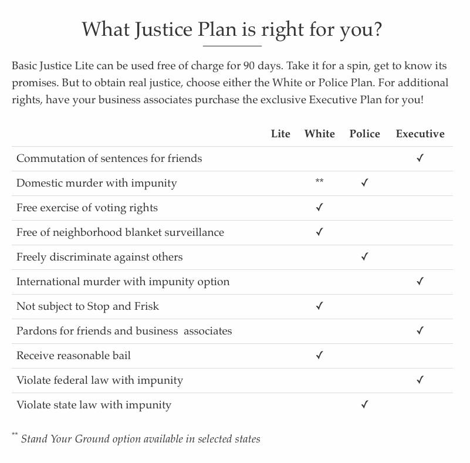

---

I don’t mean to veer into satire — it’s not really a strength and this is hardly a joking matter. But yesterday, as I was checking out the limitations of a piece of “freemium” software (as opposed to buying the full “Pro” plan), it dawned on me that our “justice” system is *exactly* like software with the [Freemium model](https://www.investopedia.com/terms/f/freemium.asp). 

The justice most Americans receive — unless they are white, well-connected, tasked with keeping the poor and people of color in their place with state-sanctioned violence, or can buy impunity — is the inferior “Lite” version.

