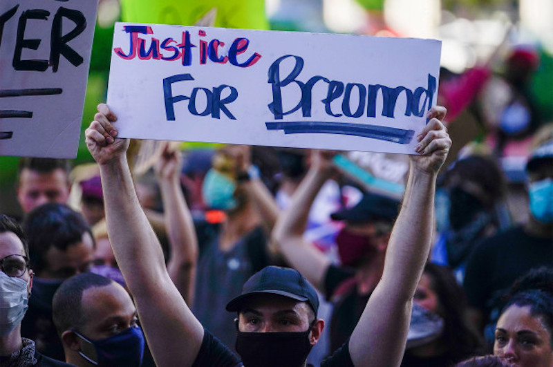

---

Sometime after midnight on March 13, 2020 Breonna Taylor was sleeping when plainclothes Louisville narcotics officers, acting on faulty information, executed a "no-knock warrant" — a violation of almost everything in the Fourth Amendment — breaking down her front door with a battering ram and killing her in the hallway of her own home. 

According to Taylor's mother, Tamika Palmer, police were looking for a drug stash owned by Taylor's ex-boyfriend, who did not live with her and had already been arrested. During the botched raid, Taylor's current boyfriend, Kenneth Walker, assumed it was a home invasion and fired what he said was a warning shot. Police then unleashed a fusillade of 35 rounds on both occupants of the apartment. Taylor was hit six times and several shots were fired into adjacent apartments, endangering three people. As Breonna Taylor bled out, police stood around watching her die, offering her no aid.

Breonna's killing has brought some changes to Louisville Metro Police Department (LMPD) procedures and also resulted in a $12 million wrongful death settlement with the City of Louisville. 

But holding police to account was a bridge too far. 

A Kentucky grand jury presented Judge Annie O'Connell with its recommendation that none of the three officers who shot Taylor ought to face charges. Although former Det. Brett Hankison was indicted on three charges of wanton endangerment — for shooting up the apartments next door — Sgt. Jonathan Mattingly and Detective Myles Cosgrove will not face any charges for killing Taylor. 

Police have been less than honest. Although at least one officer, Tony James, was photographed wearing a body camera, and another officer was filmed wearing a bodycam mount on his vest, LMPD at first insisted there was no bodycam footage. Then Todd McMurtry, Sgt. Mattingly's attorney, miraculously produced bodycam footage of the raid that showed that his client, who was shot in the leg, could not possibly have shot Taylor.

Likewise, Kentucky Attorney General Daniel Cameron's whitewash makes a mockery of fact and law. Cameron claims that Walker was the only one at the scene who could have shot Mattingly because all the officers were carrying .40 caliber handguns. But Det. Brett Hankison — the one who shot up the neighboring apartments — had a 9 mm weapon. Worse, Cameron turns justice on its head by declaring that the police had a right to defend themselves from Walker — even after breaking in, unannounced, in error, and plainclothed. Whatever Cameron's tortured rationale, officers were not defending themselves from a little 26 year-old EMT when they fired almost two dozen rounds at her.

Following the release of Cameron's findings, on September 21st the same police department that killed Breonna Taylor declared a state of emergency, announcing that in anticipation of protests they would be shutting down traffic, limiting parking, and setting up barricades — to protect property.

Breonna Taylor's killing has left Louisville in turmoil. Hearts are broken and in the absence of justice many windows are going to have to be broken to vent outrage at a system that values property more than human life, and black lives least of all.

Breonna Taylor. Say her name. Honor her name. 

If we truly believe in justice in this country, there must also be justice for Breonna Taylor.

