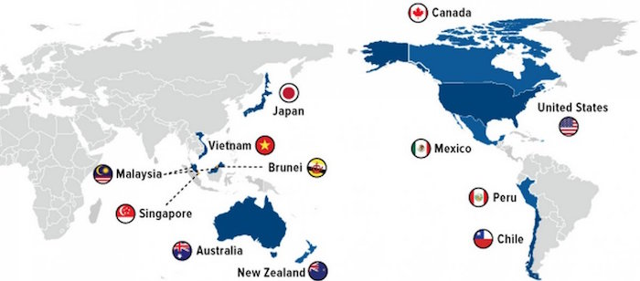

---

There has been a lot of speculation and an enormous amount of nonsense written about the TPP (Trans-Pacific Partnership) agreement. The main reason is that few people really know much about the agreement since it was negotiated in secret and the public (even our legislators) were not privy to its provisions.

This alone should be reason #1 for rejecting it, but it has its supporters.

Big Business loves it. Manufacturers love it. Wall Street loves it. 

But environmentalists see red flags and the words "global warming" appear nowhere in the document. The Electronic Freedom Foundation finds privacy concerns and troubling intellectual propery language. Unions recognize its anti-worker and union-busting provisions.

Hillary Clinton loves it -- though during the primaries she said otherwise. Now she and her running mate love it again. Bernie Sanders opposed it. The Green Party opposes it. The (former Republican) Libertarian candidates support it. 

Donald Trump hates it, while the rest of the GOP loves it. But anything that issues from Donald Trump's mouth must be motivated purely out of xenophobic hate-mongering -- so the TPP must *really* be a good thing. *Right?*

Wrong. On this one thing Trump's right. Read the leaked draft of the TPP yourself and click on the top links to display the annotations by environmental, privacy, and worker's rights lawyers.

[http://www.readthetpp.com/](http://www.readthetpp.com/)

Here is summary of some of the TPP's more troubling provisions:

- Chapter 9 (corporate-appointed judges replace national law)

- Chapter 11 (corporations can block national regulations, including financial regulations)

- Chapter 12 (short-circuiting of immigration regulations)

- Chapter 13 (nations give up their rights to control and regulate telecommunications markets, voiding national control over data protection laws - for example, Germany with its strong data privacy laws)

- Chapter 14 (inadequate provisions for protecting personal information transmitted via electronic commerce)

- Chapter 15 (eliminates provisions allowing states to protect local jobs or address local environmental concerns)

- Chapter 17 (permits state-owned enterprises to maintain price-fixing and dumping, preventing the U.S. from challenging such market manipulations)

- Chapter 18 (overrides domestic laws protecting public health, nutrition, and socio-economic development)

- Chapter 19 (does nothing to address wage inequity or slave wages, blocks corporate exploitation of public-sector or unionized workers, blocks economic penalties for violations of human rights, anti-gay, or racist discrimination)

- Chapter 20 ("climate change" does not appear anywhere in this chapter on the environment, blocks environmental laws that create "restrictions on trade")

- Chapter 24 (blocks small businesses from seeking certain types of "recourse to dispute settlement")

- Chapter 27 (a commission can change the TPP agreement at will - without Congressional approval or public overview - i.e, just like the TPP was crafted in the first place)
