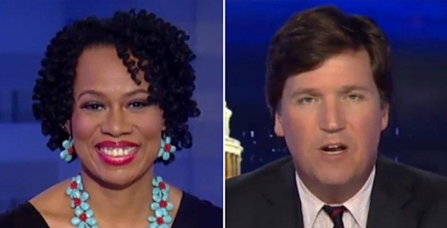

---

### The petition

Last month I signed a [change.org petition](https://medium.com/r/?url=https%3A%2F%2Fwww.change.org%2Fp%2Fessex-county-college-board-of-trustees-reinstate-professor-lisa-durden-equality-for-adjuncts) demanding the reinstatement of [Lisa Durden](https://medium.com/r/?url=https%3A%2F%2Fen.wikipedia.org%2Fwiki%2FLisa_Durden), an adjunct professor at Essex County College in New Jersey. Durden is also a well-known media commentator who in that capacity crossed swords with Tucker Carlson on FOX News, only to lose her part-time teaching job two days later. On the surface it seemed like just another case of an American discovering the limits of the First Amendment.

But as I read more, the story had components that touched on issues of race, gender, corporatism, worker protections for part-timers, and censorship of all types:

- A Black Lives Matter chapter in New York City wanted to celebrate the black roots of Memorial Day — the roots of which most Americans are ignorant.
- The American Right is always looking for an opportunity to smear Black Lives Matter.
- Durden came to BLM’s defense and was censored and insulted as both a black person and as a woman.
- Two days later the “senior management executive” of her community college fired her because free speech and academic freedom are inconvenient luxuries for an institution in crisis — and also because adjuncts are a cheap, disposable resource — just the way corporate America likes it.

Durden’s experience encapsulates a lot that’s wrong with America.

### FOX News and Friends

On June 6, 2017 Lisa Durden, who had previously appeared on the [Kelly File](https://medium.com/r/?url=https%3A%2F%2Fwww.youtube.com%2Fwatch%3Fv%3DDQ3qnYYczCM) at FOX News, appeared on the Tucker Carlson show, also on FOX. [Carlson began his segment](https://medium.com/r/?url=https%3A%2F%2Fwww.youtube.com%2Fwatch%3Fv%3DGfNIgvOFhMw) by showing viewers selected quotes from a Black Lives Matter invitation to a blacks-only Memorial Day Party in New York City. FOX News viewers knew where this was going: demonization of Black Lives Matter, best known for raising hell about the American epidemic of police murders.

But Carlson omitted two key facts in his “set-up”: first, the party was a single event in a single city; and second, the organizers wanted to celebrate the black origins of Memorial Day \[more on this in a minute\]. Carlson also conflated a single celebration with the entire Black Lives Matter movement — which is actually an umbrella organization with many different tendencies and numerous white allies — and then he asked Durden to respond:

> *“… I thought the whole point of Black Lives Matter, one of the points would be to speak out against singling people out on the basis of their race and punishing them for that, because you can’t control what your race is, and yet, they seem to be doing that. Explain that to me.”*

This was supposed to be an easy score against BLM’s supposed hypocrisy but Durden insisted on putting it in context — something ill-suited for FOX viewers.

### The reality of White Privilege

Now, Lisa Durden is no shrinking violet. She is equal parts public intellectual and showman. And there is a very good reason [FOX](https://medium.com/r/?url=http%3A%2F%2Frollingout.com%2F2015%2F09%2F22%2Flisa-durden-remains-brilliant-black-outspoken-todays-social-issues%2F) kept asking her back, particularly to debate FOX’s black reactionary Kevin Jackson on police violence — conflict sells. Durden also has a tendency to tune her BS-detector right up to the max. On this particular evening, when Carlson asked her if it wasn’t racist to have a black-only party Durden responded:

> *“Boo hoo hoo, you white people are angry because you couldn’t use your white privilege card to get invited to the Black Lives Matter, all-black Memorial Day celebration. Wow! Let me contextualize that for you — ”*

And that was enough. Carlson had heard “White Privilege” and it effectively short-circuited portions of the brain related to high-level executive function. He was seeing White and he was seeing Red. In addition, a woman was challenging him. And not only that, Carlson had heard a strong black woman refuse to play along with his patronizing attempt to catch her in a transparent trap. Carlson interrupted Durden, going so far as to cut off her microphone. She had actually dared to offer viewers an explanation for a black celebration of Memorial Day — to “contextualize” it, as she put it. But Carlson just wasn’t having any.

> *“No, you don’t need to contextualize anything for anyone considering your logic is nonexistent and your racism abundant.”*

Durden’s unsympathetic “Boo hoo hoo” was probably the trigger. But now there would be no opportunity to hear Durden’s reasoning, though she tried unsuccessfully to be heard, to explain to viewers that Memorial Day was a commemoration first celebrated by South Carolina slaves. But the FOX segment only went downhill from there.

### Nevertheless she persisted

“A man is the image and glory of God, but the woman is the glory of man” (Corinthians). “Wives, submit to your husbands as to the Lord” (Ephesians). Today’s white male Republicans love to drag their conveniently medieval theology into the public sphere — whether it’s government or a broadcasting studio.

When Elizabeth Warren argued against Jeff Sessions’ racist history during confirmation hearings, Mitch McConnell invoked an arcane [Senate rule](https://medium.com/r/?url=https%3A%2F%2Fwww.washingtonpost.com%2Fnews%2Fthe-fix%2Fwp%2F2017%2F02%2F08%2Fnevertheless-she-persisted-becomes-new-battle-cry-after-mcconnell-silences-elizabeth-warren%2F) barring “insults” to former members of the Senate. When Warren argued Sessions’ record was germane to his confirmation, McConnell angrily defended her harsh censure: “Nevertheless she persisted.” Because once a Good Ole Boy tells you to shut up, you’d better do it immediately.

But if persistence is an offense, derision is a capital offense.

During the same confirmation hearings [Desiree Fairooz](https://medium.com/r/?url=https%3A%2F%2Fwww.laprogressive.com%2Ffemale-laughter%2F), a 61-year-old member of Code Pink, was forcibly removed and arrested for laughing at Jeff Sessions. Fairooz chuckled when Republican Senator Richard Shelby praised Sessions’ “extensive record of treating all Americans fairly under the law,” adding it “is clear and well-documented.” It is remarkable that there wasn’t even more laughter. For more on this topic, see Maggie Hennefeld’s excellent piece in [LA Progressive](https://medium.com/r/?url=https%3A%2F%2Fwww.laprogressive.com%2Ffemale-laughter%2F), “On the Criminalization of Female Laughter.”

Five years ago, when Megan Kelly was still at FOX, she hosted a segment with the express purpose of attacking Elizabeth Warren’s mention of distant Cherokee ancestry. [Kelly asked](https://medium.com/r/?url=http%3A%2F%2Fwww.mediaite.com%2Ftv%2Fmegyn-kelly-apologizes-for-jehmu-greene-calling-tucker-carlson-a-bow-tying-white-boy%2F) both Tucker Carlson and black feminist Jehmu Greene whether this was laughable. Greene defended Warren, pointing out that even the Chief of the Cherokee Nation was only 3% Cherokee and calling out Carlson’s racist and sexist dog-whistles: “You see Scott Brown really questioning her qualifications because he has to appeal to white, working-class voters who feel marginalized because of affirmative action. This smells real stank to women who do not like being called on their qualifications.”

Typically, Carlson made it patronizing and personal with Greene, again challenging a black woman’s reasoning: “It’s so offensive and dumb. But leaving that aside, it does provide a window into a system that is fundamentally corrupt that awards people based on their DNA.” Greene then called him out on both the misogyny and racism: “\[Your attitude\] “is going to appeal to folks like you, voters like you: bow-tying white boys.”

With this past as prolog, Durden’s persistence and derision didn’t go over well with Carlson, or at FOX, the 24 hour racism and sexism channel.

### Freedom of What?

Durden’s firing is not unique. People are dismissed, censored, or punished all the time for views employers, schools, advertisers, [lobby](https://medium.com/r/?url=http%3A%2F%2Fwww.truth-out.org%2Fnews%2Fitem%2F40817-cal-state-university-halts-middle-east-studies-search-due-to-outside-pressure) groups, [internet](https://medium.com/r/?url=https%3A%2F%2Fwww.youtube.com%2Fwatch%3Fv%3DHfS_2oXVch0) service [providers](https://medium.com/r/?url=http%3A%2F%2Fwww.csoonline.com%2Farticle%2F2458621%2Fmicrosoft-subnet%2Ffacebook-posts-can-land-americans-on-watchlists.html), and even [foreign governments](https://medium.com/r/?url=https%3A%2F%2Fwww.commondreams.org%2Fnews%2F2014%2F04%2F18%2Fnyt-slammed-honoring-israeli-govt-gag-orders) don’t like. People can be fired whether they are speaking on or off the clock, as representatives of a group, or simply for themselves. They can be fired for saying nothing but simply *being* who they are — and that includes being gay or [pregnant](https://medium.com/r/?url=http%3A%2F%2Fwww.motherjones.com%2Fpolitics%2F2014%2F02%2Fcatholic-religious-schools-fired-lady-teachers-being-pregnant%2F). They can be fired for being [whistle-blowers](https://medium.com/r/?url=http%3A%2F%2Fwww.cnn.com%2F2013%2F07%2F13%2Fjustice%2Fzimmerman-it-firing%2Findex.html) — even when they are exposing criminal acts.

It’s actually quite distressing how little the First Amendment actually protects freedom of expression.

And it’s not just liberals who run afoul of censorship and retaliation. Bill O’Reilly was fired by FOX by his [advertisers](https://medium.com/r/?url=https%3A%2F%2Fwww.theatlantic.com%2Fnews%2Farchive%2F2017%2F04%2Fwhy-was-bill-oreilly-really-fired%2F523614%2F), though not because of his chronic sexual harassment. Richard Spencer lost a [gym membership](https://medium.com/r/?url=http%3A%2F%2Fthehill.com%2Fblogs%2Fblog-briefing-room%2Fnews%2F334424-richard-spencer-loses-gym-membership-after-confrontation) expressly because he’s noxious white supremacist scum. Tech entrepreneur Brendan Eich [lost his seat](https://medium.com/r/?url=https%3A%2F%2Fwww.theinquirer.net%2Finquirer%2Fnews%2F2336520%2Fmozilla-defends-ceo-over-homophobic-claims) on the board of Mozilla for his homophobic views.

Right or Left, in America social and political “norms” must be enforced and outliers punished. On the Left it’s frequently gay-bashers and neo-Nazis. On FOX it’s simply progressive black women.

### Academic Freedom

But the First Amendment says that government cannot censor you in word or print. This is commonly understood as applying to public or government entities like community colleges and universities. Durden’s firing should certainly trigger a lawsuit for violation of her First Amendment rights.

And there is also a long tradition in colleges and universities of giving faculty members freedom to say what they want without censorship. The American Association of University Professors ([AAUP](https://medium.com/r/?url=https%3A%2F%2Fwww.aaup.org%2Four-programs%2Flegal-program%2Flegal-informational-outlines%2Facademic-freedom-and-professorial-speech)) notes that academic freedom as “common law” has existed since 1940. Many of the rights extended to faculty depend on tenure and teaching status, though there are disagreements among Federal Courts about what rights apply to whom.

Still, the [Collective Bargaining Agreement](https://medium.com/r/?url=http%3A%2F%2Fwww.essex.edu%2Fhr%2Fwp-content%2Fuploads%2Fsites%2F20%2F2013%2F10%2Fhr_download_Adjunct_Faculty_Contract_2011_2014.pdf) under which Durden was hired “declares its commitment to sustain the principles of academic freedom” as well as “retention of all the adjunct faculty members’ rights as a citizen to free speech and publication. Such rights are not, as such, subject to institutional censorship or discipline.” The only caveat in the contract pertains to “the adjunct faculty member’s unusual influence on the opinions and values of the students with whom the adjunct faculty member works.“

But Lisa Durden never identified herself as an Essex faculty member and was attempting only to influence Tucker Carlson's viewers, not a room full of impressionable undergrads.

### Adjuncts

Community Colleges may be called “colleges” but there is a caste system when it comes to teaching in America’s institutions of higher learning. To put it indelicately, adjuncts like Durden are the fast-food workers of the academic world. The AAUP has [attempted](https://medium.com/r/?url=https%3A%2F%2Fwww.insidehighered.com%2Fnews%2F2006%2F09%2F13%2Faaup) to show some solidarity with adjuncts but this has never been translated into anything substantial. Instead, it has been up to advocates like [Robin Meade](https://medium.com/r/?url=https%3A%2F%2Fwww.aft.org%2Fnews%2Fruling-vindicates-adjuncts-right-speak-out), a union organizer for Moraine Valley Community College, to add rights for adjuncts into contracts.

Yet when Meade spoke out about adjuncts being treated as “disposable resources” at her college she had much the same experience as Durden: The “chief of campus police hand-delivered a letter of termination to Meade at her home. Her college email was immediately cut off and locks were changed on the union office at the college.” Meade appealed to the Illinois Department of Labor Relations and she won. Though this was a labor rights case, it also touched on her rights as an academic.

[Seventy-five percent](https://medium.com/r/?url=http%3A%2F%2Fannlarson.org%2F2015%2F11%2F22%2Fladyadjuncts%2F) of faculty members in American colleges are [adjuncts](https://medium.com/r/?url=https%3A%2F%2Fwww.insidehighered.com%2Fnews%2F2008%2F12%2F03%2Fadjunct) and, shockingly, they [earn less](https://medium.com/r/?url=https%3A%2F%2Fwww.insidehighered.com%2Fnews%2F2011%2F01%2F20%2Fstudy_documents_pay_gap_faced_by_adjuncts) than poverty wages. A [majority](https://medium.com/r/?url=https%3A%2F%2Fwww.aaup.org%2FNR%2Frdonlyres%2F08E023AB-E6D8-4DBD-99A0-24E5EB73A760%2F0%2Fpersistent_inequity.pdf) of adjunct faculty members are women — those facing the most discrimination with tenure track positions. And while 60% of adjuncts in [Colorado](https://medium.com/r/?url=https%3A%2F%2Fwww.coloradoan.com%2Fstory%2Fnews%2F2017%2F04%2F20%2Fcsus-gender-gap-goes-deeper-than-pay%2F100562880%2F), for example, are women, they earn significantly less than their male counterparts. And the percentage of adjuncts is increasing nationally, just as part-time workers are increasing in the general labor market.

A typical adjunct can expect to earn $3-$5K for a single semester course. Her union will often — as in Durden’s case — be able to do little for her both in terms of wages or representation. Like Meade, after being fired Durden was denied union representation and treated like a criminal.

Because in the end Durden — like all American workers — was just another disposable resource.

### College or Corporation?

While its adjuncts earn $7 to $8 an hour, Essex County College’s president, [Anthony E. Monroe](https://medium.com/r/?url=http%3A%2F%2Fwww.nj.com%2Fessex%2Findex.ssf%2F2017%2F05%2Fnew_president_takes_helm_of_essex_county_college.html), a former healthcare consultant, earns $215,000 every year. Monroe was hired in May to deal with a stream of crises that have plagued the predominantly black college.

In May 2017 the former president and former university attorney were fired for pursuing an investigation of financial misconduct and coverup by the same administrators who terminated them. Both women are now pursuing wrongful termination lawsuits against the college. Essex is also [at risk](https://medium.com/r/?url=http%3A%2F%2Fwww.nj.com%2Fessex%2Findex.ssf%2F2017%2F05%2Ffired_essex_county_college_president_sues_college.html) of losing its accreditation by the Middle States Commission on Higher Education for “enrollment” and “leadership” issues.

Enter Anthony E. Monroe, Ed.D, MBA, MPH, FACHE.

Monroe’s [resume](https://medium.com/r/?url=https%3A%2F%2Fwww.udc.edu%2Fdocs%2FAnthony%2520Munroe%2520CV.pdf) describes him as a “Senior Management Executive” and his own effusive description of his abilities oozes like a jelly donut with corporate flummery:

> *“Dynamic, energetic, and experienced visionary and strategic executive with 28 year career in complex, world-class institutions that is showcased by an impressive record of leadership and management performance. Significant track record and achievements in delivering strong market, financial, and operational results in very complex and large systems. Recognized for innovative leadership in transitioning underperforming organizations into top producers and guiding others through growth and expansion; skilled in negotiations, changing culture, board relations, creating systemness, improving operations efficiency and project management, driving revenues and market shares, improving productivity and quality, generating savings, enhancing customer satisfaction, managing multi-site operations and integrating systems. Expertise in public health systems operations, physician relations, network development, strategy execution, clinical excellence, financial management, and market growth.”*

Monroe came from City Colleges of Chicago, Malcolm X College, where he was president for seven years. He revamped a $251 million dollar campus, put his fingerprints on a $524 million capital plan, oversaw an 80% increase in degrees, saw graduation rates increase by 3%, and so on. Numbers. Widgets. Percentages. And “systemness.”

But Monroe’s other talent was making controversies go away. While president of Malcom X College, [Dr. Micah Young](https://medium.com/r/?url=http%3A%2F%2Fchicago.suntimes.com%2Fnews%2Fsuit-former-malcolm-x-dean-fired-for-complaining-about-decomposing-bodies-stored-in-lab%2F), Dean of Medical Sciences, informed Monroe that there were four boxes of rotting cadavers stored in an unrefrigerated closet in the James Craig Lab, and that they represented a slew of health and workplace safety [violations](https://medium.com/r/?url=http%3A%2F%2Fwww.nbcchicago.com%2Fnews%2Flocal%2FUnidentified-Corpses-Stored-at-City-Colleges-301826981.html). Within a week Young was out of a job.

Young’s lawyer, Dennis Stefanowicz, said, “He tried to do the right thing for the families and for the individuals who gave their bodies to science. When he tried to do the right thing, he ran into a brick wall, and when he brought the issue to light, instead of taking the time to figure out how the problem occurred and figure out how to right the wrong, they just terminated the person who brought the issue to light. It was the easy way out.”

### Mission Creep

Monroe’s talent for taking “the easy way out” certainly came in handy within weeks of assuming the presidency at Essex County College. Monroe posted a long-winded [justification](https://medium.com/r/?url=http%3A%2F%2Fwww.essex.edu%2Fpr%2F2017%2F06%2F23%2Fstatement-from-essex-county-college-president-anthony-e-munroe-3%2F) for Durden’s firing — one sounding like it had been concocted in a corporate H.R. department but not an institution of higher learning:

> *“While the adjunct who expressed her personal views in a very public setting was in no way claiming to represent the views and beliefs of the College, and does not represent the College, her employment with us and potential impact on students required our immediate review into what seemed to have become a very contentious and divisive issue. \[…\] In consideration of the College’s mission, and the impact that this matter has had on the College’s fulfillment of its mission, we cannot maintain an employment relationship with the adjunct. The College affirms its right to select employees who represent the institution appropriately and are aligned with our mission.”*

When Durden’s case finally goes to court Monroe will have to explain precisely why violating an adjunct’s employment contract was necessary, what he thinks the college’s “mission” is, and precisely how Durden’s private opinions were incompatible with that mission. Or was it simply that Durden's views clashed with Monroe's corporatist views?

### Black Lives Matter

But let’s not forget where this journey began — with Durden defending Black Lives Matter.

Four years ago George Zimmerman killed Trayvon Martin. Many on the jury believed Zimmerman was [guilty of murder](https://medium.com/r/?url=http%3A%2F%2Fwww.nydailynews.com%2Fnews%2Fnational%2Fjuror-b29-george-zimmerman-murder-article-1.1408913) but they were instructed that Florida’s “stand your ground” laws prevented a finding of guilt. Black Lives Matter was born out of this injustice. The murdering of black people is an important part of the BLM movement, but [BLM’s statement](https://medium.com/r/?url=https%3A%2F%2Fcelebrateblm.com%2Fshare%2Fcelebrating4years) describes it as a liberation movement with broader goals:

> *“Four years ago, what is now known as the Black Lives Matter Global Network began to organize. It started out as a Black-centered political will and movement building project turned chapter-based, member-led organization whose mission is to build local power and to intervene when violence is inflicted on Black communities by the state and vigilantes.*
>
> *In the years since, we’ve committed to struggling together and to imagining and creating a world free of anti-Blackness, where every Black person has the social, economic, and political power to thrive.*
>
> *Black Lives Matter began as a call to action in response to state-sanctioned violence and anti-Black racism. Our intention from the very beginning was to connect Black people from all over the world who have a shared desire for justice to act together in their communities. The impetus for that commitment was, and still is, the rampant and deliberate violence inflicted on us by the state.”*

The BLM [movement](https://medium.com/r/?url=https%3A%2F%2Fmic.com%2Farticles%2F159496%2Fexclusive-black-lives-matter-issues-a-statement-on-trump-s-election) foresaw that, especially after the election of Donald Trump, things were going to get ugly — and fast:

> *“What is true today — and has been true since the seizure of this land — is that when black people and women build power, white people become resentful. Last week, that resentment manifested itself in the election of a white supremacist to the highest office in American government.”*

[Newsweek](https://medium.com/r/?url=https%3A%2F%2Fwww.yahoo.com%2Fnews%2Fblack-lives-matter-four-years-140235139.html) cited the Trump administration’s threats:

> *“The president has targeted the organization, especially protesters who have taken to the streets. The White House website went live after inauguration and promised to end the ‘anti-police atmosphere’ while noting ‘our job is not to make life more comfortable for the rioter, the looter, or the violent disrupter.’ Slate wrote about this shift with the headline ‘In One of His First Acts as President, Donald Trump Put Black Lives Matter on Notice.’”*

### Ignorance of American History

The history lesson Durden hoped to remind America of was lost the moment Tucker Carlson heard the words “white privilege.” But the history is quite relevant to this entire story.

In 2011 historian David Blight looked at the history of Memorial Day in a [New York Times piece](https://medium.com/r/?url=http%3A%2F%2Fwww.nytimes.com%2F2011%2F05%2F30%2Fopinion%2F30blight.html), “Forgetting Why We Remember.”

> *“By the spring of 1865, after a long siege and prolonged bombardment, the beautiful port city of Charleston, S.C., lay in ruin and occupied by Union troops. \[…\] Whites had largely abandoned the city, but thousands of blacks, mostly former slaves, had remained, and they conducted a series of commemorations to declare their sense of the meaning of the war. \[…\] The largest of these events, forgotten until I had some extraordinary luck in an archive at Harvard, took place on May 1, 1865. \[…\] After the Confederate evacuation of Charleston black workmen went to the site, reburied the Union dead properly, and built a high fence around the cemetery. They whitewashed the fence and built an archway… \[…\] The war was over, and Memorial Day had been founded by African-Americans in a ritual of remembrance and consecration. The war, they had boldly announced, had been about the triumph of their emancipation over a slaveholders’ republic. They were themselves the true patriots.”*

Though the impulse to honor the half-million Union and Confederate dead was expressed in many such commemorations, black Americans are very likely to have been the first to do so.

This is what Lisa Durden never got to explain to White America.

