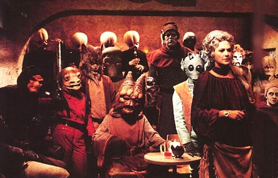

---

Last year in a talk to the youth of her Christian Democratic Union party, Chancellor Angela Merkel declared MultiKulti (multiculturalism) to be dead in Germany. Economist Thilo Sarrizin from the Sozialdemoktratische Partei Deutschland broke with his own party to declare it a failure as well in a badly researched book. In Norway a member of the far Right angered by his own country's embrace of multiculturalism, and exemplified by what he regarded as Creeping Shariah in Europe, murdered many of the next generation of leaders of the Norwegian Labor Party - all children. The fanaticism with which the Right in America has pursued anti-Immigrant, anti-Latino, anti-Muslim, anti-Gay, anti-Feminist, and anti-Secularist rhetoric and legislation, and has had such a bug up its ass since a Black president was elected, got me thinking that when it comes right down to it, **race mixing** is what really upsets them.

All this got me thinking of the ultimate example of multiculturalism we probably all saw years ago in George Lucas's Star Wars. I mean, of course, the bar scene on a remote outpost in space. I went looking for the image and found what I was looking for:

But apparently I was not the first. Our old dependable racist pill popper, Rush Limbaugh, beat me to it, I'm ashamed to say he even had the same picture in mind:

I'm sure Rush would much prefer an America that looks like this homogenous group of _ansehnliche Jugendliche_:

