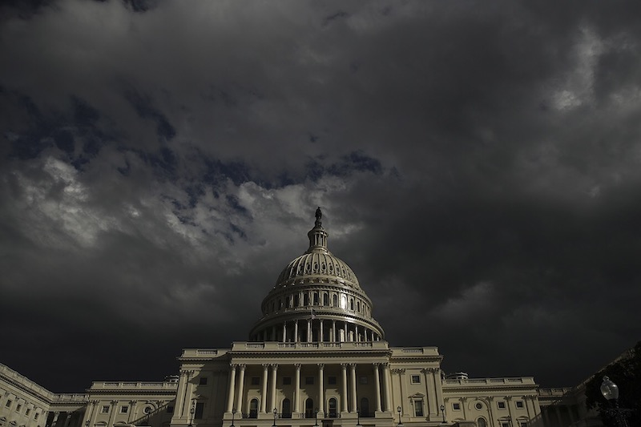
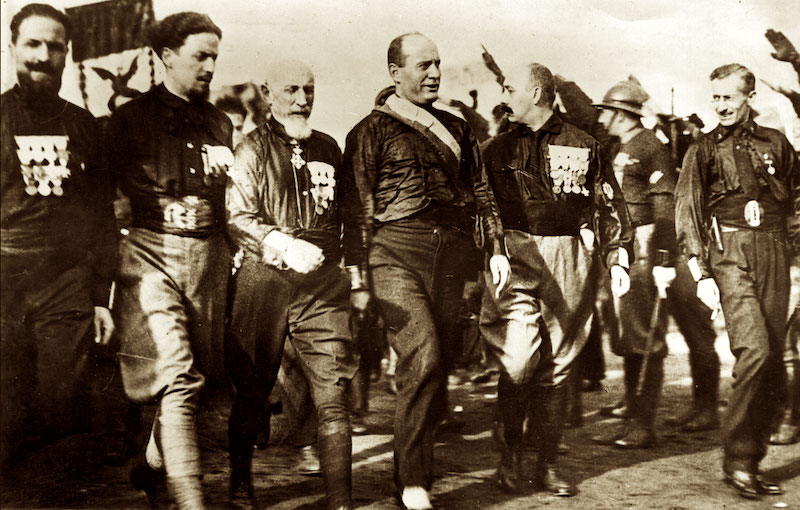
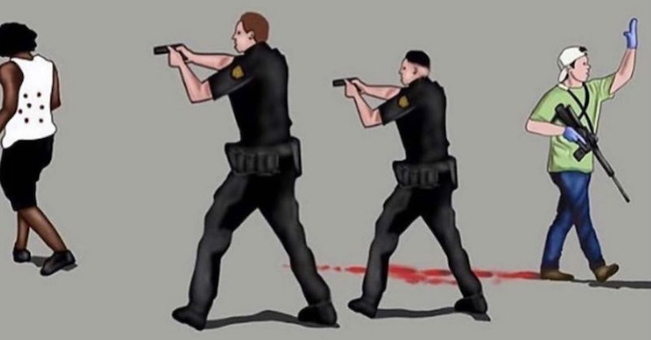
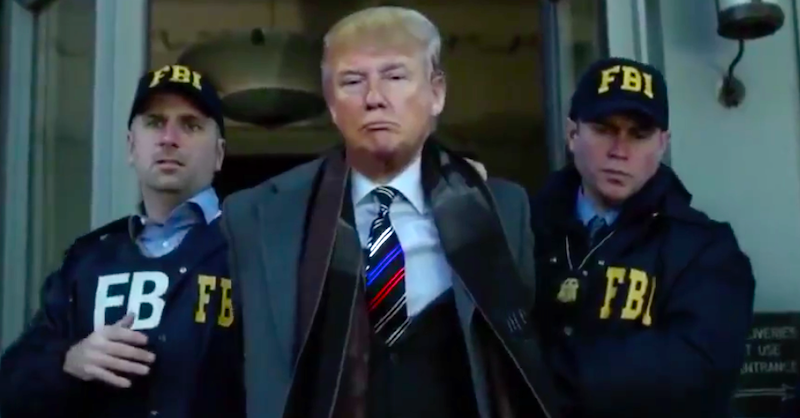

---

In my almost 70 years on this planet, this is my first American coup. And I had been thinking that 2020 was the *interesting* year. I was certainly wrong.

I was going to write about the similarities between last Wednesday's coup attempt and its precedents in the [Munich coup of 1923](https://www.britannica.com/event/Beer-Hall-Putsch) or Mussolini's [March on Rome](https://www.britannica.com/event/March-on-Rome) in October 1922. I though I might mention that the [Mar-a-Lago Führer](https://archive.vanityfair.com/article/share/e515a2cd-a51b-4f83-8d61-6ebb9a104e0a) had long been fascinated by his fascist forebears, even keeping a copy of Hitler's collected speeches in his nightstand, a fact confirmed by multiple sources including Trump himself.

It occurred to me I should also mention the *differences* between these coups — that, unlike Trump's 2021 attempt, the Munich police actually *fought* the 3,000 *Bierkeller* fascists, killing a number of them. Instead, it was reported today that [off-duty police](https://www.washingtonpost.com/national-security/2021/01/09/investigating-police-rioters/) from around the country may have participated in Trump's attempt to derail the certification of Electoral College votes and physically intimidate lawmakers. 

Or that Capitol police, some who appeared in *selfies* with the mob, appear to have actually [invited](https://www.youtube.com/watch?v=aI2609BeLKk) the insurrection into chambers, some armed, some carrying plastic ties to take lawmakers hostage, some erecting gallows, *fixin'* to lynch the Vice President and House and Senate leaders. Videos show police actually [opening the doors](https://www.youtube.com/watch?v=9V_q39nLp_U). And now we read that the [deployment of Maryland National Guard troops](https://www.msn.com/en-us/news/politics/hogan-still-puzzled-by-delay-in-approval-for-maryland-national-guard-assistance-during-capitol-riot/ar-BB1cDdxL) may have been slow-walked by Trump loyalists in the Pentagon. There are a lot of questions to be answered in the investigations I hope are coming.

Unlike Mussolini, who triumphantly entered Rome with his fellow blackshirts, Trump retreated back to his bunker for another cheeseburger, despite promising the mob he would be marching with them. Unfortunately, America's First Fascist didn't even show the courtesy of committing suicide in his bunker like the man whose speeches he loves so much.

But who can say today that they were really suprised by this coup — coming from a man whose administration built concentration camps for children, proposed putting DACA recipients in boxcars and shipping them out of the country, never once distancing himself from his white supremacist base and in fact speaking for them? Who could say they were truly suprised at any of this — from a man who managed to corrupt everyone around him and never once encountered anything but impunity for even the most treasonous actions?

Yet what upsets me the most are the reactions the coup attempt has provoked. 

Even after four years of the most egregious corruption and authoritarianism, the mainstream press still finds it difficult to pronounce Trump's attempt to prevent the counting of Electoral College votes a failed coup. Instead, this retrospectively ham-handed effort is variously described as an *insurrection* or a *riot* — as if it were a fraternity party or a Superbowl celebration that got out of hand. 

It was, of course, no such thing.

I had planned to mention that the all-too-frequently published photo of the Norseman with his spear provided an undeserved comic veneer to what was actually a [deadly coup](https://www.youtube.com/watch?v=lhjRXO72v1s) that cost the life of six people, including two Capitol police officers. Anyone who watches the [videos now surfacing](https://www.youtube.com/results?search_query=trump+coup) understands that many of the participants thought they were part of a "revolution" liberating Congress, just as they had been instructed to "liberate" [state capitals](https://www.motherjones.com/politics/2021/01/trump-supporters-spread-chaos-to-state-capitals/) by the President.

Despite all this, Republicans have refused to invoke the 25th Amendment and we now hear from Jim Clyburn that Democrats will likely conduct an impeachment inquiry 100 days into the Biden administration. Some voices gravely warn us that pursuing justice *at all* will only divide the country.

In the face of all this bending-over-backwards to avoid prosecuting white supremacists and rich white guys, the only concrete response to Trump's coup has been for three social network giants to de platform [Parler](https://www.forbes.com/sites/johnkoetsier/2021/01/09/apple-suspends-parler-from-app-store-until-dangerous-and-harmful-content-resolved/?sh=3962114b448f), the far right version of Twitter, and to ban Trump himself from Facebook and Twitter. There is a long precedent for this. Facebook, Google, and Twitter have been cancelling accounts of terrorists since 9/11, and telecom giants have on occasion [blocked entire websites](https://shadowproof.com/2010/12/15/quasi-governmental-entities-att-and-verizon-blocking-wikileaks-sites/) like Wikileaks. Social networks — precisely like members of the Trump administration now writing their resignation letters — simply didn't care about lies, white supremacy or the threats of violence they suborned until they were *forced* to care.

But punishing one undemocratic action with another is not going to fix what's wrong with American democracy.

Trump's calls to invade the Capitol and disrupt the Electoral College ought to have had immediate consequences. But those who swore to uphold the Constitution violated those oaths. A bunch of pitchfork-wielding white supremacists — even when calling for lynching — apparently did not alarm authorities as much as BLM's calls for police reform this Spring. Support for overturning the Electoral College vote from Republican legislators like Josh Hawley and Ted Cruz should also have set off alarm bells. Well-telegraphed plans to disrupt the election should have resulted in immediate investigations and extra protection for Congress members. Instead, impunity for legislators driving and supporting the coup and violating free speech for everyone else are the only solutions we can come up with.

If overturning the results of a democratic election has no consequences, if coup attempts are trivialized and any thought of prosecuting ringleaders is not pursued, then autocracy will have won.

There have to be consequences for last Wednesday's coup attempt. People must serve some serious time in prison for it, including the President, several Senators and a number of Congressmen, and thousands of white supremacists and conspiracy nuts who broke into Congress and attempted to crush police to death. Some of these spineless Congressmen are now blaming their actions on their own constituents. Michigan Republican Representative [Peter Meijer claimed](https://thehill.com/homenews/house/533548-gop-representative-some-republicans-voted-to-challenge-election-results-due-to) that many Republicans went along with the President's attempt to subvert the election because their constituents had threatened them.

But if none of these instigators, ringleaders, or the organizations responsible for ground operations are held accountable, then let's simply open the nation's prisons — which contain tens of thousands serving life sentences for trivial drug and property offenses. Seriously, just let them go. If there are no consequences for ringleaders of a large-scale coup to overturn an elected government-in-waiting, then why should there be any consequences for a guy who arrested with a little too much weed on him?

The American Constitution has made many of the anti-democratic maneuvers we've seen in the last four years possible, granting excessive power to the Executive, undermining fair elections that everyone must have faith in — and these are all worries of both Liberals and Conservatives. It's something we should all agree on.

If we really want to fix our democracy, we must start by rewriting the awful rule book that governs its operation. 

