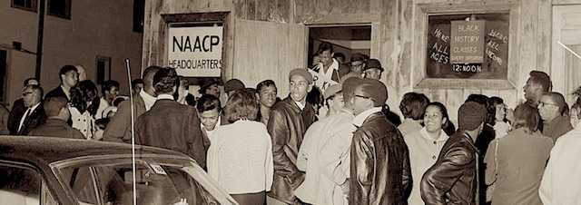

---

The [New Bedford Branch](http://listings.findthecompany.com/l/11993302/National-Association-For-The-Advancement-Of-Colored-People-Inc) of the NAACP is celebrating its 100th Anniversary!  

On December 10, 1917, the National Board of the NAACP chartered the New Bedford Branch, joining a long history of struggle for civil rights and social justice across the nation. Recently a [UMASS Dartmouth branch](https://pbn.com/umass-dartmouth-students-collaborate-new-bedford-naacp/) was formed to work with the city chapter. The New Bedford chapter was formed only eight years after the NAACP itself was established.

To commemorate its centennial, the New Bedford NAACP Branch is holding a [100th Anniversary Gala](http://www.southcoasttoday.com/news/20161210/new-bedford-naacp-to-celebrate-100th-anniversary) on **(Saturday) December 16, 2017 at White’s of Westport, **[66 State Road](https://goo.gl/maps/bJCmZqW8wjC2) in Westport, Massachusetts.

The keynote speaker for this event will be **[Ms. Clayola Brown](http://www.thehistorymakers.org/biography/clayola-brown-41)**, President of the [A. Philip Randolph Institute](http://apricfl.org/) in Washington D.C. and former National NAACP Board Member. The event will feature a cocktail hour, dinner, music and dancing, an awards presentation, and a historical review of the New Bedford NAACP Branch. The occasion promises to be a memorable event to mark the anniversary of the chartering of a branch of the nation’s oldest civil rights organization.

Mark your calendars and please support this tremendous milestone in both national and local history. Tickets for the semi-formal event are $75.00 each and may be purchased by contacting Mr. Peter Silva via e-mail at [degbor.silva2@comcast.net](mailto:degbor.silva2@comcast.net). If you can't attend, buy a ticket anyway and earmark it for a student.

Before the light of brotherly love totally flickers out in this country, it might be a good time to support those fighting for civil liberties and the rights of all of us.

See you on the 16th!

Download the flyer [here](http://newbedford.wpengine.netdna-cdn.com/community-services/wp-content/uploads/sites/17/2017/Gala-Flyer-Final-11-9-b.pdf).