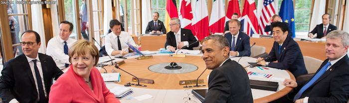

---

When Donald Trump's presidential campaign really started to take off, shocking everyone, pundits ascribed its success to White Anger. The consensus in the Liberal media was that Trump's supporters were basically all "Abner Snopes" -- William Faulkner's angry white sharecropper, racist white trash. At the time pundits made more of Snopes' racism than the fact that he burned down the barns of rich white men. In fact Snopes would have happily burned down both Trump Tower *and* the Clinton mansion in Chappaqua. Ultimately it wasn't race that made Abner Snopes angry.

But now that Trump is the GOP candidate and shock and awe has truly set in, Liberals are still scratching their heads. The same distrust of globalization has popped up in Britain with the Brexit, and it's only slowly dawning on Liberals that there's much more to it than racism or xenophobia. But no matter -- Democrats don't need to address such issues head-on if Trump can be a new Hitler.

The *Atlantic Monthly* published a piece recently that takes another shot at understanding Donald Trump's appeal among poor whites and their anger at the "Liberal elites" they say are largely responsible for their misery. And poor whites have a point, though the Republican Party has done nothing to help them either.

<http://www.theatlantic.com/magazine/archive/2016/09/the-original-underclass/492731/>

Liberals see the real racism of poor whites lashing out at demographic shifts and ascendant minorities. It's not an illusion. But they also judge poor whites to be doing little to "better themselves" -- a strange formulation which, if directed at people of color, would sound a lot like unvarnished racism. Yet this is a common view among many well-educated Liberals -- people like you and me. In years past we told the lazy bum, "Go get a job." Now we tell him to go get a master's degree. This is the essence of the meritocracy: work hard and get ahead. We pat ourselves on the back that we're not racists because both Mark Zuckerberg and Barak Obama merit our approval.

But just as Capitalists assume markets and resources are infinite, Liberals assume the capacity to replace manufacturing jobs with highly-skilled technology jobs is equally unbounded. Yet, for a multitude of reasons, not every unemployed factory worker is going to make a happy transition to web designer or CNC programmer, particularly if he's been out of work a decade. And how do Liberal policy makers intend to deal with this fact of life? They have no solutions.

The authors of the Atlantic piece make the case that it is the *neoliberalism* which upper middle class whites uncritically support -- people like you and me -- that has created unemployment, trade imbalances, and economic disaster for the working class -- and this obviously includes the *white* working class. Liberals -- people like you and me -- see ourselves, however fuzzy the image in the mirror, as part of the meritocracy -- people who have gotten up early, gone to bed late, attended night school, lifted ourselves up by the boot-straps. Anyone who didn't manage to replicate our feats of dedication, perserverance and daring is a loser. How very like Trump we really are.

Consider a recent Town Hall meeting in Elkhart, Indiana, at which President Obama patiently explained to an older Carrier air conditioning employee that there is little that we can do as a nation to help people like him when factories like his move to Mexico. *Yes, people like you are affected*, the President explained with characteristic eloquence, *but America is moving forward with high-tech jobs in exciting new industries and training is the key*. End of discussion. Go get some training.

But in what? No one in Free Market paradise has either a crystal ball or a Five Year Plan.

So there seems to be a somewhat *magical* view that sending people off to community college or paying for everyone to attend four year colleges will solve employment problems without any long-term economic planning or public-private training partnerships. As if there were not enough issues on its plate, Education has now become *totally* responsible for fixing the social problem of unemployment.

But back to Elkhart, Indiana. The older Carrier employee just stood in the aisle, a bit surprised at the President's answer, and respectfully mute as the Chief Executive explained why the country was leaving him behind in its wake of progress. When I recounted this story to a friend of mine, she had little sympathy for the air conditioning worker. "I put myself through college. He could have done it too."

The picture of Poor White America as lazy racist "white trash" -- Abner Snopes again -- is pervasive. It's also not easy to reject completely if you've ever seen the Tea Party in action. But like everything in this country, the reality is always more complex. The authors of the Atlantic piece argue that we should have seen all this coming long, long ago, and they lay the blame squarely at the feet of people -- like you and me -- who identify as Democrats and progressives.

*We* created these policies. *We* hardened our hearts. *We* looked away from the misery right in our own backyards -- all while saving endangered species and writing checks to *truly* worthy causes. *We* do this at a distance -- like the far-off wars which Liberals regularly vote for -- without once seeing the real human costs. And *we* do this from our perch of superiority and entitlement.

But here is how Trump's supporters see it in the small towns where jobs are long gone:

> "The demoralizing effect of decay enveloping the place you live cannot be underestimated. And the bitterness -- the “primal scorn” -- that Donald Trump has tapped into among white Americans in struggling areas is aimed not just at those of foreign extraction. It is directed toward fellow countrymen who have become foreigners of a different sort, looking down on the natives, if they bother to look at all."

And we do this to *everyone*, not just Poor White America.

Earlier in the year the Atlantic ran another piece on the white working class. Again, the takeaway from this article was that it's the upper middle class -- shrinking by the second -- that has transmuted into a meritocracy of college graduates for whom advanced degrees are almost a necessity, who receive the majority of high-paying jobs and leave the rest of America behind:

http://www.theatlantic.com/business/archive/2016/01/white-working-class-poverty/424341/

The idea of a meritocracy is hardly new, but *those who merit* have shrunk to a kernel consisting mainly of the white upper middle-class. Though meritocracy seems almost an article of American faith, both Conservatives and Progressives now increasingly see it as a sham, a cruel lie that masks the fact that the *true* predictor of success in America is your father's wealth. Here's how the Wall Street Journal sees it:

<http://blogs.wsj.com/economics/2015/05/12/american-meritocracy-isnt-what-it-used-to-be-in-five-charts/>

But don't say that to a Liberal Democrat.

Democrats are no less rigid or doctrinaire than their Republican brethren. Few who regard themselves as straight-ticket Democrats want to confront the party's neoliberalism -- globalism, trade, the "meritocracy."  Liberals are *shocked* that a whole new generation of voters hasn't accepted this article of faith and is holding out for a different kind of America. It was *unthinkable* that 46% of the Democratic Party membership in Philadelphia actually meant what they said about the Trans-Pacific Partnership. *And, anyway, they weren't really Democrats*.

But rather than examining what neoliberalsm has actually wrought, Democrats have taken a lazy, even dishonest tack -- distracting voters with external threats. A piece in "Overland," a progressive Australian journal, describes the shameful strategy of presenting Trump as little more than a fascist:

http://overland.org.au/2016/08/trump-fascism-putin-and-wikileaks-the-anatomy-of-a-liberal-nervous-breakdown/

The basic point of the article is that -- without any firm identity or an understanding of who it actually serves -- the Democratic party's survival depends mainly on frightening the bejesus out of members and voters alike. The DNC stands *for* nothing this year -- only *against* a manufactured threat of "fascism."

The author of the Overland piece quotes Thomas Frank's thesis, which is developed in his book "Listen, Liberal:"

<http://www.goodreads.com/book/show/30325613-listen-liberal>

Diane Ravich summarizes it this way:

> In recent years, the Democrats have been consistently liberal on social issues, but indistinguishable from the Republicans on economic issues. They are as likely to be as hostile to unions as Republicans. Their unabashed support for free trade hurt the working class and exported the manufacturing sector. America used to be a country where a person without a college degree could get a good job, but now a college degree is priced beyond the reach of low-income and even middle-income students.
>
> What happened to the Democrats? He says that they have been blinded by their Ivy League pedigrees, and they surround themselves with people just like themselves. Their class interests blind them to the needs of working-class Americans. They do not hear from people outside their social and economic class. He takes Bill Clinton and Barack Obama as examples of people who were plucked from obscurity and turned into superstars and came to believe that meritocracy would solve the nation’s problems. They were wrong. Meritocracy served to put them out of touch and to insulate them from different points of view.

Bill Moyers interivewed Franks as well:

<http://billmoyers.com/story/author-thomas-frank-talks-hillary-clinton-bernie-sanders-and-his-new-book-listen-liberal/>

Democrats can no longer claim to be the party of the people. As Franks argues, we -- people like you and me -- have become neither fish nor fowl -- neither "the people" nor the oligarchic 1% that owns and runs the country. Liberals have become almost a separate class, lost and confused about their true identity and unreliable in their allegiances. We are really nothing but the pampered accountants, fixers, and middle management for the 1%. And if you've ever listened to Phil Ochs' "Love me, I'm a Liberal," it's been this way longer than any of us can remember.

