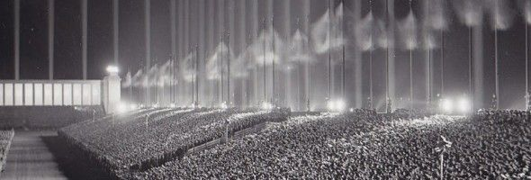

---

Donald Trump's habit of quoting [Mussolini](http://www.nytimes.com/politics/first-draft/2016/02/28/donald-trump-retweets-post-likening-him-to-mussolini/) and praising [Putin](http://www.washingtonpost.com/politics/inside-trumps-financial-ties-to-russia-and-his-unusual-flattery-of-vladimir-putin/2016/06/17/dbdcaac8-31a6-11e6-8ff7-7b6c1998b7a0_story.html), [Saddam](http://www.cnn.com/2016/07/05/politics/donald-trump-saddam-hussein-iraq-terrorism/index.html), and even [Kim Jong Un](http://www.thestar.com/news/world/2016/01/09/donald-trump-says-kim-jong-un-deserves-credit-for-wiping-out-rivals.html) has been duly noted. The [racist and xenophobic nature of the Tea Party](http://donate.naacp.org/page/-/TeaParty/TeaPartyNationalism.pdf) faction, which has now consumed the Republican Party and anointed Trump as its mouthpiece, has been well-studied and documented. The F-word (fascism) has been mentioned many times when discussing the Trump phenomenon. Even [members of his own party say he is](http://www.cnn.com/2015/11/24/politics/donald-trump-fascism/index.html) a fascist.

But it wasn't until [Trump's acceptance speech](http://www.nytimes.com/2016/07/22/us/politics/trump-transcript-rnc-address.html) at the Republican National Convention last night that I realized how much Trump seems to consciously emulate fascist rhetoric. Last night he was selling American nationalism, pride, and strength by demonizing others -- and doing it in an eerily familiar way. His wife isn't the only one in the family to lift themes from others' speeches: Trump's remarks could easily have been lifted from an Austrian fascist who delivered a [pre-election appeal](http://archive.org/details/19320715Hitlerappealtothenationae) to *das Volk* on July 15, 1932.

The fascist's speech began with a litany of complaints about the degradation of the German people and its fall from greatness. The Liberals, he said, had had "more than thirteen years to be tested and proven" and turn things around. But they had failed the nation, delivering only propaganda and lies. "The German peasant is impoverished; the middle class is ruined; the social hopes of many millions of people are destroyed." There was not a single economic sector doing well in 1932, he claimed.

"The worst thing," he continued, "is the distruction of the trust in our Volk, the elimination of all hope and confidence." In thirteen years all the liberals had succeeded in doing was polarizing the country. "They have played people against each other; the city against the country; the service worker against the civil servant, the manual laborer against the office worker." 

"Now, thirteen years later, after they have destroyed everything in Germany, the time has finally come for their own removal," he warned.

What the nation needed now was economic policy fused with nationalism.

 Germany First.

"As long as Nationalism and Socialism march as separate ideas, they will be defeated by the united forces of their opponents."

And who would save the nation?

He would. of course. He would be the great unifier, giving Germans their first hint of the man's megalomania and narcissism. He went on to proudly cite the number of his supporters:

"With seven men I began this task of German unification thirteen years ago, and today over thirteen million are standing in our ranks. [...] Thirteen million people of all professions and ranks -- thirteen million workers, peasants, and intellectuals; thirteen million Catholics and Protestants..."

And he would have the last laugh at those who doubted him, opposed him.

"Thirteen years ago we [...] were mocked and derided -- today our opponents' laughter has turned to tears!"

And now for *The Close*. He was selling himself -- by promising honor and greatness.

"The Almighty, Who has allowed us in the past to rise from seven men to thirteen million in thirteen years, will further allow these thirteen million to become a German Volk. It is in this Volk that we believe, for this Volk that we fight; and if necessary, it is to this Volk that we are willing [...] to commit ourselves body and soul."

"If the nation does its duty, then the day will come which restores to us: one Reich in honor and freedom..."

And -- well, you probably know the rest of the story.
