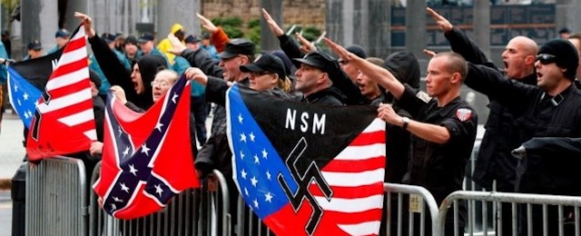

---

Yesterday's [terror attack in Charlottesville](http://www.cnn.com/2017/08/13/opinions/charlottesville-act-of-domestic-terrorism-bergen/index.html) reminds us how openly America's white sheets and brown shirts have been displayed for years, and how dangerous they've always been -- especially since Donald Trump's embrace. White supremacists and neo-Nazis were in Charlottesville this week as part of white supremacist Richard Spencer's "Unite the Right" rally. They were in town to protest the removal of a Confederate statue, a lingering symbol of slavery. Yesterday former KKK Grand Wizard [David Duke](http://www.huffingtonpost.com/entry/david-duke-charlottesville-rally-trump_us_598f3ca8e4b0909642974a10) was out singing Trump's praises, while the night before [Spencer](http://www.cbsnews.com/news/charlottesville-protest-richard-spender-kkk-robert-e-lee-statue/) was carrying Klan torches.

And then James Fields, a member of [Vanguard America](http://www.nydailynews.com/news/national/charlottesville-suspect-held-hate-group-shield-attack-article-1.3407245) with a Hitler haircut, tore through a pedestrian mall in his Dodge Challenger, mowing down dozens of people and killing one. Most [media outlets](http://fair.org/home/for-media-driving-into-a-crowd-of-protesters-is-a-clash/) reported the terror attack as part of a "clash" that occurred at a protest, but after [years and dozens of right-wing attacks](https://www.splcenter.org/20100126/terror-right), the attack illustrated the need to start taking American fascism seriously.

The Great new America Trump promises is founded on toxic, racist and authoritarian politics we haven't seen since 1925. That was the year the United States had [4 million members](http://www.splcenter.org/fighting-hate/extremist-files/ideology/ku-klux-klan) of the Ku Klux Klan. Now racists and fascists feel emboldened to march in public. After all, they're in the White House.

The Trump campaign finally found its winning ticket with a [third campaign manager, an anti-Semite](http://forward.com/news/354329/will-steve-bannon-be-the-anti-semitic-firebrand-in-donald-trumps-inner-circ/) with a soft spot for neo-Nazis who tapped into the American cesspool of racism and authoritarianism. Trump's Attorney General, Jeff Sessions, is an unrepentant segregationist. Three of his advisors, Steve Bannon, Stephen Miller and Sebastian Gorka, have ties to neo-Nazi groups. America's white supremacist in chief himself receives daily cabinet briefings. And, as the NAACP pointed out seven years ago, the House's Tea Party members are [riddled with racist and neo-Nazi elements](https://naacp.3cdn.net/36b2014e1dddfe3c81_v7m6bls07.pdf). 

After the Charlottesville attack Republicans issued a series of insincere repudiations of white terror, but took pains not to alienate their base. Paul Ryan, for example, called [white supremacy](http://thehill.com/homenews/house/346361-ryan-white-supremacy-is-a-scourge) a "scourge." But scourge or not, racists comprise a [majority](http://www.publicpolicypolling.com/pdf/2015/PPP_Release_National_90115.pdf) of Trump's supporters. David Duke reacted to Trump's not-quite-a-condemnation of the terror attack, warning: "I would recommend you take a good look in the mirror and remember it was White Americans who put you in the presidency, not radical leftists."

And the GOP knows it. They courted it. They count on it.

Unfortunately Democrats have little inclination to fight back. Whether by denial, PTSD, or Stockholm Syndrome, the DNC seems to be moving toward the right along with the Republicans. Rather than convincing DNC leaders that political centrism is an empty husk, the shellacking the party took in 2016 appears to have made it even *less* willing to be the party to defend Americans from institutionalized racism and bigotry.

When Democrats unveiled their [Better Deal marketing strategy](http://www.nationalreview.com/article/449815/democrats-better-deal-falls-flat), they did so only a hundred miles from Charlottesville, focusing strictly on economic issues -- making it clear their purpose was to attract Southern white voters. This appeared to be a repudiation of the "identity politics" [some hold responsible](http://www.nationalreview.com/article/442534/identity-politics-tim-ryan-mark-lilla-call-end-democrats) for the loss of the 2016 Presidential election. [Jamil Smith](https://www.vanityfair.com/news/2017/08/why-the-democrats-better-deal-is-political-suicide) wrote in Vanity Fair that the Democrat's new campaign is wrapped in Red, White, and Blue and doesn't dare tread on issues of social justice: "Party leadership seems to want a divorce from identity politics. Or a trial separation, at least."

A piece in the New York Times right after the election by Mark Lilla  ("[The End of Identity Liberalism](http://www.nytimes.com/2016/11/20/opinion/sunday/the-end-of-identity-liberalism.html)") castigated liberals for celebrating diversity instead of commonality. [Lilla advised liberals to turn their backs on civil rights](http://verysmartbrothas.com/mark-lillas-the-end-of-identity-liberalism-is-the-whitest-thing-ive-ever-read/) "issues that are highly charged symbolically [...], especially those touching on sexuality and religion. Such a liberalism would work quietly, sensitively and with a proper sense of scale. [...] America is sick and tired of hearing about liberals’ damn bathrooms." But it wasn't just bathrooms. As Lilla observed, it's *every* issue pitting fundamentalism against secular Americans.

In retrospect, the DNC seems to have listened to Lilla and those like him. Besides backing away from "identity politics" the DNC now won't even unequivocally support [abortion rights](http://thehill.com/homenews/campaign/330992-dems-struggle-with-abortion-litmus-test). Secularism and multiculturalism, it seems, are not to be major efforts of the new Democratic Party.

Steve Phillips, columnist, civil rights lawyer and [author](https://www.goodreads.com/book/show/25159295-brown-is-the-new-white), hammers the DNC's "Better Deal" as not only a [repudiation](http://therealnews.com/t2/index.php?option=com_content&task=view&id=767&Itemid=74&jumival=19745) of America's true majority but as a case of moral delinquency:

> "Rather than draw a line in the sand, speak out against that, summon people to their highest and best selves to actually embrace a multi-racial country that we have, the Democrats are putting their head in the sand and ignoring that and simply trying to go after this economic message, which is both mathematically unfounded as well as morally delinquent in terms of speaking up to the outrages and the attacks on the various communities of color and the other marginalized groups in this society that this administration is doing."

[The GOP is 89% white, while that number is 60% for Democrats](http://www.gallup.com/poll/160373/democrats-racially-diverse-republicans-mostly-white.aspx). For decades it has been up to the Democratic Party to defend civil rights of all types -- abortion, voting rights, wage parity, marriage equality, privacy -- rights the GOP works so tirelessly to dismantle.

But now the DNC has handed in its resignation at the worst possible time.

