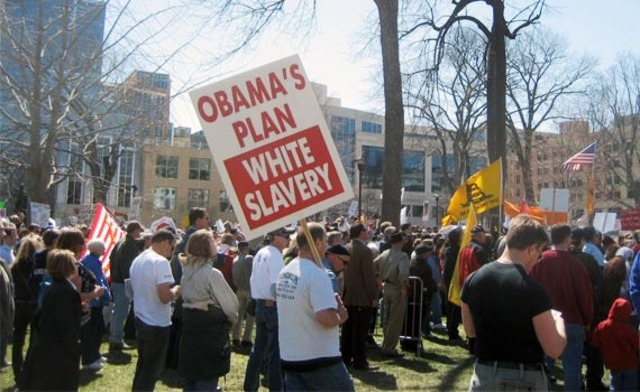

---

loonwatch has previously reported the links between the Tea Party and the far-right [English Defense League](http://www.loonwatch.com/2010/10/the-edl-and-the-tea-party-joining-forces/) or individual loons like [Rick Lazio](http://www.loonwatch.com/2010/09/rick-one-issue-lazio-loses-to-paladino/), [Rabbi Nachum Shifren](http://www.loonwatch.com/2010/10/rabbi-nachum-shifren-edl-is-the-salvation-of-the-west-from-muslim-dogs/), and a [Brooklyn group](http://www.loonwatch.com/2010/10/brooklyn-mosque-rally-turns-ugly/) protesting Park51. We've posted [Tea Party Express organizer](http://www.loonwatch.com/2010/07/racist-mark-williams-calls-naacp-racist/) Mark Williams' "Allah is a Monkey God, Muslims are His Animals" remarks along with his amusing charges that the NAACP is a "racist" group. We've posted the [NAACP's resolution](http://www.loonwatch.com/2010/07/naacp-tea-party-movement-is-racist/) condemning racism within the Tea Party.

Now the [Institute for Research & Education on Human Rights](http://www.irehr.org/) has released a [study of the Tea Party showing that nativism and bigotry is rampant](http://teapartynationalism.com/) within the movement. It's not just blacks, gays, Latinos, immigrants, and Muslims. 

Tea Partiers are equal opportunity haters.

The [complete 94-page report](http://www.teapartynationalism.com/pdf/TeaPartyNationalism.pdf), which [studies six of the national Tea Party organizations](http://teapartynationalism.com/index.php?option=com_wrapperhttp://teapartynationalism.com/index.php?option=com_wrapper&view=wrapper&Itemid=260view=wrapperhttp://teapartynationalism.com/index.php?option=com_wrapper&view=wrapper&Itemid=260Itemid=260) and includes a forward by NAACP President Benjamin Todd Jealous, notes several efforts that the various Tea Party organizations have made to soften criticism for their racism. For instance, Mark Williams was eventually fired for his Islamophobic remarks, as was Tim Ravndal for his calls for violence against gays. It also cautions that not everyone within the Tea Party movement is a racist:

> "It would be a mistake to claim that all Tea Partiers are nativist vigilantes or racists of one stripe or another, and this report manifestly does not make that claim. As this report highlights, however, all of the national Tea Party factions have had problems in these areas. Of the national factions, only FreedomWorks Tea Party, headquartered in the Washington, D.C. area, has made an explicit attempt to narrow the focus of the movement as a whole to fiscal issues -- an effort that has largely failed, as this report documents."

But the report takes the Tea Party to task for the nativism found within most groups, suggesting that its core issues are less economic and more xenophobic:

> "The result of this study contravenes many of the Tea Parties' self-invented myths, particularly their supposedly sole concentration on budget deficits, taxes and the power of the federal government. Instead, this report found Tea Party ranks to be permeated with concerns about race and national identity and other so-called social issues."
>
> "While Tea Partiers and their supporters are concerned about the current economic recession and the increase in government debt and spending it has occasioned, there is no observable statistical link between Tea Party membership and unemployment levels."

The report warns:

> "Tea Party organizations have given platforms to anti-Semites, racists, and bigots. Further, hard-core white nationalists have been attracted to these protests, looking for potential recruits and hoping to push these (white) protestors towards a more self-conscious and ideological white supremacy. One temperature gauge of these events is the fact that longtime national socialist David Duke is hoping to find money and support enough in the Tea Party ranks to launch yet another electoral campaign in the 2012 Republican primaries. [...] The leading figures in one national faction, 1776 Tea Party (the faction more commonly known as TeaParty.org), were imported directly from the anti-immigrant vigilante organization, the Minuteman Project. Tea Party Nation has provided a gathering place for so-called birthers and has attracted Christian nationalists and nativists."

The largest and fastest growing group is [Tea Party Patriots](http://teapartynationalism.com/index.php?option=com_k2&view=item&layout=item&id=97&Itemid=272). The report describes its May 2010 convention in Gatlinburg:

> "Notable among the workshops were presentations by **Pam Geller**, an anti-Islam agitator; and a set by the Oath Keepers, a quasi-**militia** group that focuses on recruiting law enforcement officers and military personnel, and defending their version of the Constitution. A similar workshop with Spike Constitution Defenders, mixed a bit of Posse Comitatus-style rhetoric into their propaganda. Another workshop presenter, Samuel Duck, conducted a workshop advocating repeal of both the Sixteenth and Seventeenth Amendment."

The second largest Tea Party group is [ResistNet](http://teapartynationalism.com/index.php?option=com_k2&view=item&layout=item&id=92&Itemid=270) which is described as "notable" as a home to nativists and Islamophobes. It includes a number of militia members and anti-immigration activists, including Robert Dameron, founder of Citizens for the State of Washington (Yakima, WA); Wendell Neal, leader of the Tulsa Minutemen (Broken Arrow, OK); Mike Jarbeck, director of the Florida chapter of the Minuteman Civil Defense Corps (Orlando, FL); David Caulkett, creator of IllegalAliens.us and Report Illegals (Pompano Beach, FL); Robin Hvidston of the Southern California Minuteman Project and Gilchrist Angels (Upland, CA); Ruthie Hendrycks, founder of Minnesotans Seeking Immigration Reform (Hanska, MN); Evert Evertsen, founder of Minutemen Midwest (Harvard, IL); and Rosanna Pulido, the founder of the Chicago Minutemen and a former staffer for the Federation for American Immigration Reform (Chicago, IL).

The report adds:

> "Another ResistNet partner organization is TakeAmericaBack.org, a website launched in April 2009 to publish **anti-immigrant** propaganda. One article claimed that 'multiculturalism' demands that 'Americans learn to speak Spanish so illegals can take over America with foreign cultures.' Another article on this site concluded that 'a Kenyan, Communist, son of a terrorist, as our wannabe president, who has not only expressed his hatred of America, but is also an avowed Muslim...' Also included among the official partners is a trio of groups run by anti-Islam activist **Pam Geller**."
>
> "It is this untenable attempt to vilify President Obama as 'non-American' and 'foreign' that pushes a significant number of ResistNet Tea Partiers out of the ranks of a responsible opposition and into the columns of bigots and xenophobes."

One minor quibble: it's not just the attack on President Obama that moves these wackos into the column of bigotry and xenophobia.

Next in membership and growth is [Tea Party Nation](http://teapartynationalism.com/index.php?option=com_k2&view=item&layout=item&id=95&Itemid=271). Describing its Convention in Nashville in February 2010:

> "Despite all of these pre-conference difficulties, the convention in Nashville was well attended. Sarah Palin spoke there, generating discussion about her speaking fee, rumored to be over $100,000. Underneath the hoopla attending Palin's appearance, the convention highlighted the place of Christian conservatives, indeed **Christian nationalism**, inside this movement generally, and in Judson's Tea Party Nation specifically. The convention also built bridges to nativists and so-called birthers. There was a marked shift away from a supposed focus on bailouts and budget deficits towards a **culture war**."

The convention was also attended by an inexplicable (and to this Jewish writer, a disgusting) number of Jewish ultraconservatives, including Andrew Breitbart, Orly Taitz, and members of the Judeo-Christian Council for Constitutional Restoration. It wasn't that long ago that we were reviled by such bigots; now some of us are sleeping with these people.

At the bottom of the list and the bottom of the barrel is the [1776 Tea Party](http://teapartynationalism.com/index.php?option=com_k2&view=item&layout=item&id=88&Itemid=269), heavily loaded with vigilante militiamen. These guys (and the membership is overwhelmingly male) practically define the word "fringe." 

> "On February 27, 2009, Robertson attended a Tea Party event in Houston with a sign reading 'Congress = Slaveowner, Taxpayer = Niggar.' He's also sent out racist fundraising emails depicting President Obama as a pimp. Robertson also has a history of promoting anti-Semites on his 'Tea Party Hour' radio program. Both incidents increased the negative publicity surrounding the 1776 Tea Party, but its notoriety did not stop two leaders of an anti-immigrant vigilante group, Minuteman Project, from stepping in to run the 1776 organization."

The report includes a chapter, [Tea Parties - Racism, Anti-Semitism and the Militia Impulse](http://teapartynationalism.com/index.php?option=com_k2&view=item&layout=item&id=110&Itemid=264). The Tea Party is riddled with anti-Semites, Holocaust deniers, white supremacists, militia members, and Christian Identity spokesmen. Dale Robertson, chairman of the 1776 Tea Party, supports the views of Pastor John Weaver:

> "According to [Weaver's] particular theology, Jews are considered a satanic force (or the incarnation of Satan himself), and people of color are considered less than fully human. By contrast, the white people of northern Europe are considered racial descendants of the Biblical tribes of Israel, and the United States of America is considered their 'promised land;' a theory descended from a theology known as British-Israelism. Although Weaver describes his particular outlook as a variant of 'Dominionism,' his essay, 'The Sovereignty of God and Civil Government' was listed in a book catalogue published by the British-Israel World Federation. As such, this would place Weaver just one step to the right of the most radical forms of Christian fundamentalism. The list of out-front anti-Semites on Tea Party platforms includes an event in July 2009. One thousand people gathered in Upper Senate Park for a rally in D.C. A full line-up of speakers included representatives from several tax reform groups, FreedomWorks, and talk show hosts. Also on the platform that day was the band Poker Face, playing music, providing technical back up, and receiving nothing but plaudits from the crowd. The band, from Lehigh Valley, Pennsylvania, already had a reputation for anti-Semitism. Lead singer Paul Topete was on the public record calling the Holocaust a hoax, and writing and performing for American Free Press -- a periodical published by Willis Carto, the godfather of Holocaust denial in the United States. According to Topete, 'The Rothschilds set up the Illuminati in 1776 to subvert the Christian basis of civilization.' Because of their bigotry, the band had been kicked off venues at Rutgers University in 2006 and a Ron Paul campaign event in 2007. But they made it to the stage of the Tea Party without any questions asked."

And there's a lot more in the IREHR document: David Duke, European fascists, neoconservatives, and loons like Pamela Geller. But in the interests of space and time, read the frightening report yourself.

[http://teapartynationalism.com/index.php](http://teapartynationalism.com/index.php)

-----

*This was published in Loonwatch on December 3, 2010* 
*<http://www.loonwatch.com/2010/12/frothing-racism-in-the-tea-party-movement/>*

