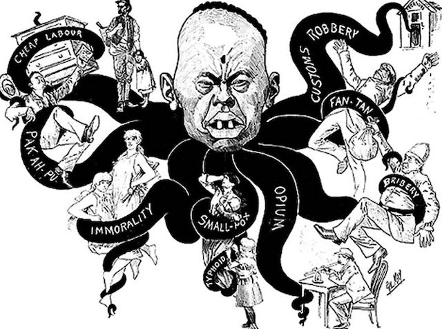

---

#### *"We are a nation of laws."*

I'm sure you've heard this one before, and it may even ring true if you were born white — in which case you can also get presidential pardons or concierge service in the courts. But this is a lie we tell ourselves. And by "we" I mean white people.

But if you were born poor, brown, black, or without American citizenship, the "nation of laws" claim often rings as hollow as a November pumpkin.

Just ask [Cyntoia Brown](http://www.pbs.org/independentlens/films/me-facing-life/), who was enslaved into sex work and had to shoot her rapist to escape. Brown was sentenced to 51 years in prison for the killing and, despite wide [support for clemency](https://www.instagram.com/p/BrqEPqCBevo/), was not on Tennessee governor [Bill Haslam's list](https://www.wsmv.com/news/gov-haslam-grants-executive-clemency-to-cyntoia-brown-not-included/article_1612fdaa-0490-11e9-9de3-6751c9fe4988.html) of 11 people granted clemency on Thursday.

On the flip slide, [Jeffrey Epstein](https://progressive.org/dispatches/cyntoia-brown-jeffrey-epstein-justice-181218/) — a friend of Donald Trump's — received a relatively light sentence of 13 months in jail for raping dozens of underaged girls. One of his victims was even recruited at Trump's *Mar Lago* resort. Epstein's prosecutor, Alexander Acosta — also a friend of Trump's — worked out the gentlemanly plea deal *entre blancs* and went on to become Trump's Secretary of Labor.

If you think Epstein, Trump, and Brett Kavanaugh are exceptions to how society winks at white sexual predators, consider this case from last week. In Louisiana a white Baylor University [frat boy](https://news.vice.com/en_us/article/kzvkmn/why-the-baylor-ex-frat-president-accused-of-rape-wont-serve-any-time-in-jail) convicted of rape got a $400 fine and probation — and that was it.  Jacob Walter Anderson walked away after paying a fine, his life and freedom intact. No jump suit, no 51 year sentence.

#### *"These people need to get in line for citizenship."*

When it comes to refugee status, asylum, work visas, and citizenship, we white people cloak ourselves in the same sorts of lies.

From the beginnings of the nation until 1924, only white people were allowed to legally immigrate. The Chinese Exclusion Act was based on claims that Chinese were immoral, criminal, brought smallpox, opium, and could not be culturally absorbed — virtually every lie that today's FOX News commentators repeat about Central American refugees. 

The Supreme Court ruled in 1922 that a Japanese businessman named [Takao Ozawa](http://www.nbcnews.com/id/24714378/ns/us_news-gut_check/t/s-s-immigration-defining-whiteness/) was not a Caucasian and therefore did not qualify for citizenship. A case three months later involving an Indian, Bhagat Singh Thind, ruled that Indians were not Caucausians and Thind actually had his citizenship stripped. If you've been paying attention to Trump's immigration policies, renewed threats of [denaturalization](http://theinvestigativefund.org/investigation/2018/12/19/denaturalization-trump-immigration) and the movement to [abolish the 14th Amendment](https://jacobinmag.com/2018/12/trump-fourteenth-amendment-citizenship-reconstruction-constitution) are revived assaults on people of color in a long, continuous, racist history. 

So let's be clear. For almost all of our history *there was no immigration line* for anyone except white people. And a story from this week's news illustrates a related fact — that, besides demonizing people of color, the "system" has continuously provided legal advantages for white immigrants — even to this day.

Outgoing "moderate" House Speaker Paul Ryan, who has persistently blocked help for DACA recipients and reforms which would benefit Latinos and other brown people, submitted bill [H.R. 7164](https://www.congress.gov/bill/115th-congress/house-bill/7164/text), written to let Irish nationals use some of the 10,500 annual Australian visas — thus ensuring that white people are directed to the head of the immigration line.

*Sláinte!*

