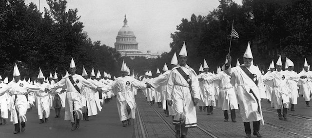
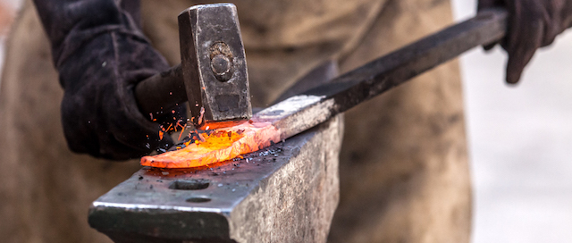
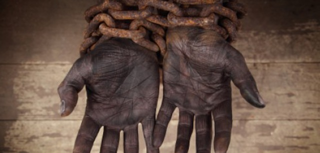
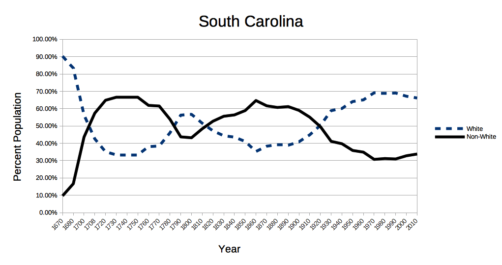

After he was elected Donald Trump crowed, "this is the day we take our country back." The Orange One's supporters knew what his dog whistle meant. White supremacist [Richard Spencer](https://theintercept.com/2016/12/07/america-belongs-white-men-alt-right-founder-says/) announced: "We won. America belongs to white men." His buddy [Jared Taylor](http://abcnews.go.com/Politics/people-white-nationalist-jared-taylor-muslim-american-journalist/story?id=46211947) told ABC News journalist Amna Nawaz: "we built a wonderful country that your ancestors could not have [built]. That is why people like you come here." Taylor put into words what many white Americans believe -- that the nation is the crowning achievement of Christian white people and that it's *their* country.

But history professor [Joe Krulder](http://historynewsnetwork.org/article/166734) isn't buying the myth of America as a lily white nation. In "America was never White" Krulder provides numerous examples of the diversity that actually built America, and of a much more complex history -- not simply white settlement -- that made the nation.

The founding myths of America that white supremacists like Richard Spencer and Jared Taylor are flogging almost seem to have been taken from Nazi and Soviet era propaganda. White farmers braving cold Dakota winters in sod houses, nobly attacking the land with scythes, or pictures of muscular white tradesmen hammering iron or forging the beams of American skyscrapers. It's quite romantic.

And it's also a crock. Historians can tell you that the *real* America was conquered by genocide, ethnic cleansing, and violence. Much of our national wealth was accumulated by stealing the lives and labor of those regarded as less than human and pressing them into slavery. White supremacy had to be invented to justify slavery, but white supremacy has proven to be both versatile and extensible in justifying America's many wars of choice on brown and yellow people around the world.

White supremacy, in fact, is such a major strand of our national DNA that it leads many to believe that we are something grander than a nation among other nations, that we have a divine mission to minister to our benighted brown brethren in other countries, guide them, murder them if necessary, deliver to them our great institutions of democracy and capitalism through the barrel of a gun. Every aspect of our society -- from economic inequality to the prison system -- is based on white supremacist myths that people like Spencer and Taylor have long been selling. Even our first black president, a man who lived in other cultures, considered himself an advocate of American Exceptionalism.

Charlottesville reminded us again of this when racists and Nazis mobilized to defend Southern "heritage" in the form of a Confederate statue. According to the [Southern Poverty Law Center](https://www.splcenter.org/sites/default/files/whoseheritage_splc.pdf) there are at least 1,500 monuments to the "lost cause" of the Confederacy, many of them built by the [United Daughters of the Confederacy](http://www.hqudc.org/) (UDC) and the [Sons of Confederate Veterans](http://www.scv.org/) (SCV).

The Daughters of the Confederacy describes itself as a [patriotic](http://www.hqudc.org/objectives/#patriotic) organization. But like Spencer and Taylor the UDC promotes a [revisionist history](http://www.hqudc.org/why-am-i-a-daughter-of-the-confederacy/). It is "an organization which has for its purpose the continuance and furtherance of the *true history* of the South and the ideals of southern womanhood." The "true history" the UDC is selling is "a heritage so rich in honor and glory that it far surpasses any material wealth."

Likewise the Sons of Confederate Veterans is [committed to](http://www.scv.org/new/) “the vindication of the cause for which we fought. [...] the perpetuation of those principles [...] and those ideals which made him glorious and which you also cherish.” Glorious slavery.

But don't believe me. Believe the slavemasters themselves. The [Constitution of the Confederate States](http://avalon.law.yale.edu/19th_century/csa_csa.asp) spells out the Confederate glories in detail. Slavery is mentioned no less than a dozen times in the document, and it was such a central, *glorious* "ideal" that the Confederate Constitution contained a clause which prevented slavery from ever being abolished.

But if we really want to look at Southern heritage, let's begin where the Civil War began -- in South Carolina.

The first settlements in the Carolinas date from 1640 to 1650. A second wave of colonists, slave traders from Barbados, arrived in 1665, and a third wave came in 1670 to what is now Charleston, South Carolina. They were a quarrelsome, violent bunch. Authoritarian government, political intrigue, dissension, murder and insurrection were the rule rather than the exception. Brotherly love among white colonists might have been a Christian notion but it was nowhere to be found. British Anglicans prohibited French Protestants from owning land in the colony, for example.

For this, after all, was colonialism. Competitors had to be fought and killed, natives had to be "repealed and replaced." In 1713 Carolina's colonists forced Tuscorara, Westoe and Coree Indians to flee north where they were eventually assimilated by the Iroquois. Despite colonial treaties many Indians were pressed into slavery and shipped to the West Indies to serve on plantations. It seems triply obscene that Jeff Sessions won't let them back in *their* country.

The French, English, and Spanish were all in the New World to conquer it. And they hated each other. It is laughable to think of Spencer's and Taylor's fairytale notion of a monolithic European culture at America's founding. Queen Anne's War was a colonial dispute over conquered Spanish territory that played out all over the North American continent. Indians in the Carolinas -- when they were not being whipped and shipped into slavery -- were pressed into the ranks of militias on both the French and English sides.

But then there are the demographics. If, as white supremacists argue, America was *always* a white Christian nation, then the early American population should have been demonstrably white.

But [census data](https://en.wikipedia.org/wiki/Demographics_of_South_Carolina) easily disproves this notion.

Throughout the Deep South, for much of our early history, slaves outnumbered whites. It was slaves who farmed the land. In cities many slaves were skilled tradesmen and artisans. Besides white brethren who refused to see them as such, it was also slaves -- and the children of slaves -- who were hammering on American iron. Go to Charleston, South Carolina and you can see hundreds of pieces of the enduring iron work of Philip Simmons, who learned his craft from a former slave.

During World War I the 371st Infantry Regiment numbered many black Americans from South Carolina. Pershing didn't see much use for them and he actually handed over the regiment to French command. But numerous members of the 371st received the *Croix de Guerre* and the Order of *Légion d'Honneur*. Then they returned to a nation they had just defended but never heard the phrase: "thank you for your service."

Census figures from the early 1700's show a consistent non-white majority in South Carolina until 1920 -- that was the year that white people finally edged past 50.38%. The nation was 150 years old; whites could finally claim South Carolina was white.

White supremacist myths can't hold up to history and fact. It may be true that the reins of the economy have always been in white hands, but the work of building and defending America was done -- and always has been done -- by those rarely given their rightful credit.

