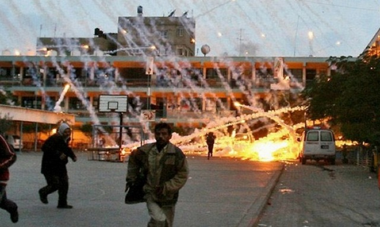

---

I have recently read several of my co-religionist's pieces in the Standard Times, and would like to offer a different Jewish view on the siege of Gaza. Does the world unfairly fault Israel for protecting itself, as Irving Fradkin and Bob Feingold maintain? Are critics of Israel usually anti-Semites, as another recent article suggests? The answer to both of these questions is an emphatic "no."

Before the siege of Gaza, Hamas and Israel had been exchanging rockets for months, both parties in violation of a truce. On November 4th Israel launched attacks in Gaza. On December 19th Hamas announced an end to the truce, and on December 27th Israel unleashed its tremendous military might on a population of 1.5 million locked into a space twice the size of Dartmouth. After the escalation of hostilities, 3 Israeli civilians were killed, 1500 Palestinians were killed -- half of them children, and 10 Israeli Defense Force soldiers were killed, half by "friendly fire." It was the reckless and disproportionate use of force on a civilian population that had nowhere to go, combined with the use of phosphorus bombs on civilians and other violations of international law that has so enraged the world and drawn the criticism of the UN and human rights organizations. In addition, there was indiscriminate bombing of infrastructure -- sewage plants, first responders, medical facilities, UN food distribution centers, schools, and aid agencies. This was calculated to punish Palestinians for voting for Hamas, and for no strategic military reason.

Irving Fradkin suggests that what Israel did was simply what the United States would do if Mexico or Canada began bombing the US. A more apt analogy is: what would the United States do if the military wing of a Canadian political party began lobbing missiles into Detroit? Would we destroy most of Windsor, Ontario and the surrounding province, killing thousands and destroying half its infrastructure? I would like to think we would act swiftly, forcefully, but far more surgically than Israel did in either Gaza or Lebanon.

Those with longer memories than Mr. Fradkin will recall that, in 2002, Israel similarly destroyed the Palestinian government in Ramallah and brought about the demise of Fatah, the Palestinian political party it now wishes were in power. Israel now openly admits it is trying to do the same with Hamas. Although the U.S. and Israel have categorized Hamas as a "terrorist" organization, it actually has more in common with Sinn Fein than Al Qaida or Israel's Irgun. For years Hamas has been running social services important to desperate Gazans, is involved in government, is constituted as a political party, and has generally been less corrupt than Fatah. Like it or not, Palestinians have some valid reasons to embrace Hamas. And, like it or not, Israel will have to talk to Hamas -- just as it is now clear that the United States will have to start talking to Iran.

The issue of peace in Israel and Palestine is complicated by all sorts of emotional, religious, historical, and racial baggage. The only way this issue will ever be resolved is to look clearly at the reality of life for both Israelis and Palestinians. Israel/Palestine in 2009 is not biblical Israel. The Ottoman empire is gone. Israelis aren't leaving, and they won't be bombed. Palestinians aren't leaving, and they're not going to permit themselves to be herded into Indian reservations. Israel must admit and address the misery of Palestinians since the Nakba, and Palestinians and the wider Islamic world around it must acknowledge that the Israelis, too, had nowhere to go after the Shoah. But Israel holds more cards than the Palestinians, receives massive military aid from the United States, and has less motivation to compromise on the basic issues that have stymied a resolution. It will be up to Israeli voters in the next election to decide whether they want to reject a militaristic, go-it-alone strategy that we have abandoned here -- or to finally engage in good-faith negotiations organized by a very different U.S. administration. I would urge everyone, especially American Jews, to pressure Israel and our own government to keep the fragile and heartbreaking realities of not only Israeli lives -- but those of Palestinians too -- in their minds and hearts.

-----

*This was published in the Standard Times on January 30, 2009* 
*<http://www.southcoasttoday.com/article/20090130/opinion/901300324>*

