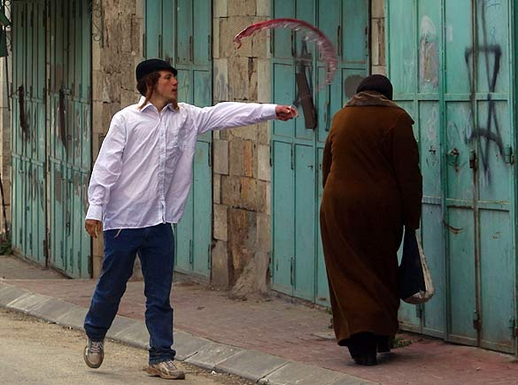

---

[]

Nowadays it's difficult to criticize Israel without being called an antisemite. Somehow a revisionist definition of antisemitism has replaced racist generalizations of Jews. Now antisemitism is defined as any critique of Zionism, criticism of Israel's occupation, land theft, rampant racism, civil rights abuses, press censorship, or noting similarities with the old South African _Apartheid_ system. Despite the _hasbarists'_ best attempts to quash criticism, the fact remains: Israel is a rogue state with plenty to dislike.

*   Illegal settlements, land theft
*   Settler violence
*   Use of martial law to appropriate land, which is then turned over to settlements
*   Arrests without warrants
*   Detentions without trial for tens of thousands of people, many children
*   The killing of 6400 Palestinians since 2000
*   The killing of of over 1000 civilians during the siege of Gaza
*   Using children as human shields
*   Bombing schools, hospitals, ambulances, water and sewage facilities in Gaza
*   Using white phosphorus bombs on humans
*   Kidnappings, like the recent case in the Ukraine
*   Assassination teams, like the one in Dubai
*   The killing of 8 Turks and one American citizen on the Mavi Marmara
*   Resale of joint US-Israeli military technology to China
*   Spying on the United States
*   Killing and wounding of international protesters and journalists
*   Impunity Israel enjoys at the UN &#8212; like Syria enjoys thanks to Russia's veto
*   Meddling in US politics and foreign policy by pro-Likud AIPAC, WINEP, JINSA, ZOA, and others, whose politics are _not_ mainstream American or even moderate Israeli views
*   Israel's outreach toward right-wing Fundamentalist Christian groups and wingnuts like Glen Beck, with their Jerusalem revival meetings and End Times nonsense
*   Avigdor Lieberman, an incredible racist, whose campaign Eric Yoffie, president of the Union for Reform Judaism called "an outrageous, abominable, hate-filled campaign, brimming with incitement that, if left unchecked, could lead Israel to the gates of hell."
*   Former Sephardi Chief Rabbi Ovadia Josef, who looks and sounds like an ayatollah himself and has said a number of offensive things about gentiles, besides advocating the murder of all Palestinians
*   The institutionalized racism and discrimination against Arab Israelis, Ethiopians, and the difficult legacy of growing up as Mizrachim — Arab Jews
*   Vigilante groups (in places like Petah Tikva and Kiryat Gat) which beat Arab men who date Israeli women, or stage "interventions" with the families of the women
*   Laws which call into question the "Jewishness" of American Jews, of Masorti Reform, Reconstructionist, Humanist Jews &#8212; or privilege Orthodox Judaism
