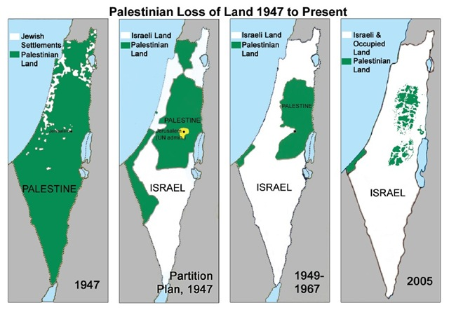

---

#### Criticism of Israel is "anti-Semitic"

Israel and its American lobbyists were once fond of using a sledgehammer to pound critics. The sledgehammer was, of course, the loosely-wielded accusation that objections to Israel's occupation were "anti-Semitic." Of course, for most people anti-Semitism is like pornography &#8212; you recognize it when you see it. Swastikas on walls, death threats, discrimination, slurs, publications like the "Protocols of the Elders of Zion" or stories like the "blood libel" and assumptions about the physiology or psychology of Jews were all recognizable features of anti-Semitism. Jewish "rootlessness," "clannishness," "cosmopolitanism," or avarice were as common as charges that Jews controlled the global economy. To all of this the [1906 Jewish Encyclopedia](http://www.jewishencyclopedia.com/view.jsp?artid=1603&letter=A&search=anti-semitism) added the rejection of Jewish nationality (meaning "peoplehood" and clearly _not_, in 1906, referring to a state):

> While the term Anti-Semitism should be restricted in its use to the modern movements against the Jews, in its wider sense it may be said to include the persecution of the Jews at all times and among all nations as professors of a separate religion or as a people having a distinct nationality.

So it was understandable when Israel's critics, in response, uttered a collective "You've got to be kidding" and waved the classical definitions of anti-Semitism back at the accusers.

So Israel simply redefined anti-Semitism.

#### Redefining anti-Semitism

In 2005 Natan Sharansky developed a definition of anti-Semitism which was published in the [Jewish Political Studies Review](http://www.jcpa.org/phas/phas-sharansky-s05.htm) and is now used by many Jewish and political organizations.

Sharansky's definition of anti-Semitism completely throws out ill-treatment of Jews as individuals or a people and replaces the "Jewish people" with the "state of Israel":

> The first "D" is the test of demonization. When the **Jewish state is being demonized**; when Israel's actions are blown out of all sensible proportion; when comparisons are made between Israelis and Nazis and between Palestinian refugee camps and Auschwitz &#8211; **this is anti- Semitism, not legitimate criticism of Israel**.
>
> The second "D" is the test of double standards. When **criticism of Israel** is applied selectively; when Israel is singled out by the United Nations for human rights abuses while the behavior of known and major abusers, such as China, Iran, Cuba, and Syria, is ignored; when Israel's Magen David Adom, alone among the world's ambulance services, is denied admission to the International Red Cross &#8211; this is anti-Semitism.
>
> The third "D" is the test of delegitimization: when **Israel's fundamental right to exist** is denied &#8211; alone among all peoples in the world &#8211; this too is anti-Semitism.

A Jewish child taunted for wearing a yarmulke and bullied on the way home would _not_ be the victim of anti-Semitism according to this revisionist definition.

#### "Delegitimization" equals a Palestinian State

In the last few years Sharansky's last "D" has been getting quite the workout. The [Reut Institute](http://reut-institute.org/data/uploads/PDFVer/20100310%20Delegitimacy%20Eng.pdf), an Israeli think tank, has developed a strategy for [fighting Israel's critics](http://www.haaretz.com/print-edition/news/think-tank-israel-faces-global-delegitimization-campaign-1.265967) by labeling them "delegitimizers" and "naming and shaming" them. As BDS becomes a more accepted way of challenging the occupation, [Israel is fighting back](http://www.haaretz.com/jewish-world/news/want-to-delegitimize-israel-be-careful-who-you-mess-with-1.284184) by categorizing BDS supporters as "delegitimizers" and anti-Semites. The concept has entered Israeli consciousness to the point that politicians bludgeon each other with it. Tzipi [Livni recently accused Benjamin Netanyahu](http://www.haaretz.com/news/livni-slams-netanyahu-for-delegitimization-of-israel-1.3913) of delegitimizing Israel. _Everything_ is potentially delegitimizing. The [Gaza flotilla](http://www.haaretz.com/magazine/week-s-end/comment-israel-delegitimizers-threaten-its-existence-1.261477) was described as a delegitimization effort. The [Goldstone report](http://www.haaretz.com/news/delegitimization-of-israel-must-be-delegitimized-1.5970) was seen as another such effort. Refusing to buy Jaffa oranges is too.

But, by far, the most creative application of "delegitimization" is that a [Palestinian state will delegitimize Israel](http://www.jta.org/news/article/2010/06/23/2739747/arad-palestinian-state-delegitimizes-israel), according to Uzi Arad, chairman of Israel's National Security Council. For Arad, [Palestinian legitimacy equals Israeli delegitimization](http://coteret.com/2010/06/23/israeli-nsc-arad-on-record-two-states-thats-a-zero-sum-game/) and talk of two states only fosters this:

> On the one hand, most of the people of Israel see the two-state solution as the path to a peace agreement. There are even quite a few Israelis who have mobilized for a Palestinian state and the promotion of its legitimacy, and are winning converts to it.
>
> What they do not notice is that this claims a certain price. The more you market Palestinian legitimacy, the more you bring about a detraction of Israel's legitimacy in certain circles. They are accumulating legitimacy, and we are being delegitimized.

So one doesn't even have to deny Israel's right to exist. Simply calling for a parallel Palestinian state makes one an anti-Semite, as Jewish groups like J Street are beginning to discover.

While Arad says that most Israelis want a two-state solution, Israel's political parties and members of the Knesset have apparently not heard. For instance, no one who has bothered to read the [Likud platform](http://www.knesset.gov.il/elections/knesset15/elikud_m.htm) really believes that Israel has ever been dedicated to two states:

> The Government of Israel flatly rejects the establishment of a Palestinian Arab state west of the Jordan river. [..] The Palestinians can run their lives freely in the framework of self-rule, but not as an independent and sovereign state.

It is therefore questionable if the polls are correct and Israelis _really_ want a two state solution. Or, if they do, what they _mean_ by two states.

#### No Palestinian State equals a One State Solution

 It is pronouncements like Arad's that convince many that Israel will never accept a Palestinian state. 

But Arad is hardly alone in rejecting two states.

A few weeks ago Moshe Arens, who has served as both defense and foreign minister with the Likud, suggested simply [granting citizenship to Palestinians](http://www.haaretz.com/print-edition/opinion/is-there-another-option-1.293670):

> Unlike the dire predictions heard so often, Israeli sovereignty over Judea and Samaria would not be the end of the State of Israel, nor would it mean the end of democratic governance in Israel. It would, however, pose a serious challenge to Israeli society. But that is equally true for the other options being suggested for dealing with the Israeli-Palestinian conflict. This option of Israeli sovereignty in **Judea and Samaria** merits serious consideration.

The one-state solution is an option that many Palestinians now recognize as inevitable, although they might take issue with Arens' claims that Israel would "continue" to govern democratically. For instance, the Palestine Strategy Group, which represents the viewpoints of Israeli, occupied, and Diaspora Palestinians, examined different state formations in a paper it published in 2008, [Palestinian Strategic Options to End Israeli Occupation](http://www.palestinestrategygroup.ps/Regaining_the_Initiative_FINAL_17082008_(English).pdf). While a Palestinian state has always been a national goal, the end of Occupation is an even greater goal:

> [...] So, if Israel refuses to negotiate seriously for a genuine two-state outcome, Palestinians can and will block all four of them by **switching to an alternative strategy** made up of a combination of four linked reorientations to be undertaken singly or together. [...]
>
> *   Fourth, **the shift from a two state outcome to a (bi-national or unitary democratic) single state** outcome as Palestinians' preferred strategic goal. This reopens a challenge to the existence of the State of Israel in its present form, but in an entirely new and more effective way than was the case before 1988. [...]
>
> Is this what Israel wants? Israel cannot prevent Palestinians from a strategic reorientation along these lines. Does Israel really want to force Palestinians to take these steps?

One of the authors has described this option as simply shutting down the PA and turning the struggle for a sovereign state into a civil rights struggle. Given the fact that Israel's land grab has already eliminated the possibility of a [viable contiguous state](http://www.msnbc.msn.com/id/35794859/ns/world_news-mideastn_africa/) and Israel itself is ideologically opposed to a Palestinian state, a single state appears inevitable. And because of demographics, that state will _not_ remain exclusively Jewish.

A number of political analysts share this view. John Mearsheimer recently discussed the inevitability of a single state in detail [in a talk last April at the Palestine Center](http://www.thejerusalemfund.org/ht/display/ContentDetails/i/10418), in which he began:

> Contrary to the wishes of the Obama administration and most Americans &#8212; to include many American Jews &#8212; **Israel is not going to allow the Palestinians to have a viable state of their own in Gaza and the West Bank.**&#160;**Regrettably, the two-state solution is now a fantasy.** Instead, those territories will be incorporated into a "Greater Israel," which will be an apartheid state bearing a marked resemblance to white-ruled South Africa.&#160; Nevertheless, a Jewish apartheid state is not politically viable over the long term. In the end, it will become a democratic bi-national state, whose politics will be dominated by its Palestinian citizens. In other words, it will cease being a Jewish state, which will mean the end of the Zionist dream.

It is ironic, but Zionism's own excesses, rather than external enemies, have destroyed the dream of a Jewish state.
