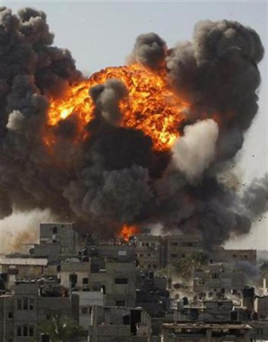

---

On September 15th a United Nations Human Rights Council commission led by Richard Goldstone, a South African Jew, released a 545-page report on last winter's offensive in Gaza, Israel's _Operation Cast Lead_. The report accuses both Israel and Hamas of war crimes and potential crimes against humanity. The commission will forward its recommendations to the International Criminal Court in the Hague if independent examinations by Israel and Hamas do not occur within 6 months.

The report follows two others by Human Rights Watch, one issued on the 13th on the killing of unarmed civilians, another on the 6th concerning Qassam rocket attacks on Israelis. Both the UN and HRW findings are similar.

B'Tselem, an Israeli human rights organization, carefully documented cases of IDF killings of unarmed civilians, the bombing of ambulances, of the IDF preventing medical personnel from helping the wounded, the use of white phosphorus on civilians, and called on Israel to permit the UN to investigate the allegations. Israel consistently refused, choosing to impede investigations.

Israeli Defense Forces soldiers who participated in the Gaza operation recounted the use of the "Johnny procedure" (using Palestinians as human shields) and the shooting of unarmed civilians, 70 cases of which were documented by B'Tselem. Similar findings were released by a group of soldiers called "Breaking the Silence," whom the government attempted to intimidate in the months after Cast Lead. On September 9th B'Tselem released its report analyzing the number of civilian casualties which again were consistent with the UN results.

A joint report by Israel Physicians for Human Rights and the Palestinian Medical Relief Society documented cases of shooting unarmed civilians and widespread attacks on hospitals and ambulances by the IDF. Employees of the World Health Organization, the World Food Program, and the UN numbered among IDF victims.

By UN and B'Tselem counts, almost 1400 people were killed in Israeli operations, while only 330 of them were militants. These figures agree with statistics from another human rights group, Amnesty International.

The day after the Goldstone report was issued, Israel immediately went on the offensive. It flew Deputy Foreign Minister Danny Ayalon to New York to kick off a number of meetings with Jewish and pro-Israel organizations. Ayalon reportedly told the American Jewish Congress they had to commit to "removing ... and torpedoing" the report. The AJC dutifully condemned the findings as "grotesquely distorted" and attacked Human Rights Watch as well. Abraham Foxman of the Anti-Defamation League labeled the investigation an "initiative born of bigotry." NGO Monitor, CAMERA, UN Watch, and other pro-Zionist "watch" groups all ratcheted up their attacks on the United Nations and most of the established human rights organizations.

But not all Jewish organizations were ready to vilify the Goldstone report. JStreet, the "pro-Israel, pro-peace" PAC, had condemned Israel's disproportionate force in Gaza in the early days of the military campaign but has cautiously refrained from publicly commenting on the report. The progressive Jewish magazine Tikkun wrote this evening of "the disgrace of Israel now trying to deny what everyone knows to be true."

All this comes at an inconvenient time for Israel. It is simultaneously trying to swat down a damning UN report and trying to drum up support for bombing Iran. All this while defying the White House on the issue of settlements and imposing new travel restrictions on American citizens which use ethnic profiling.

In the coming days we are certain to hear a lot of rhetoric on the right of a sovereign nation to defend itself while the entire world is arrayed against it, and so on. This argument has kept its charge for a surprisingly long time, but the battery died after Gaza. Many of Israel's problems are linked to increasingly ugly displays of nationalism, blindness of its own excesses, insensitivity to the people it has displaced, and to no longer caring whether it is accepted as a "nation among nations," as Israeli Prime Minister Netanyahu titled one of his books.

The tragedy of the UN report is not that it was ever written, but that Israel is so determined to repudiate what others can so clearly see.

-----

*This was published in the Standard Times on September 21, 2009* 
*<http://www.southcoasttoday.com/20090921/opinion/909210306>*

