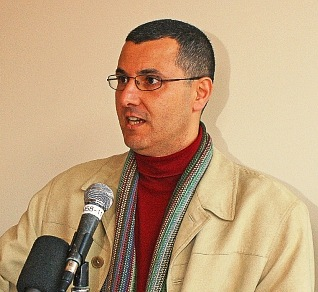

---

Over the last few years I have struggled with the idea of BDS. A year and a half ago I set about informing myself of the [different kinds of BDS](/Zionism/applying-pressure/) tactics.

About a year ago [I visited Israel and Palestine](/Personal/palestine-visit/). One of the people I met was Omar Barghouti, a well-known voice for BDS. Nothing about divestment from occupation or military-related industries - whether Israeli or international corporations - seemed inappropriate at the time, but I had reservations about cultural boycotts and felt that consumer boycotts were meaningless or even destructive. Part of the reason is that I have Israeli friends - great people who share a vision for peace but will be affected by these campaigns.

This year - having seen the occupation up close and having a chance to think about it - it was more difficult to define the parameters of what was appropriate and what was not, but I gave nuance and thoughtfulness [my best shot](/Zionism/thoughts-bds/).

And I'm not alone. Lots of Jews have grappled with BDS. [Jerry Haber](http://themagneszionist.blogspot.com/2010/06/bernard-avishai-targeted-sanctions-yes.html), in an excellent piece, analyzes Bernard Avishai's nuanced and thoughtful reflection on the subject in his Nation article. Avishai is a decent guy, a progressive Zionist whom I heard speak last October in Washington. His ethical gyrations reminded me of my own.

Avishai, like numerous other liberal Jews, voices the great fear that BDS will drive even progressive Israelis into the arms of the right, and that BDS would create a "siege mentality" in Israel - and on this basis he advocates _selective_ application of BDS tactics. Yet Haber parts with Avishai and describes how he added his name to a petition for TIAA-CREF's divestment from Israel.

Where I part with Avishai's arguments - an argument shared by well-respected figures in the Israeli peace movement like Uri Avnery - is that it's way too late: Israel has been in a siege mentality almost since its founding. If this is the primary progressive Jewish argument against BDS, it's a non-starter.

As we have by now been forced to recognize, Israel itself admits that the blockade of Gaza is meant to strangle the Gazan economy and punish its people. This has become such a well-known secret that [Chuck Schumer can recite the same rationale](http://www.huffingtonpost.com/2010/06/11/chuck-schumer-on-gaza-str_n_609594.html) ("Strangle them economically") to Orthodox constituents without fear of being labeled a bigot, as Helen Thomas was. And it's not just Gaza. Palestinians in the West Bank cannot travel and their economy is still severely limited by Israeli control. Critics of Israel, NGOs, and just recently a German development minister, have all been barred from Israel-controlled areas.

Finally it was clear to me: the Israeli government doesn't appreciate nuance and that force might be the only language they understand. Economic force.

All this being the case, why is it not appropriate that Israel drink its own medicine as long as the Palestinians are forced to? There are no longer any justifications for any more tortured, nuanced discussions of BDS. It's a matter of justice, and a simple matter at that.

Boycotts, divestment, and sanctions should be applied to Israel until the day that the _Israeli_ equivalents of BDS (economic strangulation, restrictions on travel, etc.) cease to be imposed on Palestinians and international critics of Israel's occupation.
