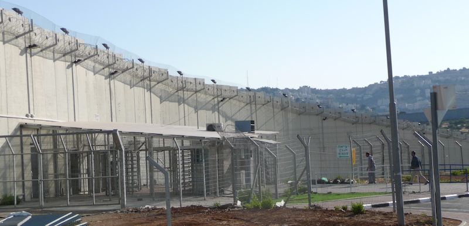

---
 

Nof Zion is a religious Zionist settlement in East Jerusalem created by removing the Palestinian residents of Jabel Mukaber (Author, 2009)

Friends and family know that I am no partisan of Israel's ethnic cleansing of Palestine, its 75-year occupation of Palestinians now either relegated to refugee camps or internally-displaced, controlled by barbed wire, high-tech fences, whose movements are controlled by ubiquitous checkpoints, who are surveilled, suffer warrantless searches by the Israeli military and indeterminate detention without recourse to a justice system only for Jews, whose houses are bulldozed or expropriated by settlers, who are denied their own state, ringed by settlements that further ghettoize them and breed resentment and hatred, such as we saw last week.

for Palestinians in the West Bank there is no such thing as freedom of movement. Instead, checkpoints and walls and barbed wire (Author, 2009)

I have friends and family with Israeli roots, and I am still in touch with peace activists from the Eshkol district in Israel where almost all the attacks occurred. I have plenty of anger and grief over what happened in the Negev. But I do think we have to be honest about where Palestinian resentment comes from. We also need to admit that killing a child, whether by commando, blockade, sanctions on medical equipment, or F16, is *still* the murder of a child.

Over the years I have followed Israel's many military operations against both Fatah and Hamas; its shameful participation in the 1982 Sabra and Shatila massacres of 3,500 Palestinians in Lebanon by Falangist militias; a commando attack on the Mavi Marmara, which killed 19 peace activists, including Americans trying to deliver aid to Gaza; Israel's disproportionate use of military force in Operation Cast Lead, the 2008 version of what is likely to come this week; and the killing of journalists, last year Palestinian-American reporter Shireen Abu Akleh, three days ago Reuters videographer Issam Abdallah.

I have met Palestinians whose olive groves are routinely vandalized or destroyed by settlers, whose young men are routinely harassed in often deadly versions of Stop and Frisk, and whose children are detained without warrant or counsel in adult prisons for throwing rocks. I have met Gazans who live in the tiny enclave of refugee camps the size of Detroit – but with 3.5 times the population – and can't even fish the waters off their own coast. And I have met Palestinians who still have the key to a home now occupied by a Jewish family in Jerusalem. Both historical and daily wounds afflict Palestinians because of ethnic cleansing and occupation that began in the 20th Century and festers well into the 21st.

Over time Israel's politics have lurched from right to far right. Its 37th government is now comprised of extremists who intend to neuter Israel's supreme court – the last obstacle to full annexation of the West Bank. And they also want to impose religious restrictions, such as gender segregation and changes to marriage law, on even secular citizens. Last week’s trauma to Israel has been compared to 9/11. As with 9/11, when Americans began chanting “USA! USA!,” Israelis now heed the call to “Stand with Israel.” Trauma seems to feed nationalism. This is also true of Palestinians. 

A member of the ruling coalition recently endorsed pogroms on Palestinian villages after extremist settlers went on a rampage of killing and arson. “I think the village of Huwara needs to be wiped out. I think the state of Israel should do it,” said Israeli Minister of Finance Bezalel Smotrich, who is also responsible for civil administration in the occupied West Bank. Meanwhile, Israel's Security Minister Itamar Ben Gvir enlightened journalists with his Jewish supremacist views: "My right, the right of my wife and my children to move around Judea and Samaria [biblical names for the West Bank] is more important than freedom of movement for the Arabs." 

These are the gloves-off versions of Apartheid and ethnic cleansing that Israel's government was once too ashamed to say out loud. Before Hamas attacked Israel such talk was beginning to frighten semi-liberal secular Israelis. Now Israel’s pro-democracy demonstrators are fully behind a new war government that has already killed over 2,000 in Gaza with indiscriminate bombing.

But territorial maximalism is a primary goal of all the political parties in Israel's coalition government. Israel's settler movement and its friends in the Knesset are still angry about Arial Sharon's 2005 withdrawal from Gaza. Even if Hamas had not attacked Israel last week, many expected extremist ministers to propose re-establishing some of the 21 Jewish settlements that once occupied 45% of the Gaza Strip. Such talk has surfaced in the wake of the attacks, and Israel is now forcing 1.1 *million* Gazans to flee south – an incomprehensible number which Palestinians fear could create a second *Nakba* (catastrophe). Those with passports are fleeing across the Erez Crossing into Egypt. Between the bombing and the forced expulsions, there will surely be another reduction in the population of Gaza. Someone has called it "ethnic cleansing on the installment plan."

Throughout the years the Israeli human rights group B'Tselem has documented the killing of tens of thousands of Palestinians through raids, military operations, or settler violence. Israel calls this periodic bloodletting "mowing the grass." In its efforts to target Hamas fighters, Israel manages to mow down mostly civilians, more often than not children. Each time a payment on the aforementioned installment plan. 

Even assuming that reports of children being decapitated by Hamas fighters last week are true, why have so few tears been shed for the thousands of children whose bodies are blown apart by Israeli bombs paid for by American tax dollars? Perhaps for the same ugly reason it has been so easy for Americans to kill Mexicans, Koreans, Vietnamese, Central Americans, Puerto Ricans, Afghanis, and Iraqis. Israel certainly has some soul-searching to do. Americans too.

For all the US State Department and Israeli Foreign Ministry press releases expressing shock, anger, and solidarity — for all the many emotional appeals, for all the bias in the media, the cynical invocations of the Holocaust, the unfortunately necessary pushback against antisemitic incidents that inevitably occur in the wake of this conflict, or the religious and racial connections between Western Jews and Christians – we’re still ignoring the most glaring feature of this conflict: the wrongs done and wrongs being done to Palestinians.

The Occupation is Israel's and Israel's alone. Every death that emanates from this conflict weighs most heavily on Israel because Israel chooses not end the Occupation. No nation should enable, justify, defend, or fund the Occupation. Let Israel go it alone and see how quickly change can come about – when the US isn't subsidizing it.

It is an abomination that Israel's occupation has gone on for 75 years. The human misery it has inflicted and inflicts daily ought to shame every Western power complicit in its continuation.

The United States must not provide a cent more to Israel.
