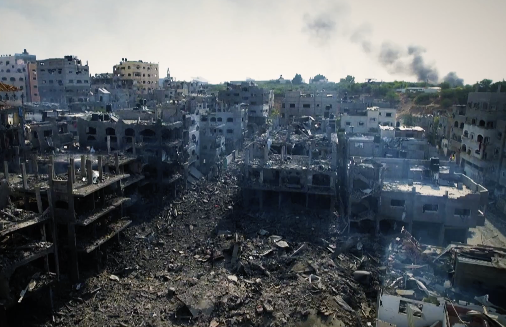
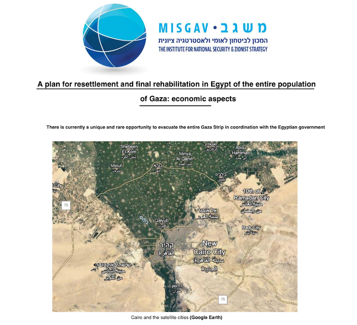

---
 

Killing the “animals” - Israel’s “surgical” bombing of Gaza

Genocide and ethnic cleansing are part of America's DNA and many of us would prefer to not think about it. Maybe that's why American politicians bristle at those words when applied to Israel. It is inconceivable to many of us that a nation often described as "the only democracy in the Middle East" and (for Believers) the second incarnation of Biblical Israel could ever commit such atrocities. Congressional resolutions, preferred trading status, military and intelligence cooperation, and vetoes at the UN shield Israel from the consequences of its actions. Israel has received over $165 billion in aid from the US, the largest for any country. Laws in 37 states penalize or criminalize criticism of Israel. It’s been a veritable love-fest. Until this month Israel has largely enjoyed impunity for humanitarian crimes against a civilian population almost as large as its own.

But these last couple of weeks have been very different. Israel's bombing of Gaza has moved well beyond retaliatory, far beyond indiscriminate, to a level bordering on genocidal. And there is no clearer sign of the persistence of the ethnic cleansing that created Israel than a widely-discussed plan to use it again in concert with the bombing of Gaza.

On October 9th Israeli Defense Minister Yoav Gallant declared a siege on the entire civilian population of Gaza, calling them "human animals." Intended was apparently a return to primitive warfare where walled cities are conquered by destroying all life within. But a walled city is more than just a metaphor in Gaza, where the world's largest open air prison is surrounded by deadly border technology.

Palestinian home vandalized, reads - “Death to the Arabs”

Voice after Israeli voice promised vengeance on Gaza's civilian population for the Hamas attacks. “Gaza will become a place where no human being can exist,” retired IDF Major General Giora Eiland wrote in *Yedioth Ahronoth*. In a nation that [enshrines](https://english.alarabiya.net/perspective/analysis/2014/11/24/What-s-the-future-for-non-Jews-in-the-Jewish-state-) Jewish supremacy in law and where "Death to the Arabs" is chanted at [marches](https://www.politico.com/news/2022/05/29/israel-jerusalem-march-death-arabs-00035862), [rallies](https://www.insider.com/jewish-supremacists-chant-death-to-arabs-amid-clashes-in-jerusalem-2021-4), [soccer games](https://www.timesofisrael.com/liveblog_entry/beitar-jerusalem-fans-sing-death-to-arabs-on-train-en-route-to-soccer-game/) or sprayed on Palestinian homes and [graves](https://www.wikiwand.com/en/Death_to_Arabs), and where government ministers [invoke](https://www.haaretz.com/israel-news/2023-03-01/ty-article-opinion/.premium/death-to-the-arabs-backers-of-settler-violence-now-sit-in-heart-of-israels-government/00000186-9820-d172-a587-9d78def00000) it while encouraging anti-Arab pogroms, it's not just *Hamas* Israel is looking to expel or kill. It's every Palestinian in Gaza.

Gallant's orgy of bombing, which launched as many strikes in a single day as the United States launched in Afghanistan in a *year*, was originally to be followed up by forcible transfer of all Palestinians from Gaza.

Leaflet warning Gazans to flee south

On October 13th Israel dropped [leaflets](https://www.calcalist.co.il/local_news/article/psmis6sds) telling residents of Gaza City:

> "You must evacuate your homes immediately and go to the south of Wadi Gaza. For your security and safety you must not return to your homes until further notice from the Israeli Defense Forces. Public and known shelters must be evacuated. It is forbidden to approach the security wall, and anyone who approaches exposes himself to death.

Gazans from the north made the trip by car, donkey cart, and on foot in scenes reminiscent of the 1948 *Nakba*. Almost as soon as compliant refugees from Gaza City arrived in Khan Yunis, Israel began carpet bombing them. An [episode](https://www.nytimes.com/2023/10/16/podcasts/the-daily/gaza-israel.html) of the New York Times podcast "The Daily" gave listeners a sense of the desperation of civilians and the indiscriminate nature of the bombing. Nowhere was safe. Everything was being bombed. Thousands of children have been killed as a result. A panel of U.N. experts has called Israel’s bombing "collective punishment" and "a war crime."

But vast destruction and massive civilian casualties, not precision strikes on Hamas, were always the objectives.

A document provided to the Israeli financial magazine Calcalist (roughly, the *Economist*) and circulated within the Intelligence Ministry promotes the forced transfer of all residents from Gaza. According to [Calcalist](https://www.calcalist.co.il/local_news/article/rj2mplngp), "the document, [recommended by Intelligence Minister Gila Gamliel], which is unlikely to affect government policy, may have been written to give a boost to the settler movement and its objectives [but] in any case it is a direct continuation of the extreme policy that the government has been promoting since it was established."

"Gamliel's document supposedly looks at three alternatives in the post-war era, but the alternative *'to yield positive and long-term strategic results' is a transfer of Gaza citizens to Sinai*. The move includes three steps: establishing tent cities in Sinai to the southwest of the Gaza Strip, creating a humanitarian corridor to assist residents and, finally, building cities in northern Sinai. At the same time, a sterile area of several miles will be established within Egypt south of the border with Israel, *so that evacuated residents cannot return*. In addition, the document calls for cooperation with as many countries as possible so that they can absorb the displaced Palestinians from Gaza and provide them with absorption packets. Among other things, Canada, European countries such as Greece and Spain, and North African countries are mentioned."

A similar [white paper](https://drive.google.com/file/d/1e8ytZWVQyt1XncFPeDT9n1RoD_mZJRUk/view) calling for ethnic cleansing of Gaza was produced by [Misgav](https://theintercept.com/2023/10/25/israel-hamas-opportunity/), the Institute for National Security and Zionist Strategy. The document, "A plan for resettlement and *final rehabilitation* in Egypt of the entire population of Gaza," is exactly what it sounds like – a plan to force all of Gaza's inhabitants over the Rafah crossing into ten refugee cities in the Sinai desert. As with Gamliel's white paper, the international community is expected to fund Israel’s ethnic cleansing of Gazans and absorb the resulting stateless refugees. According to Misgav plan, whatever the cost, it's

> "actually a very worthwhile investment for the State of Israel. The land conditions in Gaza, which are similar to the Gush Dan area, will in the future allow many Israeli citizens to live at a high level and in fact will expand the Gush Dan area to the Egyptian border. It will also give a tremendous impetus to settlement in the Negev."

The white paper goes on to say that a deal between Egypt and Israel (and also Saudi Arabia, which would provide some of the funding and construction) could be easily concluded in days. The authors salivated over the Hamas attack as an opportunity that might never come again:

> "The IDF must *create the right conditions* for the Gazan population to immigrate to Egypt [and] there is no doubt that in order for this plan to come to fruition, many conditions must exist at the same time. Currently, these conditions are met and *it is unclear when such an opportunity will arise again, if ever*. This is the time to act. Now."

Click image to hear Ayalon discuss the Misgav plan to expel Gazans from Gaza

While Calcalist did not anticipate that the Gamliel document would get much traction within the government, in an [interview](https://www.youtube.com/watch?v=UgoUq69NZ30&t=713s) with Marc Lamont Hill on *Upfront*, former Israeli Deputy Foreign Minister Danny Ayalon cited the Misgav plan (with its ten cities) and downplayed the forced transfer as a "temporary relocation." But who was Ayalon kidding? Building ten cities for refugees in Egypt sounds like a "relocation" that is anything but temporary.

