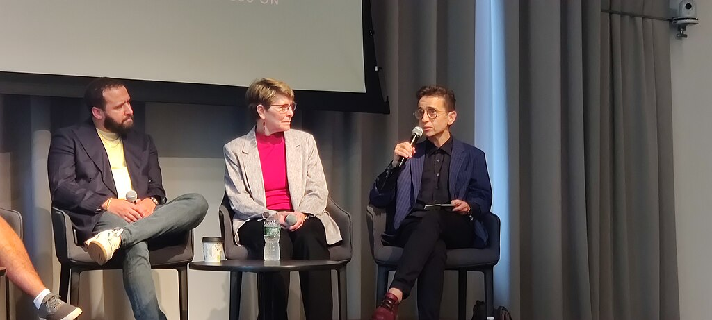

---
 

*Objectivity Wars panel held at the Columbia School of Journalism, with Masha Gessen speaking (Kegoktm, 2022, CC)*

Masha Gessen knows something about totalitarianism and human rights abuses. The Russian journalist, translator, trans rights activist, and public intellectual was born in Russia in 1967 to a Jewish family that survived the Holocaust only to experience Stalin's Soviet Union. In 1981 Gessen's family relocated to the United States. As a journalist, Gessen (they, their) have written extensively about Russian authoritarianism. In 2020 they wrote in [The Nation](https://www.thenation.com/article/society/masha-gessen-interview/) about MAGA World's threats to American democracy. Until last week everybody wanted to hear from Masha Gessen.

In mid-December Gessen was in line to receive the *Hannah-Arendt-Preis* from the [Heinrich] Böll-Stiftung and the German State of Bremen for their prescient warnings and advocacy for human rights. But the latest Gaza war erupted, and with it a wave of repression of voices critical of Israel's human rights abuses — or any advocacy of Palestinian liberation.

Just before the Böll award was to be conferred, Gessen published a piece in the [New Yorker](https://www.newyorker.com/news/the-weekend-essay/in-the-shadow-of-the-holocaust) entitled "In the Shadow of the Holocaust." The piece was mainly about how memory and history are managed in Europe. In it Gessen casually ripped Israel's human rights abuses in Gaza. They framed the piece with a visit to the Berlin Jewish Museum:

> "There, an installation by the Israeli artist Menashe Kadishman, titled 'Fallen Leaves,' consists of more than ten thousand rounds of iron with eyes and mouths cut into them, like casts of children’s drawings of screaming faces. When you walk on the faces, they clank, like shackles, or like the bolt handle of a rifle. Kadishman dedicated the work to victims of the Holocaust and other innocent victims of war and violence. I don’t know what Kadishman, who died in 2015, would have said about the current conflict. But, after I walked from the haunting video of Kibbutz Be’eri to the clanking iron faces, I thought of [the thousands](https://www.newyorker.com/magazine/2023/11/06/israel-gaza-war-hamas) of residents of Gaza killed in retaliation for the lives of Jews killed by Hamas. Then I thought that, if I were to state this publicly in Germany, I might get in trouble."

Gessen chafes at governmental regulation of thought and language, and takes issue with the International Holocaust Remembrance Alliance ([IHRA](https://www.holocaustremembrance.com/resources/working-definitions-charters/working-definition-antisemitism)) definition of "antisemitism" which "began with the obvious — calling for or justifying the killing of Jews — but also included 'claiming that the existence of a State of Israel is a racist endeavor' and 'drawing comparisons of contemporary Israeli policy to that of the Nazis.'" A competing definition, the [Jerusalem Declaration](https://jerusalemdeclaration.org/), does not regard as antisemitic: support for the Palestinian demand for justice; criticizing or opposing Zionism; or evidence-based criticism of Israel.

<iframe src="https://www.youtube-nocookie.com/embed/4dEqNDTrg3c?rel=0&amp;autoplay=0&amp;showinfo=0&amp;enablejsapi=0" frameborder="0" loading="lazy" gesture="media" allow="autoplay; fullscreen" allowautoplay="true" allowfullscreen="true" width="728" height="409" style="--tw-border-spacing-x: 0; --tw-border-spacing-y: 0; --tw-translate-x: 0; --tw-translate-y: 0; --tw-rotate: 0; --tw-skew-x: 0; --tw-skew-y: 0; --tw-scale-x: 1; --tw-scale-y: 1; --tw-pan-x: ; --tw-pan-y: ; --tw-pinch-zoom: ; --tw-scroll-snap-strictness: proximity; --tw-gradient-from-position: ; --tw-gradient-via-position: ; --tw-gradient-to-position: ; --tw-ordinal: ; --tw-slashed-zero: ; --tw-numeric-figure: ; --tw-numeric-spacing: ; --tw-numeric-fraction: ; --tw-ring-inset: ; --tw-ring-offset-width: 0px; --tw-ring-offset-color: #fff; --tw-ring-color: rgb(59 130 246 / 0.5); --tw-ring-offset-shadow: 0 0 #0000; --tw-ring-shadow: 0 0 #0000; --tw-shadow: 0 0 #0000; --tw-shadow-colored: 0 0 #0000; --tw-blur: ; --tw-brightness: ; --tw-contrast: ; --tw-grayscale: ; --tw-hue-rotate: ; --tw-invert: ; --tw-saturate: ; --tw-sepia: ; --tw-drop-shadow: ; --tw-backdrop-blur: ; --tw-backdrop-brightness: ; --tw-backdrop-contrast: ; --tw-backdrop-grayscale: ; --tw-backdrop-hue-rotate: ; --tw-backdrop-invert: ; --tw-backdrop-opacity: ; --tw-backdrop-saturate: ; --tw-backdrop-sepia: ; display: block; top: 0px; left: 0px; margin: 0px; padding: 0px; height: 409.5px; width: 728px; background-color: rgb(247, 247, 247);"></iframe>

Gessen goes on to criticize the German Bundestag's resolution to condemn the BDS [Boycott, Divestment, and Sanctions movement], which was originally introduced by the ultra-right and Nazi-connected AfD Party (*Alternative für Deutschland*). Gessen writes: "one could argue that associating a nonviolent boycott movement, whose supporters have explicitly positioned it as an alternative to armed struggle, with the Holocaust is the very definition of Holocaust relativism. But, according to the logic of German memory policy, because B.D.S. is directed against Jews — although many of the movement’s supporters are also Jewish—it is antisemitic." Gessen reminds us that the Director of the Berlin Jewish Museum Gessen began their essay with was forced to resign in 2019 for supporting the non-violent BDS movement.

Gessen mentions Zionist extremism, fascistic tendencies within it, the unprecedented extremism of the current Israeli government – and yet the demonization of any criticism by the German government and cultural institutions. “Holocaust recognition is our contemporary European entry ticket,” Gessen quotes historian Tony Judt in his 2005 book, “[Postwar](https://www.amazon.com/Postwar-History-Europe-Since-1945/dp/009954203X).”

Their *New Yorker* article contrasts the "Holocaust Memory Wars" in Germany and Poland and the involvement of the Far Right in both countries which includes even Holocaust deniers. Despite this, "Netanyahu was building alliances with the illiberal governments of Central European countries, such as Poland and Hungary, in part to prevent an anti-occupation consensus from solidifying in the European Union. For this, he was willing to lie about the Holocaust."

Babyn Yar is a giant ravine outside Kyiv in the Ukraine. In September 1941, in just 36 hours, tens of thousands of Jews were murdered in what is known as the "Holocaust by bullets," which Benjamin Netanyahu inevitably compared to the Hamas attack on a rave in the Negev desert. Netanyahu has also compared Palestinians to the Jewish concept of *Amalek* – a biblical story about a race of people who attacked the Hebrews and mix multitudes in the desert but which now refers to the very personification of evil. Gessen writes: "Netanyahu has been brandishing Amalek in the wake of the Hamas attack. The logic of this legend, as he wields it—that Jews occupy a singular place in history and have an exclusive claim on victimhood—has bolstered the anti-antisemitism bureaucracy in Germany and the unholy alliance between Israel and the European far right. But no nation is all victim all the time or all perpetrator all the time."

And now we get to Gaza and the quote that landed Gessen in hot water with the German arbiters of Holocaust memory:

> "For the last seventeen years, Gaza has been a hyperdensely populated, impoverished, walled-in compound where only a small fraction of the population had the right to leave for even a short amount of time—in other words, a ghetto. Not like the Jewish ghetto in Venice or an inner-city ghetto in America **but like a Jewish ghetto in an Eastern European country occupied by Nazi Germany**."

The reaction in the German press was predictable. Even supposedly "left-leaning" media like [taz.de](http://taz.de/) (*Die Tageszeitung*) [savaged](https://taz.de/Bremer-Hannah-Arendt-Preis-2023/!5980282&s=gessen/) Gessen. [Die Zeit](https://www.zeit.de/kultur/2023-12/deutsch-israelische-gesellschaft-masha-gessen-kritik-hannah-arendt-preis), considered to be a newspaper of record (like the NYT or WaPo), favors the [narrative](https://www.zeit.de/kultur/2023-12/deutsch-israelische-gesellschaft-masha-gessen-kritik-hannah-arendt-preis) of the *Deutsch-Israelische Gesellschaft*, the German-Israel Society, or DIG, which was founded by German protestant theologians in 1957. According to *die Zeit*, the German-Israel Society maintains that Gessen's article is in:

> "clear contrast to Hannah Arendt's thinking" with such statements. [...] Gessen is free to repeat such views, [DIG] goes on to say. "But Masha Gessen's views should not be honored with a prize intended to commemorate the Jewish philosopher Hannah Arendt."

Anyone who has read Arendt's work on Nuremberg, Totalitarianism, or her "Jewish Essays" knows this to be a dishonest characterization. Arendt may have been a Zionist inasmuch as she had been hounded from Germany herself, but Arendt was no friend to the Zionism that emerged following the Biltmore Conference in 1942. Arendt's Zionism gravitated more to a binational concept promoted by Judah Magnes, whom she revered (and who was called a "Quisling" by American Zionists for warning that the Arab world was not going to accept Revisionist Zionism's cruel vision of "Israel" and for opposing the Biltmore Conference).

Arendt gave credit – albeit with her characteristic side of critique – to a fringe Zionist group called the [Ihud](https://newlinesmag.com/essays/the-movement-that-imagined-a-jewish-homeland-without-the-state-of-israel/) which promoted an Arab-Jewish federation. She made an absolute distinction between a Zionist *state* and a Jewish *homeland*. In Arendt's writings, the latter (as long as it also provided refuge for *Shoah* survivors) was to be preferred. The Ihud was in fact only one of several groups with similar bi-national proposals that, as early as the Twenties and Thirties – a *century* ago! – knew that forcing Palestinians into cantons or concentration camps was a recipe for disaster.

Throughout her essays in *Aufbau* and later in the *New Yorker* (collected in [The Jewish Writings](https://www.penguinrandomhouse.com/books/4708/the-jewish-writings-by-hannah-arendt/)) Arendt was brutally opposed to the extreme Revisionist Zionism that became normative Israeli Zionism and which was widely promoted by American Zionists. To cite one example, in December 1948 Arendt wrote a long essay in the *New York Times* in which she violated the "antisemitic" *Verbot* of comparing Israeli fascists to other fascists – which Gessen quotes in part in their article:

> "Among the most disturbing political phenomena of our times is the emergence in the newly created state of Israel of the "Freedom Party" (nuat Haherut), a political party closely akin in its organization, methods, political philosophy, and social appeal to the Nazi and Fascist parties. It was formed out of the membership and following of the former Irgun Zvai Leumi, a terrorist, right-wing, chauvinist organization in Palestine. The current visit of Menachem Begin, leader of this party, to the United States is obviously calculated to give the impression of American support for his party in the coming Israeli elections, and to cement political ties with conservative Zionist elements in the United States. Several Americans of national repute have lent their names to welcome his visit. It is inconceivable that those who oppose fascism throughout the world, if correctly informed as to Mr. Begin's political record and perspectives, could add their names and support to the movement he represents."
>
> "A shocking example was their behavior in the Arab village of Deir Yassin. This village, off the main roads and surrounded by Jewish lands, had taken no part in the war, and had even fought off Arab bands who wanted to use the village as their base. On April, The New York Times reported that terrorist bands attacked this peaceful village, which was not a military objective in the fighting, killed most of its inhabitants — 240 men, women, and children-and kept a few of them alive to parade as captives through the streets of Jerusalem. Most of the Jewish community was horrified at the deed, and the Jewish Agency sent a telegram of apology to King Abdullah of Transjordan. But the terrorists, far from being ashamed of their act, were proud of this massacre, publicized it widely, and invited all the foreign correspondents present in the country to view the heaped corpses and the general havoc at Deir Yassin."
>
> "The Deir Yassin incident exemplifies the character and actions of the Freedom Party. Within the Jewish community they have preached an admixture of ultra-nationalism, religious mysticism, and racial superiority. Like other fascist parties they have been used to break strikes, and have themselves pressed for the destruction of free trade unions. In their stead they have proposed corporate unions on the Italian Fascist model. During the last year of sporadic anti-British violence, the IZL and Stern groups inaugurated a reign of terror in the Palestine Jewish community. Teachers were beaten up for speaking against them, adults were shot for not letting their children join them. By gangster methods, beatings, window-smashing, and widespread robberies, the terrorists intimidated the population and exacted a heavy tribute."

In today's new climate of suppressing all criticism of Israel, Masha Gessen has joined thousands of victims of firings, cancellations, shutdowns, and even arrests throughout the Western world.

The irony is that Gessen's essay — though it may have run up against the perfunctory New German Philosemitism that replaced the reptilian Old German Antisemitism — is true to Hannah Arendt’s legacy, right down to its reaction by mainstream pro-Israel groups and the Western nations too eager to blindly defend it.