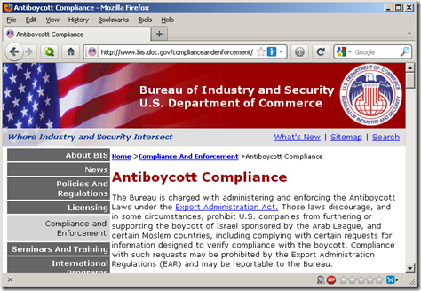

---

The Boycott, Divestment and Sanctions movement has been successful. So successful, in fact, that Israel has responded - as it usually does - by sealing another crack, putting another finger or gob of gum in the dike, in an effort to stanch the flood of criticism of its Apartheid laws and occupation.

This week Israel made it illegal for citizens to support non-violent boycotts of the nation.

If you thought that, somehow, Israel was still the "only democracy in the Middle East" because at least its Jewish citizens were free, well now you can forget that. Although primarily targeting Israeli Palestinians, it also restricts the rights of its Jewish citizens.

Haaretz columnist [Bradley Burston](http://www.haaretz.com/blogs/a-special-place-in-hell/israel-s-boycott-law-the-quiet-sound-of-going-fascist-1.372881) has it about right: this is the quiet sound of the nation finally turning fascist. If going fascist is too strong, then it's the sound of the last feeble exhalations of a dying democracy.

And what about _American_ citizens who still want to boycott Israel? Rest assured that our Constitutional rights are still ... being held ransom.

