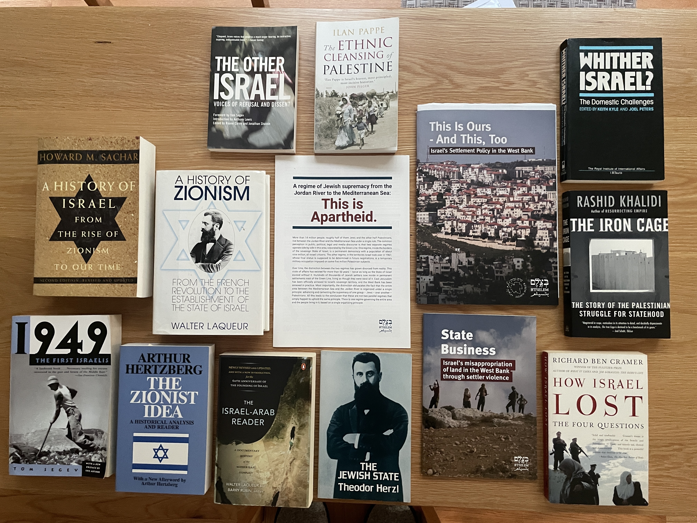

---
 

#### **News from and about Israel-Palestine**

The following websites feature Jewish Center and Progressive news and views, as well as Palestinian perspectives on Israel's occupation and politics. Most have associated RSS feeds and podcasts.

- [+972 Magazine: Independent Journalism from Israel-Palestine](https://972mag.com)
- [Association for Civil Rights in Israel (ACRI)](https://english.acri.org.il)
- [Al-Shabaka: the Palestinian Policy Network](https://al-shabaka.org)
- [BDS Movement: Freedom, Justice, Equality](https://bdsmovement.net)
- [B'Tselem: the Israeli Center for Human Rights in the Occupied Territories](https://btselem.org/)
- [Electronic Intifada](https://electronicintifada.net)
- [Haaretz (News of “The Land”)](https://haaretz.com)
- [Channel 24 News](https://i24news.tv)
- [Informed Comment (Juan Cole)](https://juancole.com)
- [Israel Policy Forum](https://israelpolicyforum.org)
- [Israel Weekly News Roundup](https://israel5.substack.com)
- [Jerusalem Post](https://jpost.com)
- [Jewish Currents](https://jewishcurrents.org)
- [Jewish Voice for Peace](https://jewishvoiceforpeace.org)
- [Jewish Voice for Peace Action](https://jvpaction.org)
- [Middle East Eye](https://middleeasteye.net)
- [Partners For Progressive Israel](https://progressiveisrael.org)
- [Times of Israel](https://timesofisrael.com)
- [Yedioth Ahronot (Latest News)](https://www.ynetnews.com)
- [Shalom Hartman Institute](https://hartman.org.il)
- [Center for Strategic International Studies](https://csis.org)
- [Foundation for Middle East Peace](https://fmep.org)
- [Americans for Peace Now](https://peacenow.org)
- [Institute of Middle East Understanding](https://imeu.org)

#### **Suggested Reading**

I’m sure there are plenty of great books on the subject. I can only recommend ones I’ve actually read:

- [1949: The First Israelis](https://www.goodreads.com/book/show/164744.1949) by Tom Segev 
  A co-editor of the Israeli newsweekly *Koteret Rashit* and a former writer for the Tel Aviv newspaper *Ha'aretz*, Segev was given access to previously restricted official documents and personal diaries. The book tells the unvarnished story of the first year's effort to build the State of Israel and in 1986 raised an uproar in Israel when many of the country's founding myths were shown to be untrue. "1949" documents directives, many from David Ben-Gurion, to expel and prohibit readmission of Palestinians. Negev was perhaps the first Israeli to *document* the ethnic cleansing of Palestinians. The second part of the book documents Israel's cruel treatment of Mizrahim (Arab Jews) and the growing conflict between religious and secular Jews.
- [A History of Israel from the Rise of Zionism to Our Time](https://www.goodreads.com/book/show/102195.A_History_of_Israel) by Howard M. Sachar
  This is a monster of a book. While Laqueur's book (below) is on placing Zionism in historical context, this book places Israel in historical and world context. Just as one example, it describes the British Mandate which was the agar plate on which Israeli statehood grew. If you are interested in long descriptions of battles in Israel's various wars, with accompanying maps, this is for you (I skipped past a lot of it). Though Sachar is no friend of the "new historians" and much of his material seems to reflect "official" positions of the government, other parts of the book seem fair. In a later chapter on Israeli politics, for example, he cites a 1984 Knesset report on Orthodox schools warning that "our schools have been thrown wide open to chauvinist and antidemocratic influences." Considerable anti-Arab hate was generated by Rabbi Zvi Kook, spiritual leader of the *Gush Emunim* settler movement. Religious arguments were twisted into hate speech. Arabs became *Amalek*. "Death to the Arabs" became a common phrase. The Techiya Party was founded by *Gush Emunim* zealots who began calling for the expulsion of all Arabs. Other "hate" parties popped up (Tsomet, Molodet, and Kach, established by Meier Kahane). Kahane was a Brooklyn racist who founded the Jewish Defense League and then emigrated to Israel. As Sachar describes him, Kahane was a civic cancer much like Donald Trump: "Attracting public attention with his demagoguery, [and] his flagrant appeals to racism and mob intimidation [...]" Israel's Jewish nationalist bigotry is the twin of America's Christian nationalist bigotry and Kahanists now dominate Israel’s current government.
- [A History of Zionism](https://www.goodreads.com/book/show/173399.A_History_of_Zionism) by Walter Zeev Laqueur 
  This is an excellent companion to Hertzberg's anthology (below). While Hertzberg lets Zionists speak for themselves, Laqueur places each in historical context. He begins with the Jewish ghettos of the Middle Ages and ends with the establishment of the state of Israel and, finally, *Thirteen Theses on Zionism*. It is not unfair to say that Laqueur is a conflicted admirer of Zionism. For him the jury's still out, but as far as he's concerned it was a necessity. His theses are worth reading, and their implications tell us certain things about Zionism. Thesis 3, for example, points out that assimilation is the enemy of Zionism and a product of contact with Europe. Thesis 8: The Zionist movement was unclear about its objectives until Nazism arrived. The betrayal of Palestinians by the West created much of the animosity toward Jewish settlement. Thesis 9: This animosity sharpened as Zionism moved from a cultural renewal focus to statehood. Thesis 10: "Seen from the Arab point of view, Zionism was an aggressive movement, Jewish immigration an invasion […] Throughout history nation-states have not come into existence as the result of peaceful development and legal contracts. They developed from invasions, colonisation, violence, and armed struggle." Laqueur adds, "It was the historical tragedy of Zionism that it appeared on the international scene when there were no longer empty spaces on the world map." Thesis 13: Zionism has succeeded in restoring dignity to Jews in the eyes of the world and becoming a focus for world Jewry. But in terms of "fanciful" expectations ("Zion as a new spiritual lodestar, a model for the redemption of mankind, a centre of humanity") it has not panned out quite as the early Zionists had hoped.
- [How Israel Lost](https://www.goodreads.com/book/show/478325.How_Israel_Lost) by Richard Ben Cramer 
  Cramer writes, "any Jew who isn't an Israeli and not on psychotropic drugs, could solve this Peace-for-Israel thing in about ten minutes of focused thought. Give back the land to the Palestinians. All of it [the West Bank, the Gaza Strip and East Jerusalem]. And since Palestinians are already living in their own country, they should have equal rights, a fact so laughably obvious – the only nation that can't see this is Israel." And this, remarkably, is from a guy who doesn't bother to disguise his contempt for Arabs in general.
- [The Ethnic Cleansing of Palestine](https://www.goodreads.com/book/show/57540.The_Ethnic_Cleansing_of_Palestine) by Ilan Pappé 
  Pappé is one of Israel's [New Historians](https://en.wikipedia.org/wiki/New_Historians) who, with the release of British and Israeli government documents in the early 1980s, began rewriting the history of Israel's creation in 1948, and the corresponding expulsion of 700,000 Palestinians that same year. Pappé maintained that the expulsions were not on an *ad hoc* basis but constituted the intentional ethnic cleansing of Palestinians in accordance with *Plan Dalet*, drawn up in 1947 by Israel's future leaders. By the time he left Israel in 2008, Pappé had been condemned in the Knesset, a minister of education had called for him to be fired, his photograph with an attached bullseye had appeared in a newspaper, and Pappé had received several death threats. American historians grappling with our own white supremacy know exactly what Pappé faced from those who refuse to look clear-eyed into the mirror of history.
- [The Iron Cage](https://www.goodreads.com/book/show/1257696.The_Iron_Cage) by Rashid Khalidi 
  This is an interesting book by a Palestinian who looks at not only Israel's (and the West's) tight control of Palestinians but at the historical errors pre-1948 which Palestinian leaders made and which contributed to the non-existence of a Palestinian state. Of course the West dealt the death-blow to Palestinian statehood when Britain gave up Palestine. Foreign Secretary Arthur James Balfour stated in 1919, "Zionism, be it right or wrong, good or bad, is rooted in age-long traditions, in present needs, in future hopes, of far greater import than the desires and prejudices of the 700,000 Arabs who now inhabit that ancient land." Translation: *Fuck the Arabs*. Khalidi ends with an appeal to the U.S., Israeli, and Palestinian leadership to “look honestly at what has happened in this small land over the past century […] and especially at how repeatedly forcing the Palestinians into […] an iron cage, has brought, and ultimately can bring, no lasting good to anyone.”
- [The Israel-Arab Reader](https://www.goodreads.com/book/show/766486.The_Israel_Arab_Reader) edited by Walter Laqueur and Barry Rubin Israel is situated in a very big neighborhood and its nearest neighbors, the Palestinians, often have no voice in historical accounts. This book does not have a "through" narrative like many anthologies, but it is provides a handy reference of important historical documents. It includes hundreds of official documents and speeches, from some of the first Zionist Congresses to the Sykes-Picot Agreement, to the San Remo Conference assignment of Palestine to Britain, to the Balfour Declaration, the PLO Constitution, speeches by Anwar Sadat, George Schultz, Yasir Arafat, and more.
- [The Jewish State](https://www.goodreads.com/book/show/164780.The_Jewish_State) by Theodor Herzl 
  In many ways this is the blueprint for Israel. This book is also found in Arthur Hertzberg's anthology as well as on Project Gutenberg in both [English](https://www.gutenberg.org/ebooks/25282) and in the [original German](https://www.gutenberg.org/ebooks/28865). It is a fascinating read. Herzl did not have a democracy in mind for the Jewish state ("I incline to an aristocratic republic"). Settlement was to be coordinated by a colonial enterprise he called the "Jewish Company" (not far off from the [Jewish Agency](https://archive.jewishagency.org/israel/content/23391/) which actually accomplished the task ). The Constitution (which never materialized) was to be forced upon the settlers ("Our people, who are receiving the new country from the Society, will also thankfully accept the new constitution it offers them. Should any opposition manifest itself, the Society will suppress it"). This year Herzl got his wish for an openly anti-democratic state. And as for those living In Palestine already? Expropriate their property and kick them out! "We must expropriate gently the private property on the state assigned to us. We shall try to spirit the penniless population across the border by procuring employment for it in the *transit countries*, while denying it employment in *our country*. The property owners will come over to our side. Both the process of expropriation and the removal of the poor must be carried out discretely and circumspectly. Let the owners of the immoveable property believe that they are cheating us, selling us things for more than they are worth. But we are not going to sell them anything back."
- [The Other Israel: Voices of Refusal and Dissent](https://www.goodreads.com/book/show/860703.The_Other_Israel) edited by Roane Carey and Jonathan Shainin 
  This is a collection of essays by writers, journalists, academics, and historians on the Israeli Left. These critics of Apartheid, Occupation, settlements, human rights abuses, and Israeli domestic and foreign policy are as reviled as many of their American equivalents on the progressive and socialist democratic Left. In 2009 I was in Israel and met Jeff Halper, one of the contributors to this volume, who discussed Israel's "matrix of control" for the systematic theft of Palestinian land. His essay on the topic is included in this collection. The book concludes with Tom Segev's essay on "Transfer" – a common euphemism for ethnic cleansing used by many on the Israeli right and center. And to be clear: ethnic cleansing is intended not only for Palestinians in the West Bank and Gaza. Former Labor Party minister Ephraim Sneh actually proposed transferring sovereignty of Israeli Arab towns, including Umm al-Fahm which is near both Haifa and Jenin, to the Palestinian Authority.
- [The Zionist Idea](https://www.goodreads.com/book/show/282238.The_Zionist_Idea) edited by Arthur Hertzberg 
  Zionism may have originally been intended to be Jewish self-determination in the service of self-protection, pride, and autonomy, but it has become a lot like its evil twin Christian nationalism. In this volume you hear the words of Zionists themselves. And there are many. Those whose names you may recognize include: Theodor Herzl (The Jewish State); Max Nordau; Hayyim Nahman Bialik; Abraham Isaac Kook; Martin Buber; Mordecai Menahem Kaplan – and some who actually had a hand in creating the state of Israel: Meir Bar-Ilan; Vladimir Ze'ev Jabotinsky; Chaim Weizmann; Abba Hillel Silver; and David Ben-Gurion.
- [Whither Israel? The Domestic Challenges](https://www.goodreads.com/book/show/4190008-whither-israel) edited by Keith Kyle and Joel Peters
  This book by British foreign policy specialists was first published in 1993 – thirty years ago – but still identifies many of the issues catching up with Israel today. From the book's blurb: "As it enters the 1990's Israel faces crucial political, economic and social challenges. Its parliamentary system is proving increasingly ineffective, prompting demands for electoral and constitutional reform; its economy is beset by stagnation, inflation and unemployment and its economic difficulties feed and exacerbate existing social and political tensions. This book considers the impact of these problems and their implication for the future direction of Israeli politics and society. Different chapters examine the social and ideological divisions that beset Israel, the roots of the country's economic problems, the dynamics of the Israeli political system and recent developments within political parties."

#### **Required Reading**

If you want to understand Israel you have to understand its longest-serving Prime Minister and his attachment to Jabotinsky's strain of Zionism.

- [The Iron Wall](http://en.jabotinsky.org/media/9747/the-iron-wall.pdf) by Ze'ev Jabotinsky 
  "Zionist colonisation must either stop, or else proceed regardless of the native population. Which means that it can proceed and develop only under the protection of a power that is independent of the native population – behind an iron wall, which the native population cannot breach." Jabotinsky was an admirer of Mussolini as were many of the Revisionist Zionists (until Italy's alliance with Germany). Benjamin Netanyahu is [at heart](https://www.vox.com/2015/3/16/8220035/what-does-netanyahu-think) a Revisionist Zionist and, not coincidentally, his father was [Jabotinsky's secretary](https://www.nytimes.com/2019/04/18/opinion/benjamin-netanyahu-israel.html). 

