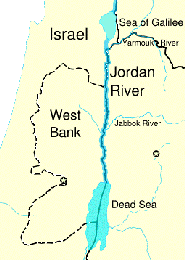

---

In his recent letter defending Israel's assault on Gaza, Irving Fradkin again maintains that Israel is blameless for human rights abuses which have received widespread international condemnation. He also attempts to sell Israel as a modern democracy as one reason for Americans to support it. Enough has been said about Gaza, but I would like to refute Dr. Fradkin's rosy image of Israel as a democracy like ours with a few facts. 

Dr. Fradkin claims that "Arabs and Israelis there have equal rights." Perhaps this is just a Freudian slip, but Arab Israelis _are_ Israelis. Palestinians in occupied territories clearly do not enjoy the same human rights as Israelis. However, Fradkin's portrait of happy Arabs in Israel is totally distorted. Because of institutionalized racism, [Arab Israelis do not have the same rights](http://www.nif.org/issue-areas/israeli-arabs/) to own property or exercise freedom of speech or assembly. Wages for Arab citizens are 30% lower. Nor do Arabs now even have full electoral rights. Two weeks ago, the Central Elections Committee in Israel [banned the Arab parties](http://www.haaretz.com/hasen/spages/1054867.html) Ta'al and Balad from running in recent election. [Avigdor Lieberman](https://www.thenation.com/doc/20070101/lynfield) has openly called for revoking Arabs' citizenship and called for "transfer" -- forced deportations of Arabs. This is a more realistic picture of life for Arab Israelis. 

Dr. Fradkin writes that Israel "wants peace and wants to share land peacefully with the Arabs." But go to the Knesset's website at [http://www.knesset.gov.il/elections/knesset15/elikud_m.htm](http://www.knesset.gov.il/elections/knesset15/elikud_m.htm) and look at the Likud's platform: "The Government of Israel flatly rejects the establishment of a Palestinian Arab state west of the Jordan river." Now look at a map and you'll notice that all of the West Bank is west of the Jordan River. Where do Israeli hardliners want Palestinians to live? Jordan and Egypt. Forced deportations are not the same as peaceful sharing. 

He writes "Israel is the only democracy in the Middle East." First of all, unlike Turkey, a secular democracy which Dr. Fradkin fails to mention, [Israel is a theocracy](http://www.duhaime.org/LegalDictionary/T/Theocracy.aspx): a "form of government which defers not to civil development of law, but to an interpretation of the will of a God as set out in religious scripture and authorities." It has [no constitution](http://www.cfisrael.org//home.html "Still none..."). Its laws are selectively enforced along racial and religious divisions - or ignored altogether. It has major human rights problems, including the use of [torture](http://www.amnesty.org/en/library/info/MDE15/031/1998/en). Israel has press [censorship](http://en.wikipedia.org/wiki/Censorship_in_Israel). If all this is a democracy, then let's call Pakistan a democracy too.

-----

*This was published in the Standard Times on February 17, 2009* 
*<http://www.southcoasttoday.com/20090217/opinion/902170339>*

