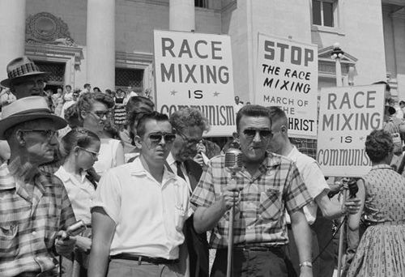
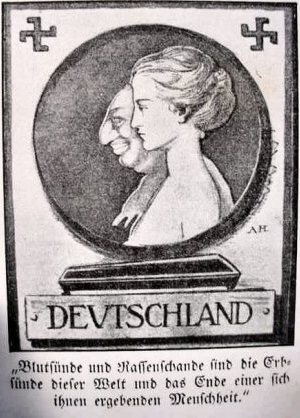

---

Petah Tikva, with the [dubious distinction](http://www.haaretz.com/hasen/spages/973716.html) of currently being Israel's only city with native neo-Nazi gangs, has just launched a municipal program to prevent Jewish women from dating Arab men. This is one of several programs throughout the country to prevent interracial dating and marriage.

Pisgat Zeev, a large Jewish settlement in the middle of Palestinian neighborhoods in East Jerusalem, has formed citizen patrols to prevent Arab men from "race-mixing" with Jewish girls, according to an article by [Jonathan Cook](http://www.counterpunch.org/cook09252009.html). The patrol, consisting of a vigilante brigade of roughly 35 men, is known as "Fire for Judaism."

Cook reports that "polls on the subject, in 2007, found that more than half of Israeli Jews believed intermarriage should be equated with 'national treason'."

A [2008 Ha'aretz report](http://www.haaretz.com/hasen/spages/997629.html) discussed a similar program launched in Kiryat Gat schools intended to prevent Jewish girls from becoming involved with Israeli Bedouin:

> The program enjoys the support of the municipality and the police, and is headed by Kiryat Gat's welfare representative, who goes to schools to warn girls of the "exploitative Arabs."
>
> The program uses a video entitled "Sleeping with the Enemy," which features a local police officer and a woman from the Anti-Assimilation Department, a wing of the religious organization Yad L'ahim, which works to prevent Jewish girls from dating Muslim men.

In 2004 in Safed posters warning Jewish women that dating Arab men would lead to "beatings, hard drugs, prostitution and crime" appeared. Safed's chief rabbi, Shmuel Eliyahu, was quoted in a local paper that "seducing" of Jewish girls was "another form of war" by Arab men.

Cook adds, "both Kiryat Gat and Safed's campaigns were supported by a religious organization called Yad L'achim, which runs an anti-assimilation team publicly dedicated to 'saving' Jewish women."

> "The Jewish soul is a precious, all-too-rare resource, and we are not prepared to give up on even a single one," says the organization's website.
