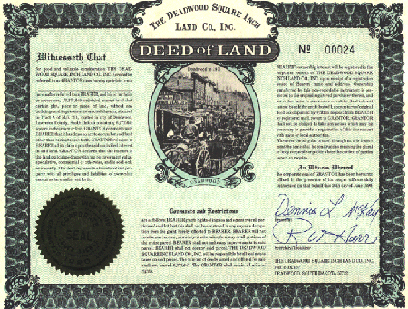

---

Many Zionists seem to be reading only the page in the Torah with the deed to Samaria and Judea. But the Torah, Talmud, and ethical Jewish writings have much to say on how to treat fellow humans:

#### The Essence of Judaism

> On another occasion it happened that a certain non-Jew came before Shammai and said to him, "I will convert to Judaism, on condition that you teach me the whole Torah while I stand on one foot." Shammai chased him away with the builder's tool that was in his hand. He came before Hillel and said to him, "Convert me." Hillel said to him, "What is hateful to you, do not to your neighbor: that is the whole Torah; the rest is commentary; go and learn it." _-- Babylonian Talmud, Shabbat 31a_

#### Compassion

> If we Jews remain indifferent to the plight of the oppressed, what right do we have to criticize the leaders of the free world for having abandoned us during the Holocaust? _-- Elie Wiesel, "From Cambodia to Sudan: Breaking Down Wall of Apathy," Article in the Forward (New York, 11 March 2005)_

#### Respect for Human Dignity

> Come and learn: Human dignity is so important that it supersedes even a biblical prohibition. _-- Babylonian Talmud, Brachot 19b_

> Rabbi Eliezer said, "Other people's dignity should be as precious to you as your own." _-- Mishna, Pirkei Avot 2:10_

#### Equal Application of the Law, even for non-Jews

> There shall be one law for the citizen and for the stranger who dwells among you. _-- Exodus 12:49_

> I charged your magistrates at that time as follows, "Hear out your fellows, and decide justly between any person and a fellow Israelite or a stranger. You shall not be partial in judgment: hear out low and high alike. Fear no person, for judgment is God's. And any matter that is too difficult for you, you shall bring to me and I will hear it." _-- Deuteronomy 1:16-17_

> You shall not subvert the rights of your needy in their disputes. Keep far from a false charge; do not bring death on those who are innocent and in the right, for I will not acquit the wrongdoer. Do not take bribes, for bribes blind the clear-sighted and upset the pleas of those who are in the right. You shall not oppress a stranger, for you know the feelings of the stranger, having yourselves been strangers in the land of Egypt. _-- Exodus 23:6-9_

> When a stranger resides with you in your land, you shall not wrong him. The stranger who resides with you shall be to you as one of your citizens; you shall love him as yourself, for you were strangers in the land of Egypt: I the LORD am your God. _-- Leviticus 19:33-34_

