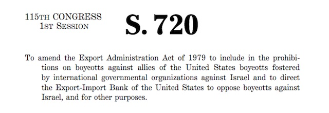

---

Lately there's a Russian under every rock if not every bed. We've also been seeing some new [bipartisan frenzy](http://www.politico.com/story/2017/07/26/senators-russia-influence-us-politics-240983) over Russian meddling in the 2016 presidential election. Senators keep heaping [sanction after sanction](https://www.govtrack.us/congress/bills/browse?congress=115&text=sanctions#sort=-introduced_date) on America's many enemies, including Russia, and there is revived interest in the registration of [foreign agents](http://www.npr.org/2017/07/26/539265688/senators-to-scrutinize-foreign-agents-but-not-trump-jr-or-manafort). “People should know if foreign governments, political parties or other foreign interests are trying to influence U.S. policy or public opinion,” says Iowa Republican and Senate Judiciary Committee chairman, Chuck Grassley.

Indeed, people *should* know who is trying to influence U.S. policy and public opinion.

And they should *also* know who the worst offender is.

[AIPAC](http://www.aipac.org/), the American Israeli Public Affairs Committee, is unique in bending U.S. policy and public opinion to a foreign government's will. Try to imagine a ChinaPAC, a SaudiPAC, or a RusskyPAC operating with as much impunity, introducing whatever federal legislation it wants on a regular basis, sending hundreds of congressmen on junkets to Moscow every summer recess, establishing Russian trade delegations in every state, letting Russians decide how we interrogate terrorists, giving a major voice to Russia on our foreign policy in Eastern Europe. It's shocking when our relationship with Israel is described like this, but It's especially shocking that Israel gets away with it because neither political party objects.

AIPAC is [only a slice](http://fortune.com/2016/03/21/aipac-israel-lobby-election-2016/) of an Israel lobby that spans dozens of organizations, but it is the largest of the Israel attack dogs, and it has teeth. As [FORTUNE](http://fortune.com/2016/03/21/aipac-israel-lobby-election-2016/) magazine put it, "if a congressman from Kansas gets a call from an AIPAC lobbyist, he and his constituents may not think much about about Israeli affairs, but voting with the lobby is politically beneficial. Voting against them, meanwhile, gives that congressman a powerful enemy." Plus, the money and junkets are great.

Unlike lobbyists who represent China, Turkey, Kazakhstan, Russia, the Ukraine or other foreign interests, AIPAC seems free to flaunt [FARA](https://en.wikipedia.org/wiki/Foreign_Agents_Registration_Act), the 1938 Foreign Agents Registration Act. Indeed, this week, in the middle of discussions on Russia, Senator [Lindsay Graham](http://jewishinsider.com/12404/graham-asks-aipac-foreign-agent/) asked [rhetorically] whether AIPAC should be required to register: “They come up here in droves: lobbying Congress to do things, in their view good for the U.S.-Israel relationship. I know they have a lot of contacts in Israel. Should somebody like that be a foreign agent?”

If they're not representing Israel, who does AIPAC really represent? Although it frequently claims to speak for [American Jews](http://www.newyorker.com/magazine/2014/09/01/friends-israel), Jewish Voice for Peace rabbi [Joseph Berman](http://www.truthdig.com/avbooth/item/boycott_divestment_sanctions_bds_law_boycott_us_20170722) would beg to disagree: "they don’t speak for the Jewish community." Poll after poll shows that American Jews are, first and foremost, Americans who believe in religious plurality, do *not* believe in ethno-religious government, and support diplomacy with Iran rather than reckless provocation. There are already plenty of lobbyists for a strong defense and muscular foreign policy so, once again, who does AIPAC really represent? In the words of Middle East expert [Juan Cole](https://www.juancole.com/2015/08/aipac-register-foreign.html), "the only logical possibility is that AIPAC is acting on behalf of the Likud government of Israel."

In [2005 AIPAC](http://www.nytimes.com/2005/04/21/politics/israeli-lobby-reportedly-fires-2-top-aides-in-spying-inquiry.html) Policy Director Steve Rosen and AIPAC Senior Iran Analyst Keith Weissman were fired after the FBI became suspicious the two had passed classified information to Israel. The stolen information was provided by Larry Franklin, who served a 12 year sentence for espionage. And though the two AIPAC employees were plainly operating in Israel's behalf, because of the belief that American and Israeli interests are synonymous the prosecution claimed it [could not prove](http://www.cbsnews.com/news/feds-drop-charges-in-aipac-spy-case/) that passing stolen information to Israel had actually harmed the United States.

AIPAC is involved with many linked organizations, including the [American Israel Education Foundation](http://www.timesofisrael.com/globe-trotting-lawmakers-flocked-to-israel-in-august-figures-show/) (AIEF) -- which operates out of the same building and sent almost all freshmen Congressmen to Israel in 2015 -- and Islamophobic groups like Citizens for a Nuclear Free Iran (CNFI). As the [INTERCEPT](https://theintercept.com/2017/03/28/former-democratic-senators-advised-group-funding-anti-muslim-extremist-frank-gaffney/) reported, AIPAC's political beneficiaries are bi-partisan. Four ostensibly "liberal" Democrats, for example, advise CNFI, which in turn finances some of [Frank Gaffney](https://en.wikipedia.org/wiki/Frank_Gaffney)'s work. AIPAC has gotten Democrats to suppress the BDS movement at both legislative and executive levels. New York governor [Andrew Cuomo wrote an executive memo](https://www.thenation.com/article/andrew-cuomos-bds-blacklist-is-a-clear-violation-of-the-first-amendment/) to establish an anti-BDS blacklist. And [Hillary Clinton's AIPAC speech](http://www.timesofisrael.com/hillary-clintons-full-speech-to-aipac/) made it clear that her party would fight BDS for Israel in the halls of Congress. And [AIPAC was grateful](http://www.aipac.org/-/media/publications/policy-and-politics/aipac-periodicals/israel-update/2017/israel-update-march-31-2017.pdf) when Republican David Friedman became the U.S. ambassador to Israel.

But the only party AIPAC really cares about is the Likud.

For the moment, however, AIPAC continues to pretend that it represents a domestic constituency and not a foreign government. But, like ALEC, it has numerous legislators willing to sponsor its Israel-friendly bills. And the legislation just keeps on coming.

Back in March AIPAC sponsored Senate bill [S.722](https://www.congress.gov/bill/115th-congress/senate-bill/722/text), "Countering Iran's Destabilizing Activities Act of 2017," designed to promote Israel's foreign policy goals regarding Iran.

In May the U.S. House of Representatives unanimously passed [H.R.672](https://www.congress.gov/bill/115th-congress/house-bill/672/text), "Combating European Anti-Semitism Act of 2017," which makes the United States responsible for Israel's interests in Europe. The bill accused European leaders who have voiced even tepid criticisms of Israel, including Angela Merkel, of anti-semitism.

More recently the **Israel Anti-Boycott Act**, also sponsored by [AIPAC](http://www.aipac.org/-/media/publications/policy-and-politics/legislative-action/2017/israel-anti-boycott-act.pdf), appeared in both [House](https://www.congress.gov/bill/115th-congress/house-bill/1697/text) and [Senate](https://www.congress.gov/bill/115th-congress/senate-bill/720/text) flavors and has been roundly denounced by civil liberties and progressive organizations. 

The "Israel Anti-Boycott Act" joins the federal [Combating BDS Act of 2017](https://www.govtrack.us/congress/bills/115/s170/text) and last year's [Anti-Semitism Awareness Act](https://www.congress.gov/bill/114th-congress/senate-bill/10/text) in trying to outlaw the Boycott, Divestment, and Sanctions movement in the United States. It also joins legislation filed by Israel's lobbyists in 35 states, and [enacted in 19](http://www.righttoboycott.org/), which outlaw the use of anti-Israel boycotts, a First Amendment right affirmed by the Supreme Court's [1982 ruling](http://www.nytimes.com/1982/07/03/us/justices-decide-for-naacp-in-boycott-case.html) in "NAACP vs. Claiborne Hardware" that tested the legality of peaceful advocacy of a politically-motivated boycott.

Despite its dubious constitutionality, **the proposed law would make support of the BDS movement a felony**, slapping $1 million dollar fines and imposing 20 year prison sentences on critics of Israel. It specifically goes after BDS supporters by suppressing *political* opposition to the Israeli government. The text of the bill reads: "The term 'politically motivated' means actions to impede or constrain commerce with Israel that are intended to coerce political action from or impose policy positions on Israel." 

**And this is what the 46 Senate and 249 House co-sponsors really oppose -- the political right of their constituents to pressure for change in Israel**.

Because the "Israeli Anti-Boycott Act" is so vaguely-worded, it could be interpreted quite extremely. For example, suppose a [consumer](https://sacbds.org/products/), before deciding to boycott an individual Israeli product, wanted to know if SodaStream machines, Naot shoes, or Ahava cosmetics are made in Israel proper or in the occupied West Bank. According to the [ACLU](https://www.aclu.org/blog/speak-freely/how-israel-anti-boycott-act-threatens-first-amendment-rights), posting even an [inquiry](https://www.aclu.org/blog/speak-freely/how-israel-anti-boycott-act-threatens-first-amendment-rights) on social media could theoretically cost a citizen 20 years of freedom or $1 million for his exercise of free speech. [Moveon.org](http://forward.com/fast-forward/377452/moveonorg-calls-on-progressives-to-kill-anti-bds-bill/) defends the right to use boycotts, "regardless how you feel about BDS," as a Free Speech issue. As well it is.

Another defect of the bill is that, while it was clearly written specifically for Israel's benefit, it contains ambiguous language punishing *anyone* who boycotts *any* "country friendly to" the United States, or who joins, supports, or echoes support for a foreign boycott of that country. This could also have unintended consequences because the United States has many [dubious friends](http://www.politico.com/magazine/story/2014/02/americas-most-awkward-allies-103889) -- including the Saudi dictatorship, [Egypt's](http://www.aljazeera.com/indepth/features/2017/07/egypt-lobbying-connection-170724073512681.html) dictator, Philippine dictator [Duterte](http://www.aljazeera.com/news/2017/07/philippine-police-dumping-bodies-drug-war-victims-170728034001676.html), Pakistan, Afghanistan's kleptocracy, Uzbekistan, Bahrain, Azerbaijan, Honduras, Qatar, Kyrgyzstan, Djibouti, Kazakhstan, Turkey, and many others.

"Friends" of the United States also include several new European members of [NATO](https://www.state.gov/s/l/treaty/collectivedefense/) that are in the process of shedding their democracies, including Poland and Hungary. And Thailand, a [SEATO](https://www.state.gov/s/l/treaty/collectivedefense/) member, is a government currently under dictatorship. No citizen should feel safe criticizing a repressive foreign regime with a toxic combination of vague, anti-democratic legislation and our present authoritarian president.

[Brand Israel](http://www.jpost.com/Opinion/Op-Ed-Contributors/Brand-Israel) has successfully sold itself as the "only Democracy in the Middle East." Yet the government's public relations campaign rings as hollow as anything to come out of the Trump administration. Israel has much in common with South Africa's Apartheid regime in maintaining a cruel, repressive occupation over a people denied their civil rights. And Israel just celebrated its [fiftieth year of occupation](https://www.theglobalist.com/israel-palestine-occupation-negotiation-peace-middle-east/). As Israeli historian [Ilan Pappe](https://jacobinmag.com/2017/05/israel-palestine-democracy-apartheid-discrimination-settler-colonialism) puts it, Israel is not a democracy, nor with an occupation could it ever be. "What we must challenge here, therefore, is not only Israel’s claim to be maintaining an enlightened occupation but also its pretense to being a democracy. Such behavior towards millions of people under its rule gives the lie to such political chicanery."

Israel is no longer recognizable as the spunky little nation of friendly kibbutzniks. Over the years it has transformed into an extreme right-wing settler state and has instituted a series of [anti-democratic laws](http://www.upj.org.au/index.php/news-and-events/news/66-news-and-events/news/81-news) of its own. Israel has cracked down on domestic human rights advocates like [B'Tselem](http://therealnews.com/t2/story:19623:Israel-Flouts-International-Law-While-Targeting-Its-Defenders) and Breaking the Silence. Like our own president, Israel treats its own press as enemies. Journalism is frequently [censored](http://www.thedailybeast.com/israels-censorship-scandal) in Israel and, like Saudi Arabia, the government is [now trying to shut down](http://www.aljazeera.com/news/2017/07/al-jazeera-slams-netanya-bid-shut-jerusalem-office-170727111707184.html) the Jerusalem office of Al Jazeera. Despite wide support for so-called "shared values," the more Americans learn about Israel the more its [reputation](http://www.haaretz.com/us-news/1.798794) in the United States suffers. Shutting down the BDS movement is not a shared value but a desperate attempt to shut down criticism within a nation that is Israel's most useful enabler.

A few weeks ago, on a tour of Eastern Europe, Israeli prime minister [Netanyahu](https://theintercept.com/2017/07/19/netanyahu-tells-european-leaders-concern-palestinian-rights-crazy/) was caught lecturing leaders of Poland, Hungary, Slovakia, and the Czech republic -- xenophobic nations that oppose resettlement of refugees -- that Israel was a bulwark in the defense of "Judeo-Christian" values against Muslim hordes and that European concern for Palestinians was "crazy." Netanyahu sounded precisely like American white supremacist Richard Spencer and an awful lot like [Donald Trump in Poland](https://www.nytimes.com/2017/07/06/world/europe/donald-trump-poland-speech.html) last week. "Don’t undermine that one European, Western country that defends European values and European interests and prevents another mass migration to Europe,” Netanyahu told his fellow right-wing Islamophobes.

BDS activists say that a [boycott](https://www.csmonitor.com/World/2014/0130/10-brands-you-ll-have-to-give-up-if-you-re-boycotting-Israel/Pampers) is a legal, peaceful way to keep pressure on Israel so long as its Palestinian occupation continues and land thefts persist. Only a few days ago 100 armed settlers invaded the home of the [Abu Rajab family](http://www.aljazeera.com/news/2017/07/israeli-settlers-occupy-palestinian-home-hebron-170728080215824.html) in Hebron and forcibly ejected them into the street. Speaking for the government, Israel's Agriculture Minister, Uri Ariel, defended the home invasion: "The entry into the home is another step in strengthening the natural connection of the Jewish people to its land. In the last few days in which Jerusalem has been under incessant *incitement*, I am glad that the people of Israel continue to establish themselves in the City of the Patriarchs." Another government minister, [Tzachi Hanegbi](https://972mag.com/senior-israeli-govt-minister-warns-palestinians-of-third-nakba/128872/), threatened Palestinians with a "third Nakba" (more ethnic cleansing). 

These were voices of the government speaking and, curiously, Ariel used the word *incitement*, which is frequently deployed when talking about BDS or making any appeal for Palestinian rights.

Sponsors of the "Israel Anti-Boycott Act" should have known a backlash was coming. Democratic Senator Ben Cardin of Maryland says now that his bill was [misinterpreted](https://theintercept.com/2017/07/25/cardin-amend-israel-boycott-bill-bds/) by the ACLU. But the ACLU's David Cole and Faiz Shakir [stood by their reading](https://www.washingtonpost.com/opinions/this-piece-of-pro-israel-legislation-is-a-serious-threat-to-free-speech/2017/07/24/0752d408-7093-11e7-8f39-eeb7d3a2d304_story.html?utm_term=.0ed2c544553d) in a Washington Post editorial:

> "Whether one approves or disapproves of the BDS movement itself, people should have a right to make up their own minds about it. Americans engage in boycotts every day when they decide not to buy from companies whose practices they oppose. Students have boycotted companies that sold clothing manufactured in sweatshops abroad. Environmentalists have boycotted Nestlé for its deforestation practices. By using their power in the marketplace, consumers can act collectively to express their political points of view. There is nothing illegal about such collective action; indeed, it is constitutionally protected."

Cardin has since offered to tinker with the bill's wording. But regardless of how it is phrased or re-phrased, **the bill ultimately has only one purpose -- to make political action by Americans illegal if it offends Israel**. 

This practically *defines* the phrase "un-American."

Voters must let [Senate co-sponsors](https://www.congress.gov/bill/115th-congress/senate-bill/720/cosponsors) and [House co-sponsors](https://www.congress.gov/bill/115th-congress/house-bill/1697/cosponsors) of this bill know in no uncertain terms that **this bill must die**. Here in Massachusetts that includes Reps. [Richard Neal](https://www.congress.gov/member/richard-neal/N000015) and [Joe Kennedy](https://www.congress.gov/member/joseph-kennedy/K000379) who once again sullies the family name.

In addition, **Congress must ensure that the AIPAC lobbyists** at 251 Massachusetts Avenue in Washington D.C. all follow what their colleagues [Paul Manafort](https://www.washingtonpost.com/politics/former-trump-campaign-chairman-paul-manafort-files-as-foreign-agent-for-ukraine-work/2017/06/27/8322b6ac-5b7b-11e7-9fc6-c7ef4bc58d13_story.html), [Michael Flynn](http://www.slate.com/blogs/the_slatest/2017/03/08/flynn_registers_as_foreign_agent_with_justice_dept_for_turkey_work_during.html), [Monica Farley](http://talkingpointsmemo.com/dc/monica-crowley-registers-foreign-agent-lobbying-for-victor-pinchuk), [John Podesta](http://www.politico.com/tipsheets/politico-influence/2016/09/fara-azerbaijan-extends-podesta-dcr-taps-bgr-216372), and thousands of others have been forced to do -- **register with the Justice Department under the 1938 FARA Act as agents of a foreign country.**

